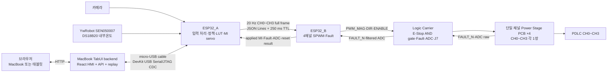

# KUGLASS — 능동형 스마트 글라스 모빌리티

KUGLASS는 카메라와 내부온도에 따라 1:10 차량 모형의 PDLC 4채널을 능동 제어하는 시연용 프로토타입입니다. ESP32_A가 입력 처리와 목표 MI 계산을 담당하고, ESP32_B가 **Logic Carrier에 장착되어** 4채널 SPWM과 제어 신호를 생성합니다. Logic Carrier의 CH0~CH3에는 동일한 단일 채널 Power Stage PCB를 한 장씩, 총 네 장 연결합니다.

> 이 저장소는 모형 시연용 개발 자산입니다. 실차 안전 장치나 자율주행 인지 성능 향상 장치를 표방하지 않습니다.

## 시스템 구성



핵심 제어 흐름은 다음과 같습니다.

```text
카메라·내부온도센서 → ESP32_A → ESP32_B(on Logic Carrier) → 단일 채널 Power Stage PCB ×4 → PDLC CH0~CH3
```

- ESP32_A: 카메라 ROI 지표, YwRobot SEN050007의 DS18B20 내부온도, 상황 모드와 수동 TTL을 처리하여 CH0~CH3 목표 MI를 계산합니다.
- ESP32_B: A의 full-frame 명령을 검증하고 Logic Carrier 핀맵으로 4채널 16 kHz `PWM_MAG`, `DIR`, 개별 `ENABLE`을 생성합니다. E-Stop, Fault 또는 A→B timeout 때 로컬 safe-off를 수행합니다.
- Logic Carrier: ESP32_B DevKit을 탑재하고 `EN_GLOBAL AND ENABLE_CHx` 하드웨어 게이팅, active-low Fault 입력, 전류·온도 ADC 필터, +3.3 V/+12 V와 J7 Power Stage 인터페이스를 제공합니다.
- TabUI: MacBook에서 직접 실행되어 화면 제공, 사용자 명령 검증, 상태 중계와 replay snapshot을 담당합니다. ESP32_A DevKit USB 단자와 micro-USB 케이블로 연결하며 LIVE 자동 정책은 계산하지 않습니다.
- 카메라 영상: TabUI의 `영상 보기` 버튼을 연 동안 ESP32_A가 VGA(640×480) RGB565를 품질 90 JPEG로 변환하여 기존 USB Serial/JTAG 링크로 보조 전송합니다. 송출은 낮은 우선순위의 비동기 단일 queue로 처리하며 자동 MI 계산과 ESP32_B 20 Hz heartbeat가 항상 영상보다 우선합니다.
- Power Stage PCB ×4: 동일한 단일 채널 PCB를 CH0~CH3에 한 장씩 연결합니다. 각 보드는 J7의 해당 채널 블록에서 신호를 받아 H-Bridge와 LC Filter로 PDLC 한 채널을 구동하고 `FAULT_N`과 ADC raw를 되돌려줍니다. 통합 4채널 Power Stage PCB를 사용하는 구성이 아닙니다.

## 채널과 입력 범위

- 제어 채널: CH0~CH3
- 입력 센서: 카메라 1대, YwRobot SEN050007 DS18B20 내부온도센서 모듈 1개
- 카메라 지표: 좌/우 ROI 포화 비율, 평균 밝기, highlight 면적, Edge Density와 검증된 경우의 AE metadata
- 출력 의미: MI 1.0에 가까울수록 CLEAR, MI 0.0 또는 disable은 전원 차단·강산란 방향

## 디렉터리

| 경로 | 역할 |
| --- | --- |
| `개발 계획서.md` | 현재 제품 구조와 개발·검증 범위의 기준 |
| `TabUI/` | 브라우저 HMI, MacBook 로컬 API와 ESP32_A DevKit USB gateway |
| `ESP32_A_Algo/` | 카메라·내부온도 처리, 정책/MI master, ESP32_B 통신 펌웨어 |
| `ESP_Camera/` (선택) | standalone 카메라 시험을 보존할 때만 사용하는 레퍼런스. ESP32_A의 빌드·플래시에는 필요하지 않으며 보관이 불필요하면 삭제 가능 |
| `ESP32_B_Algo/` | ESP32_B에 빌드·플래시할 유일한 기준 펌웨어. CH0~CH3 SPWM, Logic Carrier/Power Stage, TTL/Fault 처리 |
| `ESP32_A_TESTT/` | `type=set`, `mi[]` frame을 전송하는 독립 UART 시험 프로젝트. 현재 `ESP32_B_Algo/` 제품 계약과는 비호환 |
| `ESP32_TEST/` | ESP32_B–Logic Carrier GPIO 배선을 전력단 분리 상태에서 검증하는 독립 프로젝트 |
| `hardware/` | `Logic carrier.pdf`, `Power_stage.pdf`와 회로 분석·핀맵·HIL 규칙 |
| `Simul_Twin/` | 독립 MOCK 디지털 트윈. 수정 금지 |
| `AGENT.md` | 후속 개발의 아키텍처·안전·검증 지침 |

## 제어 계약

### TabUI → ESP32_A

TabUI는 자동 MI 배열을 만들지 않고 고수준 명령만 전송합니다.

```json
{"v":1,"type":"ui_command","seq":101,"command":"set_mode","mode":"driving"}
{"v":1,"type":"ui_command","seq":102,"command":"set_demo","demo_mode":"hot_summer"}
{"v":1,"type":"ui_command","seq":103,"command":"manual_channel","channel_id":2,"target_mi":0.42,"ttl_ms":30000,"enable":true}
{"v":1,"type":"ui_command","seq":104,"command":"return_auto","channel_id":2}
{"v":1,"type":"ui_command","seq":105,"command":"camera_stream","enable":true,"ttl_ms":15000}
```

`seq`는 단조 증가해야 하며 수동 채널은 0~3, MI는 0.0~1.0, TTL은 유한 범위여야 합니다.

### ESP32_A → ESP32_B

ESP32_A는 CH0~CH3 전체 목표를 20 Hz heartbeat로 전송합니다.

```json
{"v":1,"type":"actuator_command","seq":5501,"ttl_ms":250,"ch":[[0,0.72,true],[1,0.68,true],[2,0.42,true],[3,0.55,true]]}
```

ESP32_B는 version, type, sequence, TTL과 CH0~CH3 full/unique set을 검증합니다. 누락·중복·범위 이탈 frame은 전체를 거부합니다.

### ESP32_B → ESP32_A

ESP32_B는 실제 적용 MI, Fault/E-Stop, ADC 진단과 reset session context를 별도 상태 frame으로 회신합니다. 모든 B status에는 B 부팅 동안 고정되는 nonzero u32 `boot_id`와 재사용할 수 없는 nonzero u32 `reset_challenge`가 필수입니다.

```json
{"v":1,"type":"status","controller_id":"B","seq":5501,"boot_id":305419896,"reset_challenge":2271560481,"estop":false,"fault_code":"NONE","ch":[{"id":0,"mi":0.72,"fault":false},{"id":1,"mi":0.68,"fault":false},{"id":2,"mi":0.42,"fault":false},{"id":3,"mi":0.55,"fault":false}],"adc":{"initialized":true,"i_cali":true,"t_cali":true,"raw_valid_mask":255,"mv_valid_mask":255,"i_raw":[120,121,119,122],"t_raw":[2010,2002,2021,1998],"i_mv":[28,29,28,29],"t_mv":[1620,1614,1628,1611]}}
```

`seq`는 B status 자체의 순서이며 actuator command 또는 reset request의 `seq`와 동일하다고 가정하지 않습니다. A는 같은 `boot_id` 안에서만 status sequence를 비교하고, B가 재부팅하여 `boot_id`가 바뀌면 즉시 새 sequence 기준을 설정합니다. UI는 ESP32_A 정책의 `target_mi`, A가 보낸 `commanded_mi`, B가 보고한 `applied_mi`를 구분하며, 유효한 B 상태를 받기 전에는 적용값을 추정하지 않습니다.

### ESP32_A → ESP32_B Fault reset

A는 부팅마다 nonzero u32 `source_session_id`를 생성하고, 가장 최근 B status의 `boot_id`/`reset_challenge`를 대상으로 reset을 요청합니다.

```json
{"v":1,"type":"control","seq":9001,"source_session_id":2712847316,"target_boot_id":305419896,"reset_challenge":2271560481,"command":"reset_fault"}
```

B는 대상 boot, one-time challenge와 실제 `EN_GLOBAL/FAULT_N` 상태를 확인한 뒤 challenge를 교체하고, 결과를 status의 optional `control_result`로 회신합니다.

```json
{"v":1,"type":"status","controller_id":"B","seq":5502,"boot_id":305419896,"reset_challenge":1845949173,"estop":false,"fault_code":"NONE","control_result":{"command":"reset_fault","seq":9001,"source_session_id":2712847316,"ok":true,"error":"NONE"},"ch":[{"id":0,"mi":0.0,"fault":false},{"id":1,"mi":0.0,"fault":false},{"id":2,"mi":0.0,"fault":false},{"id":3,"mi":0.0,"fault":false}],"adc":{"initialized":true,"i_cali":true,"t_cali":true,"raw_valid_mask":255,"mv_valid_mask":255,"i_raw":[120,121,119,122],"t_raw":[2010,2002,2021,1998],"i_mv":[28,29,28,29],"t_mv":[1620,1614,1628,1611]}}
```

`control_result` fields는 `command`, `seq`, `source_session_id`, `ok`, `error`입니다. A는 `boot_id`, `source_session_id`, request `seq`가 모두 pending request와 일치하는 결과만 수락하며 UART write 성공을 reset 성공으로 ACK하지 않습니다. 현재 1,500 ms 내에 일치하는 결과가 없으면 `B_RESET_TIMEOUT`으로 실패 처리합니다. B 결과 error는 `NONE`, `RESET_UNSAFE`, `TARGET_BOOT_MISMATCH`, `CHALLENGE_MISMATCH`입니다.

ADC의 raw/mV 수집·filter·calibration validity telemetry는 구현되었지만, 현재 mV는 진단 전압입니다. Power Stage revision별 전류 A·온도 °C 환산, clamp·단선·포화 보호와 HIL이 완료되기 전에는 물리량이나 보호 판단으로 표시하지 않습니다.

## TabUI 실행

Node.js 22+와 Python 3.11+를 권장합니다.

현재 LIVE 구성은 MacBook에서 직접 실행하는 백엔드입니다. MacBook과 ESP32_A 사이에는 별도 UART TX/RX 배선을 사용하지 않습니다. 데이터 통신이 가능한 micro-USB 케이블을 ESP32_A DevKit의 USB 단자에 연결하면 macOS에 `/dev/cu.usbmodem*` 장치가 생성되고, TabUI가 단일 장치를 자동 탐색합니다.

```bash
cd TabUI
python3 -m venv .venv
source .venv/bin/activate
npm ci
python3 -m pip install -r requirements.txt
npm run check
npm run build
npm start
```

브라우저에서 `http://localhost:8080/demo`을 엽니다. 정책 근거 패널의
`영상 보기` 버튼은 새 ESP32_A firmware가 연결된 LIVE 모드에서 실제 OV2640
영상을 표시합니다. MOCK에서는 실제 프레임 대신 대기 안내를 표시합니다.

USB 장치가 여러 개이면 ESP32_A 장치를 명시합니다.

```bash
cd TabUI
python3 -m serial.tools.list_ports -v
python3 server.py --transport usb --usb-port /dev/cu.usbmodem1101
```

ESP32_A 없이 화면만 확인하는 MOCK은 명시적으로 실행합니다.

```bash
cd TabUI
python3 server.py --transport mock
```

현재 서버는 plain HTTP와 인증 없는 시연용 구성이므로 MacBook localhost 또는 신뢰된 격리 LAN의 태블릿에서만 사용하고, 그 밖의 네트워크에 직접 노출하지 않습니다.

## ESP32_A 빌드

```bash
cd ESP32_A_Algo
idf.py set-target esp32s3
idf.py build
```

ESP32_A는 [`ESP32_A_Algo/main/camera_service.*`](ESP32_A_Algo/main/)와 핀 계약, 카메라 드라이버 의존성 및 lock file을 자체 소유합니다. 따라서 루트 `ESP_Camera/`가 없더라도 `ESP32_A_Algo/` 안에서 구성·빌드·플래시할 수 있습니다. `ESP_Camera/`는 선택적인 standalone 자료이며 보관이 불필요하면 삭제할 수 있습니다.

ESP32_A 기본 연결은 다음과 같습니다.

| 기능 | ESP32_A 자원 | 주의 |
| --- | --- | --- |
| OV2640 | 카메라 서비스의 GPIO4~18 | `ESP32_A_Algo/main/camera_pins.h`의 내부 핀 계약 준수 |
| TabUI | DevKit USB 단자 → ESP32-S3 USB Serial/JTAG(GPIO19/20) | MacBook micro-USB 직결, JSON Lines + on-demand JPEG; 외부 UART 배선 아님 |
| ESP32_B | UART1 TX/RX GPIO39/40 | 두 보드 공통 GND, 실제 header 재검증 |
| YwRobot SEN050007 | GPIO41 | DS18B20 DAT, 3.3 V 전원, 공통 GND |

카메라 AE exposure/gain 단위가 검증되기 전에는 `ae_metadata_valid=false`로 유지합니다. 카메라나 온도 입력이 stale이면 결측으로 처리합니다.

## ESP32_B 빌드

ESP32_B에 빌드·플래시할 코드는 `ESP32_B_Algo/`입니다. [hardware/Logic carrier.pdf](<hardware/Logic carrier.pdf>)의 회로와 [hardware/README.md](hardware/README.md)의 규칙을 기준으로 구현하며, 물리 경로는 `ESP32_B U3 → Logic Carrier 74HC08/RC/J7 → 채널별 단일 채널 Power Stage PCB`입니다. CH0~CH3에 동일 PCB를 한 장씩 연결하며 Carrier를 생략한 임의 직결 핀맵을 사용하지 않습니다.

| 채널 | `PWM_MAG` | `DIR` | MCU `ENABLE` | `FAULT_N` | Current ADC | Temperature ADC |
| --- | ---: | ---: | ---: | ---: | ---: | ---: |
| CH0 | GPIO10 | GPIO11 | GPIO12 | GPIO13 | GPIO1 | GPIO2 |
| CH1 | GPIO14 | GPIO15 | GPIO16 | GPIO17 | GPIO4 | GPIO5 |
| CH2 | GPIO18 | GPIO21 | GPIO38 | GPIO39 | GPIO6 | GPIO7 |
| CH3 | GPIO40 | GPIO41 | GPIO42 | GPIO47 | GPIO8 | GPIO3 |

공통 `EN_GLOBAL`은 GPIO19 input-only이고, `FAULT_N`은 active-low입니다. J7의 실제 enable은 `CHx_ENABLE = EN_GLOBAL AND ENABLE_CHx`입니다. GPIO3은 strapping pin이므로 CH3 temperature ADC 연결 상태의 cold boot/reset을 검증합니다. DevKitC-1 v1.1은 GPIO38을 onboard RGB LED에도 쓰므로 board revision을 확인하고 LED/RMT 코드를 비활성화합니다.

```bash
cd ESP32_B_Algo
idf.py set-target esp32s3
idf.py build
```

`ESP32_B_Algo/main/power_stage_pinmap.h`는 현재 Logic Carrier 핀맵을 사용하고, B측 UART는 제어 핀과 겹치지 않는 GPIO43/44로 설정되어 있으며, native USB console은 비활성화되어 있습니다. 핀 중복은 compile-time 검사와 host test로 검증합니다.

> **실기 주의:** 회로도의 U3 TX(GPIO43)/RX(GPIO44)는 NC이고 별도 A↔B connector가 없습니다. 외부 UART harness와 DevKit USB-to-UART bridge contention을 확정하고, ADC A/°C 환산·입력 보호 및 Power Stage fault 차단을 완성한 뒤 HIL을 통과하기 전에는 Power Stage/PDLC/HV를 연결하지 마십시오. 부팅·잘못된 frame·A→B timeout 상태의 기본 출력은 off여야 합니다.

> 현재 `hardware/`에는 PDF 회로도와 분석 문서만 있고 편집 가능한 EDA/CAD source·BOM은 없습니다. 외부 harness connector, UART bridge 격리와 ADC clamp 등의 회로 개정은 해당 CAD 원본을 확보한 뒤 별도 EDA 작업으로 반영해야 합니다.

## 안전 동작

제어 우선순위는 다음과 같습니다.

```text
E-Stop > latched Fault > Manual(TTL) > Demo/Auto
```

- TabUI가 종료되어도 ESP32_A의 AUTO 센서 제어는 계속됩니다.
- A→B heartbeat가 TTL을 넘기면 ESP32_B가 출력을 차단합니다.
- J5 NC E-Stop이 열리면 R18 pull-down으로 `EN_GLOBAL=LOW`가 되고, 74HC08이 펌웨어와 무관하게 네 `CHx_ENABLE`을 LOW로 만들어야 합니다.
- E-Stop은 enable만 차단하며 +24 V/+12 V/+5 V rail은 계속 live입니다. PWM/DIR도 별도이므로 firmware가 동시에 PWM 0을 적용해야 하며, 이 회로를 safety-rated 전원 차단기로 표현하지 않습니다.
- 각 `FAULT_N`은 외부 10 kΩ pull-up의 active-low 입력입니다. Fault는 Logic Carrier U4의 enable AND에는 포함되지 않으므로 CH0~CH3에 연결한 단일 채널 Power Stage PCB 네 장 각각의 `FAULT_N/RUN_OK` 하드웨어 차단과 펌웨어 polling latency를 실측합니다.
- 수동 제어는 기본 30초 후 ESP32_A에서 AUTO로 복귀합니다.
- LIVE telemetry가 stale이면 UI는 마지막 실제 값을 유지하고 명령을 막습니다. MOCK으로 자동 전환하지 않습니다.
- MOCK/REPLAY는 ESP32_A USB 장치나 Power Stage 출력을 사용하지 않습니다.
- Fault clear는 ESP32_B가 reset의 `target_boot_id`/one-time `reset_challenge`와 실제 E-Stop/Fault 조건을 확인한 뒤에만 수행하며, A는 일치하는 `control_result`를 받거나 timeout이 발생할 때까지 성공 ACK을 보류합니다.

## 검증

```bash
cd TabUI
npm run check
npm run build

cd ../ESP32_A_Algo
sh host_tests/run_tests.sh

cd ../ESP32_B_Algo
sh host_tests/run_tests.sh
```

HIL에서는 다음을 확인합니다.

- 카메라·내부온도 입력과 stale 처리
- CH0~CH3 full/unique frame 검증
- command ACK, 수동 TTL과 AUTO 복귀
- TabUI 단절 중 ESP32_A AUTO 지속
- A→B timeout 후 ESP32_B safe-off
- duplicate/stale sequence 거부
- target/commanded/applied MI 분리
- E-Stop, fault latch와 안전 조건 확인 후 reset
- B reboot 후 `boot_id` sequence rebase, A reboot 후 `source_session_id` 교체, stale/replayed reset 거부
- reset `control_result` correlation과 1,500 ms timeout ACK, unsafe reset의 challenge 소비
- Logic Carrier exact GPIO/방향/active level과 UART·JTAG·ADC 중복 소유 0건
- reset 직후 `CH0~CH3_ENABLE=LOW`, PWM duty 0과 E-Stop 하드웨어 AND 차단
- J7 pin 1/odd-even 방향, 모든 even=GND, 채널별 +3.3 V/+12 V 확인
- ADC 8개 raw/mV telemetry와 validity mask, 실제 입력 범위·A/°C 환산·calibration·포화/단선 및 GPIO3 source 연결 cold boot

실측 전에는 MI-Vrms-투과도 LUT, 내부온도 임계값과 카메라 개선 수치를 확정값으로 단정하지 않습니다.
