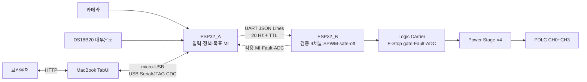

# KUGLASS

KUGLASS는 카메라와 내부온도에 따라 1:10 차량 모형의 PDLC를 CH0~CH3으로
능동 제어하는 시연용 프로토타입입니다. ESP32_A가 센서와 제어 정책을 담당하고,
ESP32_B가 제작된 Logic Carrier와 단일 채널 Power Stage PCB 4장을 통해 실제
출력을 담당합니다.

> 이 저장소는 모형 시연용 개발 자산입니다. 실차 안전 장치나 자율주행 인지
> 성능 향상 장치를 표방하지 않습니다.

## 시스템 구성



- 입력: 카메라 1대, YwRobot SEN050007 DS18B20 내부온도센서 모듈 1개
- 출력: PDLC CH0 운전석 창문, CH1 조수석 창문·선루프, CH2 운전석 옆 창문,
  CH3 조수석 옆 창문
- MI 의미: 값이 클수록 CLEAR이며 현재 운용 상한 0.60이 완전 투명 방향입니다.
  0.0 또는 disable은 safe-off·강산란 방향입니다.
- 제어 우선순위: `E-Stop > latched Fault > Manual(관리자 지속/일반 TTL) > Demo/Auto`

ESP32_A가 권위 있는 목표 MI를 계산합니다. ESP32_B는 목표를 다시 계산하지 않고
명령 검증, 출력, 로컬 차단과 실제 적용 상태 회신만 수행합니다. TabUI는 LIVE
자동 정책을 계산하지 않습니다.

ESP32_A와 ESP32_B는 Logic Carrier를 통하지 않는 외부 3선 UART harness로
연결합니다.

```text
ESP32_A GPIO39 TX -> ESP32_B GPIO44 RX
ESP32_A GPIO40 RX <- ESP32_B GPIO43 TX
ESP32_A GND       --- ESP32_B GND
```

UART1은 115200 8-N-1이며 TX↔RX를 교차 연결합니다. TX끼리 또는 RX끼리 연결하지
않습니다.

더 자세한 책임과 물리 연결은 [시스템 구조](docs/ARCHITECTURE.md), frame 형식은
[통신 계약](docs/PROTOCOL.md)을 참고하세요.

## 저장소 구조

| 경로 | 역할 | 시작 문서 |
| --- | --- | --- |
| `TabUI/` | MacBook 백엔드, 브라우저 HMI, ESP32_A USB gateway | [TabUI README](TabUI/README.md) |
| `ESP32_A_Algo/` | 카메라·온도, 정책, 목표 MI, A→B 통신 제품 펌웨어 | [ESP32_A README](ESP32_A_Algo/README.md) |
| `ESP32_B_Algo/` | 4채널 SPWM, 채널별 Fault와 전역 TTL safe-off 제품 펌웨어 | [ESP32_B README](ESP32_B_Algo/README.md) |
| `hardware/` | as-built 회로 원본, 기계 판독 계약, HIL 절차 | [hardware README](hardware/README.md) |
| `docs/` | 시스템 구조, 통신, 검증 공통 문서 | [문서 안내](docs/README.md) |
| `For_Test/` | 사용자가 대상을 지정할 때만 보는 독립 시험 코드 | [시험 영역 안내](For_Test/README.md) |
| `Simul_Twin/` | production과 분리된 디지털 트윈, 수정 금지 | [Simul_Twin README](Simul_Twin/README.md) |
| `Ioniq 3D model/` | UI에 사용하는 차량 3D 원본과 라이선스 | [모델 라이선스](Ioniq%203D%20model/hyundai_ioniq_5_-_lowpoly/license.txt) |

제품에 빌드·플래시하는 canonical firmware는 `ESP32_A_Algo/`와
`ESP32_B_Algo/`뿐입니다. 각 폴더의 `host_tests/`는 제품 계약의 일부이며,
`For_Test/`의 독립 시험 firmware와 구분합니다.

## 문서 안내

| 문서 | 독자와 용도 |
| --- | --- |
| [README.md](README.md) | 처음 보는 개발자를 위한 개요와 실행 진입점 |
| [AGENTS.md](AGENTS.md) | AI 에이전트의 작업 범위, 금지사항과 검증 규칙 |
| [개발 계획서.md](개발%20계획서.md) | 작품의 배경, 목표와 개발 계획 |
| [docs/ARCHITECTURE.md](docs/ARCHITECTURE.md) | 컴포넌트 책임, 데이터 흐름과 runtime mode |
| [docs/PROTOCOL.md](docs/PROTOCOL.md) | TabUI↔A↔B wire contract와 reset 절차 |
| [docs/VALIDATION.md](docs/VALIDATION.md) | 변경 범위별 자동 검사와 HIL 요약 |
| [hardware/README.md](hardware/README.md) | 제작 하드웨어의 기준 자료와 읽는 순서 |

AI를 사용할 때는 루트 [AGENTS.md](AGENTS.md)를 단일 진입점으로 사용합니다.

## 빠른 시작: TabUI

Node.js 22+와 Python 3.11+를 권장합니다.

```bash
cd TabUI
npm ci
npm run setup:python
npm run check
npm run build
npm start
```

ESP32_A DevKit의 USB 단자를 데이터 micro-USB 케이블로 MacBook에 연결한 뒤
`http://localhost:8080/demo`을 엽니다. 기본 LIVE 설정은 `transport=usb`,
`usb-port=auto`이며 macOS의 단일 `/dev/cu.usbmodem*` 장치를 자동 탐색합니다.

ESP32_A 없이 UI만 실행하려면 MOCK을 명시합니다.

```bash
cd TabUI
.venv/bin/python server.py --transport mock
```

현재 서버는 인증 없는 plain HTTP 시연 구성입니다. localhost 또는 신뢰된 격리
LAN에서만 사용하세요. 자세한 USB 선택, 개발 서버와 API는
[TabUI README](TabUI/README.md)에 있습니다.

## 펌웨어 빌드

두 제품 firmware는 ESP-IDF 6.0.2와 ESP32-S3를 기준으로 합니다.

```bash
cd ESP32_A_Algo
idf.py set-target esp32s3
idf.py build
```

```bash
cd ESP32_B_Algo
idf.py set-target esp32s3
idf.py build
```

플래시, 핀과 HIL 조건은 각 firmware README를 먼저 확인하세요. ESP32_B와 전력부
작업은 반드시 [하드웨어 기준](hardware/README.md)의 읽기 순서와 안전 조건을
따라야 합니다.

## 현재 구현과 미확정 범위

현재 저장소에는 다음 항목이 구현되어 있습니다.

- ESP32_A 카메라·DS18B20 입력, 정책, 관리자 지속/일반 TTL 수동 제어, 20 Hz A→B heartbeat
- ESP32_B strict full-frame 검증, 4채널 16 kHz/60 Hz SPWM, 채널별 Fault 차단과
  timeout 전체 safe-off
- boot/session/challenge에 묶인 Fault reset과 결과 correlation
- ESP32_B ADC 8채널 raw/mV 및 validity telemetry와 TabUI의 TH1 데이터시트 기반
  채널별 명목 온도 표시
- TabUI LIVE/MOCK/REPLAY 상태 분리, 명령 gateway와 on-demand 카메라 영상
- TabUI 독립 관리자 콘솔의 A/B 통신·센서·ADC 진단과 채널별 지속 Enable/MI 제어
- 제작 완료된 Logic Carrier 1장과 동일 단일 채널 Power Stage PCB 4장의 원본·계약

다음 항목은 저장소에 실측 완료 기록이 없으므로 확정값으로 사용하지 않습니다.

- 보드별 전류 A·온도 °C calibration과 protection threshold
- GPIO/connector 연속성, 부팅·reset 파형, Fault trip latency
- MI-Vrms-투과도 LUT와 카메라 개선 수치
- Power Stage 열·절연·고전압 통합 성능

상세 상태는
[`hardware/validation/current-status.json`](hardware/validation/current-status.json)을
참고하세요.

## 검증

```bash
python3 hardware/tools/validate_hardware_contract.py

cd TabUI
npm run check
npm run build

cd ../ESP32_A_Algo
sh host_tests/run_tests.sh

cd ../ESP32_B_Algo
sh host_tests/run_tests.sh

cd ..
sh hardware/validation/BAD_JSON/host_tests/run_tests.sh
```

하드웨어 validator와 host test 통과는 Power Stage/PDLC/HV 실기 검증을 대신하지
않습니다. 변경별 검사 범위와 HIL 항목은 [검증 가이드](docs/VALIDATION.md)를
참고하세요.

## 핵심 안전 주의

- ESP32_B는 제작된 Logic Carrier U3에 장착하고, Power Stage에 임의 직결하지 않습니다.
- J5 E-Stop은 enable만 차단합니다. +24/+12/+5/+72 V rail은 계속 live일 수 있습니다.
- ADC raw/mV를 calibration 전 전류 A나 보정 완료 온도처럼 표시하지 않습니다.
  TabUI의 `T °C (명목)`은 유효한 mV에 TH1 데이터시트 모델을 적용한 진단값이며
  보호 판단에는 사용하지 않습니다.
- 실제 Power Stage와 고전압은 logic-only·저전압 검증을 먼저 통과한 뒤 연결합니다.
- 상세 실기 절차는 [하드웨어 검증 문서](hardware/validation/README.md)를 따릅니다.
