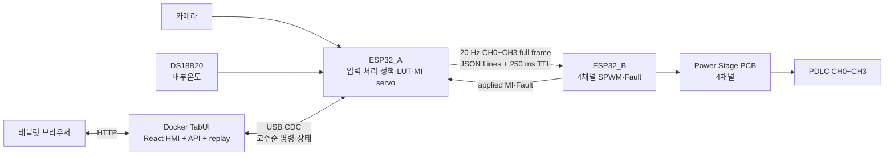

# KUGLASS — 능동형 스마트 글라스 모빌리티

KUGLASS는 카메라와 내부온도에 따라 1:10 차량 모형의 PDLC 4채널을 능동 제어하는 시연용 프로토타입입니다. ESP32_A가 입력 처리와 목표 MI 계산을 담당하고, ESP32_B가 4채널 SPWM과 Power Stage PCB를 직접 제어합니다.

> 이 저장소는 모형 시연용 개발 자산입니다. 실차 안전 장치나 자율주행 인지 성능 향상 장치를 표방하지 않습니다.

## 시스템 구성



핵심 제어 흐름은 다음과 같습니다.

```text
카메라·내부온도센서 → ESP32_A → ESP32_B → Power Stage PCB → PDLC
```

- ESP32_A: 카메라 ROI 지표, DS18B20 내부온도, 상황 모드와 수동 TTL을 처리하여 CH0~CH3 목표 MI를 계산합니다.
- ESP32_B: A의 full-frame 명령을 검증하고 4채널 16 kHz SPWM을 생성합니다. E-Stop, Fault 또는 A→B timeout 때 로컬 safe-off를 수행합니다.
- TabUI: 화면 제공, 사용자 명령 검증, 상태 중계와 replay snapshot을 담당합니다. LIVE 자동 정책은 계산하지 않습니다.
- Power Stage PCB: ESP32_B의 채널별 신호를 받아 H-Bridge와 LC Filter로 PDLC 구동 출력을 만듭니다.

## 채널과 입력 범위

- 제어 채널: CH0~CH3
- 입력 센서: 카메라 1대, DS18B20 내부온도센서 1개
- 카메라 지표: 좌/우 ROI 포화 비율, 평균 밝기, highlight 면적, Edge Density와 검증된 경우의 AE metadata
- 출력 의미: MI 1.0에 가까울수록 CLEAR, MI 0.0 또는 disable은 전원 차단·강산란 방향

## 디렉터리

| 경로 | 역할 |
| --- | --- |
| `개발 계획서.md` | 현재 제품 구조와 개발·검증 범위의 기준 |
| `TabUI/` | 태블릿 HMI, API, ESP32_A USB gateway와 Docker 실행 구성 |
| `ESP32_A_Algo/` | 카메라·내부온도 처리, 정책/MI master, ESP32_B 통신 펌웨어 |
| `ESP32_A_Algo/ESP_Camera/` | OV2640 카메라 서비스와 독립 카메라 검증 도구 |
| `ESP32_B_Algo/` | CH0~CH3 SPWM, Power Stage 직접 제어, TTL/Fault 펌웨어 |
| `Simul_Twin/` | 독립 MOCK 디지털 트윈. 수정 금지 |
| `AGENT.md` | 후속 개발의 아키텍처·안전·검증 지침 |

## 제어 계약

### TabUI → ESP32_A

TabUI는 자동 MI 배열을 만들지 않고 고수준 명령만 전송합니다.

```json
{"v":1,"type":"ui_command","seq":101,"command":"set_mode","mode":"driving"}
{"v":1,"type":"ui_command","seq":102,"command":"set_demo","demo_mode":"hot_summer"}
{"v":1,"type":"ui_command","seq":103,"command":"manual_channel","channel_id":2,"target_mi":0.42,"ttl_ms":30000,"enable":true}
{"v":1,"type":"ui_command","seq":104,"command":"return_auto","channel_id":2}
```

`seq`는 단조 증가해야 하며 수동 채널은 0~3, MI는 0.0~1.0, TTL은 유한 범위여야 합니다.

### ESP32_A → ESP32_B

ESP32_A는 CH0~CH3 전체 목표를 20 Hz heartbeat로 전송합니다.

```json
{"v":1,"type":"actuator_command","seq":5501,"ttl_ms":250,"ch":[[0,0.72,true],[1,0.68,true],[2,0.42,true],[3,0.55,true]]}
```

ESP32_B는 version, type, sequence, TTL과 CH0~CH3 full/unique set을 검증합니다. 누락·중복·범위 이탈 frame은 전체를 거부합니다.

### ESP32_B → ESP32_A

ESP32_B는 실제 적용 MI와 Fault를 별도 상태 frame으로 회신합니다.

```json
{"v":1,"type":"status","controller_id":"B","seq":5501,"ch":[{"id":0,"mi":0.72,"fault":false},{"id":1,"mi":0.68,"fault":false},{"id":2,"mi":0.42,"fault":false},{"id":3,"mi":0.55,"fault":false}]}
```

UI는 ESP32_A 정책의 `target_mi`, A가 보낸 `commanded_mi`, B가 보고한 `applied_mi`를 구분합니다. 유효한 B 상태를 받기 전에는 적용값을 추정하지 않습니다.

## TabUI 실행

Node.js 22+와 Python 3.11+를 권장합니다.

```bash
cd TabUI
npm ci
python3 -m pip install -r requirements.txt
npm run check
npm run build
python3 server.py --host 0.0.0.0 --port 8080 --transport mock
```

브라우저에서 `http://localhost:8080/demo`을 엽니다.

Docker MOCK 환경은 물리 serial 장치를 열지 않습니다.

```bash
cd TabUI
docker compose up --build
```

Linux 실기 호스트에서는 ESP32_A 장치 하나만 컨테이너에 전달합니다.

```bash
cd TabUI
TABUI_SERIAL_DEVICE=/dev/serial/by-id/<esp32-a-device> \
docker compose -f docker-compose.yml -f docker-compose.hardware.yml up --build -d
```

`--privileged`는 사용하지 않습니다. 현재 서버는 plain HTTP와 인증 없는 시연용 구성이므로 신뢰된 격리 LAN에서만 직접 사용합니다.

## ESP32_A 빌드

```bash
cd ESP32_A_Algo
idf.py set-target esp32s3
idf.py build
```

ESP32_A 기본 연결은 다음과 같습니다.

| 기능 | ESP32_A 자원 | 주의 |
| --- | --- | --- |
| OV2640 | 카메라 서비스의 GPIO4~18 | `ESP_Camera/README.md`의 보드 프로필 준수 |
| TabUI | native USB CDC GPIO19/20 | JSON Lines console |
| ESP32_B | UART1 TX/RX GPIO39/40 | 두 보드 공통 GND, 실제 header 재검증 |
| DS18B20 | GPIO41 | 외부전원, data-3.3 V 사이 4.7 kΩ pull-up |

카메라 AE exposure/gain 단위가 검증되기 전에는 `ae_metadata_valid=false`로 유지합니다. 카메라나 온도 입력이 stale이면 결측으로 처리합니다.

## ESP32_B 빌드

```bash
cd ESP32_B_Algo
idf.py set-target esp32s3
idf.py build
```

ESP32_B의 최종 Power Stage 핀맵과 E-Stop/Fault 입력은 실제 보드 연결 전 다시 확인해야 합니다. 부팅·잘못된 frame·A→B timeout 상태의 기본 출력은 off입니다.

## 안전 동작

제어 우선순위는 다음과 같습니다.

```text
E-Stop > latched Fault > Manual(TTL) > Demo/Auto
```

- TabUI가 종료되어도 ESP32_A의 AUTO 센서 제어는 계속됩니다.
- A→B heartbeat가 TTL을 넘기면 ESP32_B가 출력을 차단합니다.
- 수동 제어는 기본 30초 후 ESP32_A에서 AUTO로 복귀합니다.
- LIVE telemetry가 stale이면 UI는 마지막 실제 값을 유지하고 명령을 막습니다. MOCK으로 자동 전환하지 않습니다.
- MOCK/REPLAY는 serial 장치나 Power Stage 출력을 사용하지 않습니다.
- Fault clear는 ESP32_B가 실제 E-Stop/Fault 조건을 확인한 뒤에만 수행합니다.

## 검증

```bash
cd TabUI
npm run check
npm run build

cd ../ESP32_A_Algo
sh host_tests/run_tests.sh

cd ../ESP32_B_Algo
sh host_tests/run_tests.sh
```

HIL에서는 다음을 확인합니다.

- 카메라·내부온도 입력과 stale 처리
- CH0~CH3 full/unique frame 검증
- command ACK, 수동 TTL과 AUTO 복귀
- TabUI 단절 중 ESP32_A AUTO 지속
- A→B timeout 후 ESP32_B safe-off
- duplicate/stale sequence 거부
- target/commanded/applied MI 분리
- E-Stop, fault latch와 안전 조건 확인 후 reset

실측 전에는 MI-Vrms-투과도 LUT, 내부온도 임계값과 카메라 개선 수치를 확정값으로 단정하지 않습니다.
