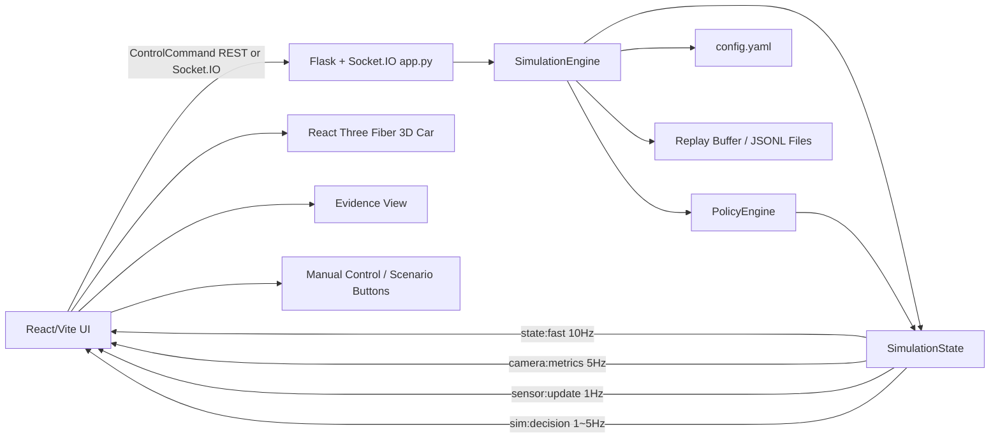
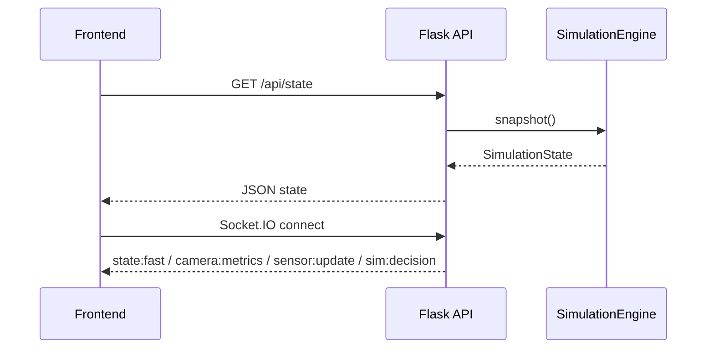
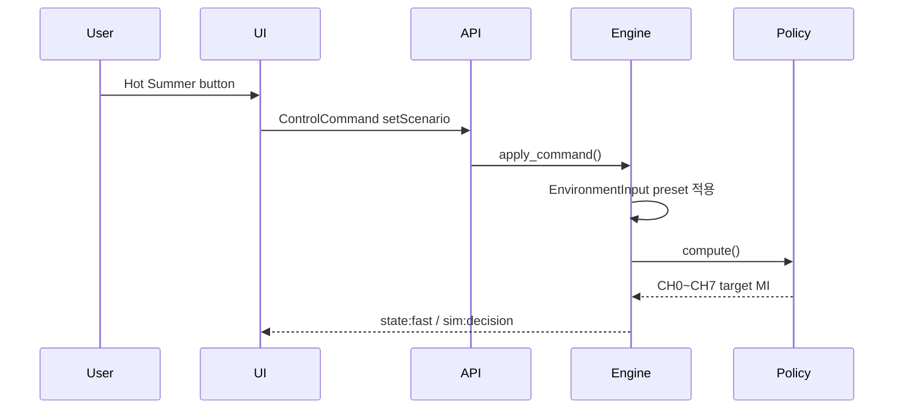
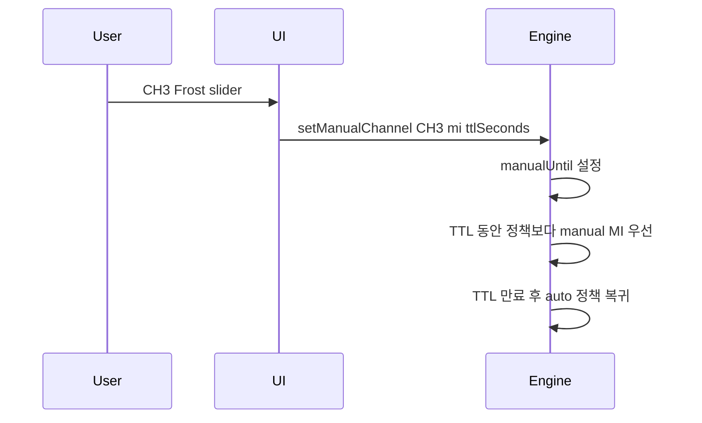

# Simul_Twin V1.0 Architecture Explain

## 1. 문서 목적

이 문서는 `Simul_Twin` 프로그램의 V1.0 아키텍처를 설명한다. `Simul_Twin`은 KUGLASS 능동형 스마트 글라스 모빌리티 프로젝트의 실제 하드웨어 제작 전 단계에서, PDLC 8채널 제어 정책과 시연 흐름을 검증하기 위한 신호 기반 디지털 트윈 시뮬레이터다.

이 프로그램은 정밀 광학/열 물리 엔진이 아니다. 목표는 실제 ESP32, PDLC 필름, 센서, 전력부가 없어도 다음을 미리 검증하는 것이다.

- CH0~CH7 PDLC 채널별 목표 MI와 적용 MI 변화
- 열부하, 차박, 주차, 전면 강광, 360도 손전등 시연 흐름
- 수동 Clear/Frost 조절과 자동 복귀 TTL
- mock 센서 입력 변화에 따른 정책 반응
- replay 저장/불러오기 기반 시연 재현성
- 최종 `/demo` HMI로 발전 가능한 UI 구조

## 2. 전체 구조 요약

`Simul_Twin`은 백엔드 시뮬레이션 엔진과 프론트엔드 3D 대시보드로 나뉜다.

```text
Simul_Twin/
  backend/
    app.py                    Flask + Socket.IO API 서버
    config.yaml               정책/서보/카메라/mock 환경 튜닝값
    simulator/
      config.py               config.yaml 로더와 기본값
      models.py               상태/채널/환경 데이터 모델
      policy.py               PDLC 제어 정책 엔진
      engine.py               시뮬레이션 루프, 명령 처리, replay 관리
    tests/
      test_policy.py          정책, config override, replay 테스트

  frontend/
    src/
      App.tsx                 대시보드 조립
      types.ts                프론트엔드 상태/명령 타입
      lib/socket.ts           REST 초기화 + Socket.IO 상태 구독
      components/
        DigitalTwin.tsx       React Three Fiber 3D 자동차
        EvidencePanel.tsx     카메라/조도/판단 근거 표시
        ControlPanel.tsx      채널 수동 제어와 환경 입력
        ScenarioBar.tsx       시나리오 버튼
        ChannelTable.tsx      8채널 상태 표
        TopBar.tsx            연결/모드/상태 상단 바

  scripts/
    dev.sh                    백엔드 + 프론트엔드 동시 실행
    check.sh                  테스트 + 타입체크 + 빌드 검증

  package.json                루트 실행 스크립트
  .env.example                로컬 환경변수 예시
```

## 3. 런타임 아키텍처



핵심 흐름은 다음과 같다.

1. 사용자가 프론트엔드에서 시나리오 버튼, 슬라이더, 환경 입력을 조작한다.
2. 프론트엔드는 `ControlCommand`를 Socket.IO 또는 REST `/api/command`로 백엔드에 보낸다.
3. `app.py`는 명령을 `SimulationEngine.apply_command()`로 전달한다.
4. `SimulationEngine`은 0.1초마다 `step()`을 실행해 10Hz 제어 루프를 모사한다.
5. `PolicyEngine`은 환경 입력, 차량 모드, 시연 모드, 조도 벡터, 카메라 saturation 값을 바탕으로 CH0~CH7 목표 MI를 계산한다.
6. `SimulationEngine`은 servo rate limit과 fast-attack 규칙을 적용해 `targetMi`를 `appliedMi`로 천천히 또는 빠르게 따라가게 만든다.
7. 백엔드는 상태를 Socket.IO 이벤트로 UI에 내보낸다.
8. UI는 3D 자동차 유리 색/투명도, Evidence View, 채널 표, 상태 배지를 갱신한다.

## 4. 백엔드 계층

### 4.1 `app.py`: API 서버와 상태 스트림 허브

`backend/app.py`는 Flask와 Flask-SocketIO를 사용한다. 역할은 다음 네 가지다.

- HTTP API 제공
- Socket.IO 연결 관리
- `SimulationEngine` 인스턴스 소유
- 시뮬레이션 루프를 백그라운드 task로 실행

주요 REST API는 다음과 같다.

| Method | Path | 역할 |
| --- | --- | --- |
| `GET` | `/health` | mock-only 서비스 상태 확인 |
| `GET` | `/api/state` | 전체 `SimulationState` 조회 |
| `POST` | `/api/command` | 시나리오, 수동 조절, 환경 입력, replay 명령 처리 |
| `GET` | `/api/replay` | 메모리 replay buffer 조회 |
| `GET` | `/api/replay/files` | 저장된 replay JSONL 파일 목록 조회 |
| `POST` | `/api/replay/save` | 현재 replay buffer 저장 |
| `POST` | `/api/replay/load` | 저장된 replay 파일을 메모리 상태로 복원 |

Socket.IO 이벤트는 최종 HMI 구조와 맞춰 다음처럼 분리되어 있다.

| Event | 주기 | 내용 |
| --- | ---: | --- |
| `state:fast` | 10Hz | 차량 모드, 시연 모드, CH0~CH7 상태 |
| `camera:metrics` | 5Hz | 전면 좌/우 saturation, edge density, glare |
| `sensor:update` | 1Hz | 4방향 조도, 상부 조도, 내부/외부 온도 |
| `sim:decision` | 1~5Hz | 정책 판단 이유 문자열 |

### 4.2 `SimulationEngine`: 시뮬레이션 중심 루프

`backend/simulator/engine.py`의 `SimulationEngine`이 프로그램의 중심이다.

책임은 다음과 같다.

- 현재 `SimulationState` 보관
- 10Hz `step()` 실행
- `ControlCommand` 처리
- 수동 override TTL 만료 처리
- 정책 엔진 호출
- target MI를 applied MI로 변환하는 servo 동작 모사
- 카메라 metric mock 계산
- 360도 손전등 시나리오의 시간 변화 입력 생성
- replay buffer 기록, 저장, 로드

`step()`의 처리 순서는 다음과 같다.

```text
demo 입력 갱신
-> manual TTL 만료 확인
-> PolicyEngine.compute()
-> 채널별 targetMi 결정
-> servo rate limit / fast-attack 적용
-> estimatedTransmittance / opticalState 갱신
-> mock cameraMetrics 계산
-> decisionReason 갱신
-> replay buffer 기록
```

### 4.3 `PolicyEngine`: PDLC 정책 계산

`backend/simulator/policy.py`의 `PolicyEngine`은 `Smart_glass_V20_0.md`의 제어 원칙을 신호 기반으로 단순화해 구현한 부분이다.

핵심 정책은 다음과 같다.

- 차박 모드: 모든 채널을 Frost에 가까운 낮은 MI로 이동
- 주차 모드: 모든 채널을 Frost에 가까운 낮은 MI로 이동
- 뜨거운 여름: CH7 -> CH6 -> CH4/CH5 -> CH2/CH3 -> CH0/CH1 순으로 더 많이 산란
- 전면 강광: CH0/CH1 fast-attack 적용
- 주행 모드: CH0/CH1 등 시야 관련 채널에 visibility floor 적용
- 360도 손전등: 4방향 조도 벡터의 방위각과 가까운 유리 채널을 우선 산란

정책 엔진은 다음 주요 입력을 사용한다.

- `vehicleMode`: `driving`, `stopped`, `camping`, `parked`
- `demoMode`: `none`, `hot_summer`, `camping`, `parked`, `camera_saturation`, `flashlight_360`
- `EnvironmentInput`: 조도, 온도, saturation, edge density
- `CHANNEL_CONFIGS`: 각 채널의 위치, 역할, 방위각, visibility floor

### 4.4 `config.yaml`: 튜닝값 분리

`backend/config.yaml`은 제어 정책 값을 코드 밖으로 분리한다. 이 파일을 수정하면 재빌드 없이 백엔드 재시작만으로 정책 감도를 바꿀 수 있다.

주요 섹션은 다음과 같다.

| Section | 역할 |
| --- | --- |
| `policy` | 기본 MI, 차박/주차 MI, 전면 강광 threshold |
| `thermal` | 열부하 risk 계산과 채널별 열 차광 강도 |
| `directional` | 방향성 조도 벡터 confidence와 angular kernel |
| `servo` | fast-attack, Frost 방향, Clear 방향 응답 속도 |
| `camera` | mock saturation 감소와 edge 손실 계수 |
| `flashlight` | 360도 손전등 mock 입력 속도와 세기 |

`backend/simulator/config.py`는 외부 패키지 없이 사용할 수 있는 작은 YAML-subset parser를 제공한다. 따라서 PyYAML이 없어도 기본 설정 로딩이 가능하다.

### 4.5 `models.py`: 상태 계약

`backend/simulator/models.py`는 백엔드 내부 상태와 프론트엔드로 전달되는 데이터 구조의 기준이다.

핵심 모델은 다음과 같다.

```text
ChannelState
  channel
  name
  targetMi
  appliedMi
  estimatedTransmittance
  opticalState
  fault
  manualUntil

EnvironmentInput
  frontLux
  rightLux
  rearLux
  leftLux
  topLux
  internalTemp
  weatherTemp
  frontLeftSaturation
  frontRightSaturation
  edgeDensity

SimulationState
  schemaVersion
  vehicleMode
  demoMode
  environment
  channels
  cameraMetrics
  decisionReason
  timestamp
```

프론트엔드의 `frontend/src/types.ts`도 같은 구조를 TypeScript 타입으로 다시 정의한다.

## 5. 프론트엔드 계층

프론트엔드는 React + TypeScript + Vite 기반이다. 3D 시각화에는 React Three Fiber와 three.js를 사용한다.

### 5.1 `App.tsx`: 화면 조립

`frontend/src/App.tsx`는 전체 화면을 조립한다.

구성은 다음과 같다.

```text
TopBar
Dashboard Grid
  DigitalTwin
  EvidencePanel
  ControlPanel
  ChannelTable
ScenarioBar
```

`DigitalTwin`은 lazy-load된다. 초기 로딩 시 3D/three.js chunk를 바로 불러오지 않아 기본 UI bundle을 줄인다.

### 5.2 `socket.ts`: 상태 동기화

`frontend/src/lib/socket.ts`는 백엔드 연결을 담당한다.

동작 방식은 다음과 같다.

1. 앱 시작 시 `/api/state`를 한 번 fetch해서 초기 상태를 받는다.
2. Socket.IO에 연결한다.
3. `state:fast`, `camera:metrics`, `sensor:update`, `sim:decision` 이벤트를 구독한다.
4. 수신한 event별로 React state의 필요한 부분만 갱신한다.
5. 명령 전송 시 Socket.IO가 연결되어 있으면 `command` 이벤트를 사용하고, 연결 전이면 REST `/api/command`를 fallback으로 사용한다.

### 5.3 `DigitalTwin.tsx`: 저폴리 3D 자동차

`DigitalTwin`은 외부 GLB/STL 없이 코드로 만든 저폴리 자동차다.

구성은 다음과 같다.

- 차체: box geometry
- 캐빈: box geometry
- 바퀴: box geometry 기반 단순 표현
- 전조등: 작은 box geometry
- 유리 8개: CH0~CH7에 대응하는 개별 mesh

각 유리 mesh는 `appliedMi`에 따라 opacity와 색이 바뀐다.

- MI가 높을수록 Clear에 가까움
- MI가 낮을수록 Frost에 가까움
- 선택된 채널은 강조 색으로 표시

### 5.4 `EvidencePanel.tsx`: 판단 근거 표시

Evidence View는 단순히 그래프를 보여주는 영역이 아니라, 심사/시연에서 "시스템이 무엇을 보고 왜 반응했는지" 설명하는 영역이다.

표시 항목은 다음과 같다.

- mock camera frame
- 좌/우 ROI saturation
- edge retention
- glare index
- before/after saturation 비교
- saturation reduction
- 방향성 조도 벡터 compass
- front/right/rear/left/top lux 값
- 정책 판단 이유 문장

### 5.5 `ControlPanel.tsx`: 수동 제어와 환경 조절

Control Panel은 다음 기능을 제공한다.

- 선택 채널 변경
- 선택 채널 Clear <-> Frost 수동 조절
- 15초 TTL manual override
- Return Auto
- replay buffer 저장
- mock weather/internal temperature 조절
- front/top lux 조절

수동 조절은 `setManualChannel` 명령으로 백엔드에 전달된다. 백엔드는 해당 채널의 `manualUntil`을 설정하고, TTL이 끝나면 자동 정책으로 복귀한다.

### 5.6 `ScenarioBar.tsx`: 시연 모드 전환

하단 시나리오 버튼은 다음 모드를 제공한다.

| UI Label | `demoMode` | 의미 |
| --- | --- | --- |
| Hot Summer | `hot_summer` | 열부하 우선순위 검증 |
| Camping | `camping` | 차박 프라이버시 |
| Parked | `parked` | 주차/도난방지 불투명 |
| Front Glare | `camera_saturation` | 전면 강광 fast-attack |
| 360 Flashlight | `flashlight_360` | 방향성 조도 벡터 기반 반응 |
| Baseline | `none` | 기본 주행 상태 |

## 6. 데이터 흐름 상세

### 6.1 앱 시작



### 6.2 시나리오 변경



### 6.3 수동 슬라이더 제어



## 7. Replay 구조

Replay는 시뮬레이션의 최근 상태들을 JSONL로 저장/복원하기 위한 기능이다.

메모리 replay buffer는 `SimulationEngine._replay`에 유지된다. 5 frame마다 상태 snapshot 일부가 기록되고, 최대 600개 이벤트만 유지한다.

저장 경로 기본값은 다음과 같다.

```text
backend/data/replays/
```

이 디렉터리는 `.gitignore`에 포함되어 있다. replay는 실험 결과물이므로 필요할 때만 별도로 보관하면 된다.

Replay API는 다음 두 방식으로 사용할 수 있다.

- UI의 `Save Replay Buffer` 버튼
- REST API: `/api/replay/save`, `/api/replay/load`

## 8. 실행과 검증

### 8.1 개발 서버 실행

```bash
cd Simul_Twin
sh scripts/dev.sh
```

기본 포트는 다음과 같다.

| Service | URL |
| --- | --- |
| Frontend | `http://localhost:5173` |
| Backend | `http://127.0.0.1:5050` |

로컬 설정은 `.env.example`을 `.env`로 복사해서 바꿀 수 있다.

### 8.2 전체 검증

```bash
cd Simul_Twin
sh scripts/check.sh
```

검증 내용은 다음과 같다.

- 백엔드 pytest
- 프론트엔드 TypeScript typecheck
- Vite production build

### 8.3 테스트 범위

현재 테스트는 `backend/tests/test_policy.py`에 있다.

검증하는 항목은 다음과 같다.

- Hot Summer에서 열부하 우선순위가 CH7 -> CH6 -> CH4/5 -> CH2/3 -> CH0/1 방향으로 동작하는지
- Camping/Parked에서 전 채널 Frost target이 되는지
- Front glare에서 CH0 fast-attack과 visibility floor가 함께 유지되는지
- Manual override가 TTL 이후 자동 복귀하는지
- 조도 센서 일부 값이 `None`이어도 정책이 계속 동작하는지
- `config.yaml` override가 정책 target에 반영되는지
- replay 저장/로드 roundtrip이 가능한지

## 9. 안전 경계

`Simul_Twin`은 mock-only 시뮬레이터다.

명시적으로 하지 않는 일은 다음과 같다.

- ESP32로 serial command를 보내지 않는다.
- 실제 PDLC 전력부를 제어하지 않는다.
- 실제 카메라, VEML7700, 온도센서를 읽지 않는다.
- 실제 차량 안전 판단 장치로 사용하지 않는다.

따라서 `Simul_Twin`은 알고리즘, UI, 시연 흐름, 상태 계약 검증용 도구이며, 하드웨어 제어 프로그램은 별도 계층에서 구현해야 한다.

## 10. 현재 한계와 개선 방향

V1.0은 시뮬레이터의 골격과 주요 정책 검증에 초점을 둔다. 남아 있는 개선 방향은 다음과 같다.

1. WebSocket 안정화
   - 현재 개발 서버는 Flask/Werkzeug 기반이다.
   - 환경에 따라 websocket 연결이 polling fallback으로 동작할 수 있다.
   - 장시간 실사용 시 eventlet/gevent 또는 별도 ASGI 구조 검토가 필요하다.

2. Replay UI 확장
   - 저장 기능은 UI에 있지만, 파일 목록/로드 UI는 아직 단순 API 중심이다.
   - `/logs` 또는 Replay panel을 만들면 시연 준비에 더 유용하다.

3. 3D 모델 교체 가능성
   - 현재 모델은 코드 기반 저폴리 차체다.
   - 나중에 GLB/STL 기반 실제 아이오닉5 형태로 교체할 수 있다.
   - 단, CH0~CH7 유리 mesh 이름/매핑 규칙은 유지해야 한다.

4. 물리 근사 모델 고도화
   - 현재 열/광학 모델은 정책 검증용 근사치다.
   - 실제 PDLC 실측 LUT, 온도 상승률 실험값, 조도센서 calibration 결과를 반영하면 시뮬레이션 신뢰도가 올라간다.

5. 백엔드/프론트엔드 타입 단일화
   - 현재 Python dataclass와 TypeScript interface를 각각 유지한다.
   - 추후 JSON Schema 또는 OpenAPI를 도입하면 상태 계약 drift를 줄일 수 있다.

## 11. 핵심 설계 의도

이 프로그램의 가장 중요한 설계 의도는 "3D 화면을 예쁘게 보여주는 것"이 아니라, 실제 제작 전에 제어 정책과 시연 전략을 빠르게 검증하는 것이다.

따라서 아키텍처는 다음 원칙을 따른다.

- 정책 계산은 백엔드 Python에 둔다.
- UI는 상태를 직접 판단하지 않고, 백엔드 상태를 시각화한다.
- manual override는 TTL이 있어 자동 정책으로 복귀한다.
- replay는 시연 재현성과 알고리즘 튜닝을 돕는다.
- 모든 출력은 mock이며 실제 하드웨어와 분리한다.
- config 값을 파일로 분리해 실험 반복 속도를 높인다.

이 구조를 유지하면 `Simul_Twin`은 최종 Raspberry Pi control/UI 구조의 원형으로도 사용할 수 있고, 동시에 하드웨어 제작 전 알고리즘 검증용 도구로도 계속 확장할 수 있다.
