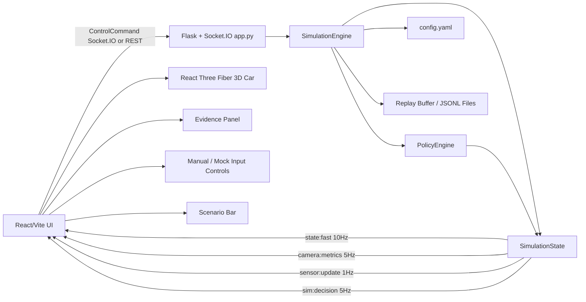
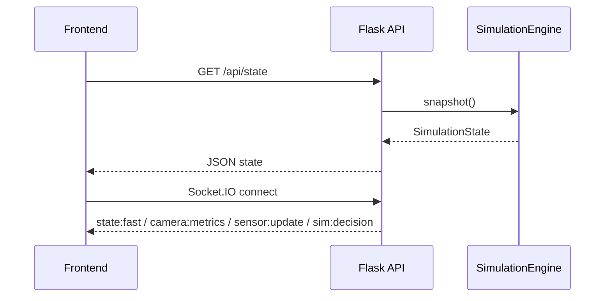
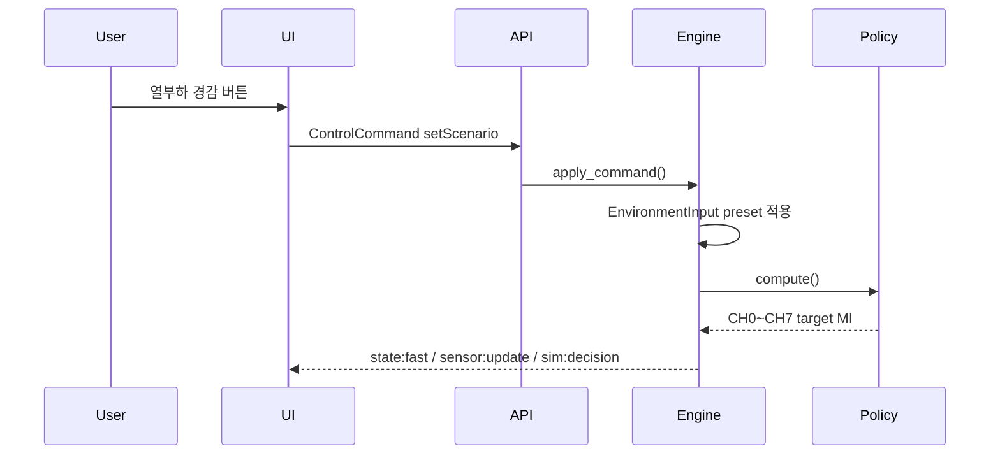
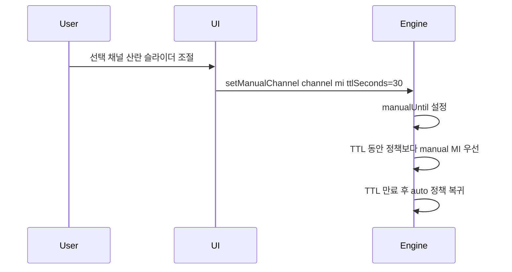
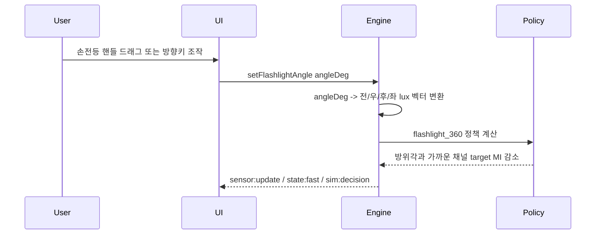

# Simul_Twin_V1_0 Explain

## 1. 문서 목적

이 문서는 현재 프로젝트 버전인 `Simul_Twin_V1_0`의 구조와 동작 방식을 설명한다. `Simul_Twin_V1_0`은 KUGLASS 능동형 스마트 글라스 모빌리티 프로젝트에서 실제 하드웨어가 완성되기 전, PDLC 8채널 제어 정책과 시연 흐름을 검증하기 위한 mock-only 디지털 트윈 시뮬레이터다.

이 프로그램은 정밀 광학/열 물리 엔진이 아니다. 목표는 ESP32, PDLC 필름, 실제 카메라, VEML7700 조도센서, 전력부 없이도 다음 항목을 빠르게 확인하는 것이다.

- CH0~CH7 PDLC 채널별 목표 MI와 적용 MI 변화
- 열부하 경감, 차박 프라이버시, 주차 도난방지, 강한 역광, 360도 손전등 시연 흐름
- 수동 Clear/Frost 조절과 자동 복귀 TTL
- mock 온도/조도/카메라 입력 변화에 따른 정책 반응
- replay 저장/로드 기반 시연 재현성
- 최종 `/demo` HMI로 발전 가능한 UI, 상태 계약, 명령 구조

## 2. 전체 구조

`Simul_Twin_V1_0`은 백엔드 시뮬레이션 서비스와 프론트엔드 대시보드로 구성된다.

```text
Simul_Twin/
  backend/
    app.py                    Flask + Socket.IO API 서버
    config.yaml               정책/서보/카메라/mock 입력 튜닝값
    requirements.txt          백엔드 의존성
    simulator/
      config.py               config.yaml 로더와 기본 정책값
      models.py               상태/채널/환경 데이터 모델
      policy.py               PDLC 제어 정책 엔진
      engine.py               시뮬레이션 루프, 명령 처리, replay 관리
    tests/
      test_policy.py          정책, 수동 TTL, config, replay 테스트

  frontend/
    index.html
    package.json
    vite.config.ts
    src/
      App.tsx                 대시보드 화면 조립
      main.tsx                React entry
      types.ts                프론트엔드 상태/명령 타입
      lib/
        socket.ts             REST 초기화 + Socket.IO 상태 구독
        defaultState.ts       초기 mock 상태
        labels.ts             한국어 라벨, 퍼센트, 조도 방위 계산
      components/
        DigitalTwin.tsx       3D 자동차, 채널 선택, 360도 손전등 상단 뷰
        EvidencePanel.tsx     카메라/조도/판단 근거 표시
        ControlPanel.tsx      채널 수동 제어와 mock 입력 조절
        ScenarioBar.tsx       시연 시나리오 버튼
        ChannelTable.tsx      8채널 상태 표
        TopBar.tsx            연결/모드/수동 TTL/Fault 상태 표시

  scripts/
    dev.sh                    백엔드 + 프론트엔드 동시 실행
    check.sh                  pytest + typecheck + build 검증

  package.json                루트 실행 스크립트
  README.md                   실행 요약
  .env.example                로컬 환경변수 예시
```

## 3. 런타임 아키텍처



핵심 흐름은 다음과 같다.

1. 사용자가 프론트엔드에서 시나리오 버튼, 채널 버튼, 수동 슬라이더, mock 입력 슬라이더, 360도 손전등 각도 조작을 수행한다.
2. 프론트엔드는 `ControlCommand`를 Socket.IO `command` 이벤트로 보낸다. 연결 전이면 REST `/api/command`로 fallback한다.
3. `backend/app.py`는 명령을 `SimulationEngine.apply_command()`로 전달한다.
4. `SimulationEngine`은 0.1초마다 `step()`을 실행해 10Hz 제어 루프를 모사한다.
5. `PolicyEngine`은 환경 입력, 차량 모드, 시연 모드, 조도 벡터, 카메라 saturation 값을 기반으로 CH0~CH7 목표 MI를 계산한다.
6. `SimulationEngine`은 servo rate limit과 fast-attack 규칙을 적용해 `targetMi`를 `appliedMi`가 따라가게 만든다.
7. 백엔드는 상태를 Socket.IO 이벤트로 UI에 내보낸다.
8. UI는 3D 자동차 유리, 판단 근거 패널, 제어 패널, 채널 표, 상단 상태 배지를 갱신한다.

## 4. 백엔드 계층

### 4.1 `app.py`: API 서버와 상태 스트림 허브

`backend/app.py`는 Flask와 Flask-SocketIO를 사용한다. 역할은 다음 네 가지다.

- HTTP API 제공
- Socket.IO 연결 관리
- `SimulationEngine` 인스턴스 소유
- 시뮬레이션 루프를 백그라운드 task로 실행

프론트엔드 production build가 `frontend/dist`에 있으면 `/` 경로에서 정적 파일을 제공한다. build가 없으면 백엔드 상태와 프론트엔드 실행 힌트를 JSON으로 반환한다.

주요 REST API는 다음과 같다.

| Method | Path | 역할 |
| --- | --- | --- |
| `GET` | `/health` | mock-only 서비스 상태 확인 |
| `GET` | `/api/state` | 전체 `SimulationState` 조회 |
| `POST` | `/api/command` | 시나리오, 수동 조절, 환경 입력, replay 명령 처리 |
| `GET` | `/api/replay` | 메모리 replay buffer 조회 |
| `GET` | `/api/replay/files` | 저장된 replay JSONL 파일 목록 조회 |
| `POST` | `/api/replay/save` | 현재 replay buffer 저장 |
| `POST` | `/api/replay/load` | 저장된 replay 파일을 메모리 상태로 복원 |

Socket.IO 이벤트는 다음처럼 분리되어 있다.

| Event | 주기 | 내용 |
| --- | ---: | --- |
| `state:fast` | 10Hz | `schemaVersion`, 차량 모드, 시연 모드, CH0~CH7 상태, timestamp |
| `camera:metrics` | 5Hz | 전면 좌/우 saturation, edge density, glare, frame id |
| `sensor:update` | 1Hz | 전후좌우/상부 조도, 내부/외부 온도, 카메라 입력값 |
| `sim:decision` | 5Hz | 정책 판단 이유 문자열 |

### 4.2 `SimulationEngine`: 중심 루프와 명령 처리

`backend/simulator/engine.py`의 `SimulationEngine`이 프로그램의 중심이다.

책임은 다음과 같다.

- 현재 `SimulationState` 보관
- 10Hz `step()` 실행
- `ControlCommand` 처리
- 수동 override TTL 만료 처리
- 정책 엔진 호출
- `targetMi`를 `appliedMi`로 변환하는 servo 동작 모사
- mock camera metric 계산
- 360도 손전등의 수동 각도 입력을 전후좌우 조도 벡터로 변환
- replay buffer 기록, 저장, 로드

`step()`의 처리 순서는 다음과 같다.

```text
demo 입력 확인
-> manual TTL 만료 확인
-> PolicyEngine.compute()
-> 채널별 targetMi 결정
-> servo rate limit / fast-attack 적용
-> estimatedTransmittance / opticalState 갱신
-> mock cameraMetrics 계산
-> decisionReason 갱신
-> replay buffer 기록
```

현재 360도 손전등 시연은 자동 회전이 아니라 사용자가 UI에서 방위각을 직접 조작하는 방식이다. `setFlashlightAngle` 명령이 들어오면 방위각을 저장하고, 그 각도에 맞춰 전방/우측/후방/좌측 mock lux 값을 즉시 재계산한다.

### 4.3 `ControlCommand`

백엔드가 처리하는 명령은 프론트엔드 `types.ts`와 같은 계약을 따른다.

| Command | 주요 필드 | 역할 |
| --- | --- | --- |
| `setManualChannel` | `channel`, `mi`, `ttlSeconds` | 선택 채널의 target MI를 TTL 동안 수동 고정 |
| `returnAuto` | `channel?` | 특정 채널 또는 전체 채널을 자동 정책으로 복귀 |
| `setScenario` | `demoMode` | 시연 모드와 해당 preset 환경 입력 적용 |
| `setFlashlightAngle` | `angleDeg` | 360도 손전등 방위각을 수동 지정 |
| `setEnvironment` | `environment` | mock 온도/조도/카메라 입력 일부 갱신 |
| `setChannelFault` | `channel`, `fault` | 선택 채널 구동기 고장 주입 또는 해제 |
| `resetFault` | 없음 | 채널 fault flag 초기화 |
| `saveReplay` | `name?` | 메모리 replay buffer 저장 |
| `loadReplay` | `name` | 저장된 replay를 메모리와 현재 상태로 복원 |

프론트엔드 수동 슬라이더는 `ttlSeconds: 30`을 보낸다. 엔진 자체의 기본 TTL fallback은 명령에서 TTL을 생략했을 때 15초다.

### 4.4 `PolicyEngine`: PDLC 정책 계산

`backend/simulator/policy.py`의 `PolicyEngine`은 `Smart_glass_V20_0.md`의 제어 원칙을 신호 기반으로 단순화해 구현한 부분이다.

핵심 정책은 다음과 같다.

- 차박 모드: 모든 채널을 최저 투명도에 가까운 산란 상태로 이동
- 주차 모드: 모든 채널을 최대 불투명에 가깝게 유지
- 열부하 경감: CH7 선루프 -> CH6 후면 -> CH4/5 후석 -> CH2/3 전석 도어 -> CH0/1 전면 순으로 산란 강도 차등 적용
- 전면 강광: CH0/CH1에 fast-attack 적용
- 주행 모드: 채널별 `visibility_floor` 아래로 내려가지 않도록 제한
- 방향성 조도: 전후좌우 lux 벡터의 방위각과 가까운 유리 채널의 목표 MI를 낮춤
- 360도 손전등: 수동 방위각으로 만든 조도 벡터를 기준으로 가까운 유리부터 산란

정책 엔진은 다음 주요 입력을 사용한다.

- `vehicleMode`: `driving`, `stopped`, `camping`, `parked`
- `demoMode`: `none`, `hot_summer`, `camping`, `parked`, `camera_saturation`, `flashlight_360`
- `EnvironmentInput`: 조도, 온도, saturation, edge density
- `CHANNEL_CONFIGS`: 각 채널의 이름, 역할, 방위각, visibility floor
- `config.yaml`: 정책 threshold, servo rate, 열부하/방향성/카메라 계수

### 4.5 `config.yaml`: 튜닝값 분리

`backend/config.yaml`은 제어 정책 값을 코드 밖으로 분리한다. 이 파일을 수정하면 재빌드 없이 백엔드 재시작만으로 정책 감도를 바꿀 수 있다.

주요 섹션은 다음과 같다.

| Section | 역할 |
| --- | --- |
| `policy` | 기본 Clear MI, 차박/주차 MI, 전면 강광 threshold, CH0/CH1 glare target |
| `thermal` | 열부하 risk 계산과 채널별 열 차광 강도 |
| `directional` | 4방향 조도 벡터 confidence와 angular kernel |
| `servo` | fast-attack, Frost 방향, Clear 방향 응답 속도 |
| `camera` | mock saturation 감소와 edge 손실 계수 |
| `flashlight` | 360도 손전등 mock lux 강도와 채널 산란 계수 |

`backend/simulator/config.py`는 외부 패키지 없이 사용할 수 있는 작은 YAML-subset parser를 제공한다. 따라서 PyYAML이 없어도 기본 설정 로딩과 override 테스트가 가능하다.

### 4.6 `models.py`: 상태 계약

`backend/simulator/models.py`는 백엔드 내부 상태와 프론트엔드로 전달되는 데이터 구조의 기준이다.

핵심 모델은 다음과 같다.

```text
ChannelState
  channel
  name
  targetMi
  appliedMi
  estimatedTransmittance
  opticalState
  fault
  manualUntil

EnvironmentInput
  frontLux
  rightLux
  rearLux
  leftLux
  topLux
  internalTemp
  weatherTemp
  frontLeftSaturation
  frontRightSaturation
  edgeDensity

CameraMetrics
  frontLeftSaturation
  frontRightSaturation
  edgeDensity
  glare
  frameId
  timestamp

SimulationState
  schemaVersion
  vehicleMode
  demoMode
  environment
  channels
  cameraMetrics
  decisionReason
  timestamp
```

프론트엔드의 `frontend/src/types.ts`도 같은 구조를 TypeScript 타입으로 다시 정의한다.

## 5. 프론트엔드 계층

프론트엔드는 React + TypeScript + Vite 기반이다. 3D 시각화에는 React Three Fiber와 three.js를 사용하고, 아이콘은 lucide-react를 사용한다.

### 5.1 `App.tsx`: 화면 조립

`frontend/src/App.tsx`는 전체 화면을 조립한다.

구성은 다음과 같다.

```text
TopBar
Dashboard Grid
  DigitalTwin
  EvidencePanel
  ControlPanel
  ChannelTable
ScenarioBar
```

`DigitalTwin`은 lazy-load된다. 초기 로딩 시 3D/three.js chunk를 바로 불러오지 않아 기본 UI bundle을 줄인다.

### 5.2 `socket.ts`: 상태 동기화

`frontend/src/lib/socket.ts`는 백엔드 연결을 담당한다.

동작 방식은 다음과 같다.

1. 앱 시작 시 `/api/state`를 한 번 fetch해서 초기 상태를 받는다.
2. Socket.IO에 연결한다.
3. `state:fast`, `camera:metrics`, `sensor:update`, `sim:decision` 이벤트를 구독한다.
4. 수신한 event별로 React state의 필요한 부분만 갱신한다.
5. 명령 전송 시 Socket.IO가 연결되어 있으면 `command` 이벤트를 사용하고, 연결 전이면 REST `/api/command`를 fallback으로 사용한다.

기본 백엔드 URL은 `http://localhost:5050`이며, `VITE_BACKEND_URL` 환경변수로 바꿀 수 있다.

### 5.3 `DigitalTwin.tsx`: 3D 자동차와 360도 손전등 뷰

`DigitalTwin`은 아이오닉 5 GLB 모델과 코드에서 생성한 CH0~CH7 PDLC 필름 mesh를 함께 사용한다.

구성은 다음과 같다.

- 차체/바퀴/램프: `frontend/public/models`의 아이오닉 5 GLB와 texture
- 유리 8개: CH0~CH7에 대응하는 개별 PDLC film mesh
- 각 film mesh를 채널별 투영 방향으로 실제 차량 surface에 ray projection
- 삼각형 subdivision과 약 6mm 시각 gap으로 곡면 추종 및 z-fighting 방지
- 수평 회전 슬라이더와 드래그 회전
- 8채널 범례 버튼
- `flashlight_360` 모드에서 나타나는 360도 손전등 상단 뷰

각 유리 mesh는 차량과 함께 회전하며 `appliedMi`에 따라 opacity, roughness, transmission, haze가 바뀐다. 평면을 차체 근처에 단순 배치하지 않고 GLB의 실제 삼각형 surface에 투영하므로 전면·측면·후면·선루프 필름이 차체 형상에 밀착된다.

- MI가 높을수록 Clear에 가까움
- MI가 낮을수록 Frost에 가까움
- 선택된 채널은 3D 유리 색상을 바꾸지 않는다. 채널 선택은 상단 설명, 제어 패널, 채널 표, 범례 상태를 연결하기 위한 UI 상태다.

360도 손전등 상단 뷰는 다음 기능을 제공한다.

- 원형 궤도 위 손전등 핸들 드래그
- 좌/우 방향키로 방위각 5도 단위 조절
- `setFlashlightAngle` 명령 전송
- 전방/우측/후방/좌측 lux readout 표시
- 상단 뷰의 CH0~CH7 버튼으로 채널 선택

### 5.4 `EvidencePanel.tsx`: 판단 근거 표시

Evidence Panel은 단순 그래프가 아니라, 시연 중 "시스템이 무엇을 보고 왜 반응했는지" 설명하는 영역이다.

표시 항목은 다음과 같다.

- mock camera frame
- 좌/우 ROI saturation
- 산란 개입 후 포화
- Edge 보존
- 강광 지표
- 산란 미개입 대비 산란 개입 saturation 비교
- saturation 감소율
- 방향성 조도 벡터 compass
- front/right/rear/left/top lux 값
- 정책 판단 이유 문장

카메라 지표는 실제 카메라 입력이 아니라 `EnvironmentInput`과 전면 채널의 `appliedMi`로 계산한 mock metric이다.

### 5.5 `ControlPanel.tsx`: 수동 제어와 환경 조절

Control Panel은 다음 기능을 제공한다.

- 선택 채널 변경
- 선택 채널의 Clear <-> Frost 수동 조절
- 30초 TTL manual override
- 선택 채널 자동 정책 복귀
- replay buffer 저장
- mock 외기온/내부온도 조절
- mock 전방/우측/후방/좌측/상부 조도 조절
- 선택 채널 구동기 고장 주입과 해제
- 전방/우측/후방/좌측/상부 조도 센서 결측 주입과 원래 값 복구

수동 조절은 `setManualChannel` 명령으로 백엔드에 전달된다. 백엔드는 해당 채널의 `manualUntil`을 설정하고, TTL이 끝나면 자동 정책으로 복귀한다.

### 5.6 `ChannelTable.tsx`: 채널 상태 표

Channel Table은 CH0~CH7의 현재 상태를 버튼형 행으로 보여준다.

각 행은 다음 정보를 표시한다.

- 채널 번호
- 광학 상태: 투명, 중간 산란, 강산란
- 적용 MI
- 추정 투과율

행을 클릭하면 선택 채널이 바뀌고, Control Panel과 DigitalTwin의 선택 상태가 함께 갱신된다.

### 5.7 `TopBar.tsx`: 상단 상태

TopBar는 다음 정보를 표시한다.

- 브랜드/프로그램명
- MOCK 연결 또는 MOCK 오프라인
- 차량 모드와 시연 모드
- 자동 정책 또는 수동 TTL 상태
- fault flag 초기화 버튼

현재 `Simul_Twin_V1_0`은 검증 도구에서 mock 구동기 fault를 주입할 수 있다. fault 채널은 `appliedMi = 0`의 fail-safe 산란 상태로 전환되고, 3D 필름과 채널 표에 고장 상태가 표시된다. 개별 해제 또는 TopBar의 전체 reset으로 자동 정책에 복귀한다.

### 5.8 `ScenarioBar.tsx`: 시연 모드 전환

하단 시나리오 버튼은 다음 모드를 제공한다.

| UI Label | `demoMode` | 의미 |
| --- | --- | --- |
| 열부하 경감 | `hot_summer` | 상부/후방/후석 우선 열부하 시연 |
| 차박 프라이버시 | `camping` | 전 채널 산란 |
| 주차 도난방지 | `parked` | 불투명 유지 |
| 강한 역광 | `camera_saturation` | 전면 강광 fast-attack과 AE 보조 시연 |
| 360° 손전등 | `flashlight_360` | 방향성 조도 벡터 기반 채널 반응 |
| 기본 상태 | `none` | 투명 기준 주행 상태 |

## 6. 데이터 흐름 상세

### 6.1 앱 시작



### 6.2 시나리오 변경



### 6.3 수동 슬라이더 제어



### 6.4 360도 손전등 각도 조작



## 7. Replay 구조

Replay는 시뮬레이션의 최근 상태들을 JSONL로 저장/복원하기 위한 기능이다.

메모리 replay buffer는 `SimulationEngine._replay`에 유지된다. 5 frame마다 상태 snapshot 일부가 기록되고, 최대 600개 이벤트만 유지한다.

저장 경로 기본값은 다음과 같다.

```text
backend/data/replays/
```

이 디렉터리는 `.gitignore`에 포함되어 있다. replay는 실험 결과물이므로 필요할 때만 별도로 보관하면 된다.

Replay API는 다음 방식으로 사용할 수 있다.

- UI의 `리플레이 저장` 버튼
- REST API: `/api/replay`, `/api/replay/files`, `/api/replay/save`, `/api/replay/load`
- Socket.IO 또는 REST command: `saveReplay`, `loadReplay`

현재 UI에는 저장 버튼만 있고, 저장된 파일 목록과 로드 UI는 별도 패널로 확장할 수 있는 상태다.

## 8. 실행과 검증

### 8.1 개발 서버 실행

```bash
cd Simul_Twin
sh scripts/dev.sh
```

기본 포트는 다음과 같다.

| Service | URL |
| --- | --- |
| Frontend | `http://localhost:5173` |
| Backend | `http://127.0.0.1:5050` |

로컬 설정은 `.env.example`을 `.env`로 복사해서 바꿀 수 있다.

관련 환경변수는 다음과 같다.

| Variable | 기본값 | 역할 |
| --- | --- | --- |
| `SIMUL_TWIN_HOST` | `127.0.0.1` | 백엔드 bind host |
| `SIMUL_TWIN_PORT` | `5050` | 백엔드 port |
| `SIMUL_TWIN_DEBUG` | `0` | Flask debug 여부 |
| `VITE_BACKEND_URL` | `http://localhost:5050` | 프론트엔드가 접속할 백엔드 URL |

### 8.2 전체 검증

```bash
cd Simul_Twin
sh scripts/check.sh
```

검증 내용은 다음과 같다.

- 백엔드 pytest
- 프론트엔드 TypeScript typecheck
- Vite production build

루트 `package.json`에서는 다음 스크립트도 제공한다.

```bash
cd Simul_Twin
npm run build
npm run test
```

### 8.3 테스트 범위

현재 테스트는 `backend/tests/test_policy.py`에 있다.

검증하는 항목은 다음과 같다.

- 열부하 경감 시나리오에서 열부하 우선순위가 CH7 -> CH6 -> CH4/5 -> CH2/3 -> CH0/CH1 방향으로 동작하는지
- 차박/주차 시나리오에서 전 채널 Frost target이 되는지
- 강한 역광 시나리오에서 CH0 fast-attack과 driving visibility floor가 함께 유지되는지
- 수동 override가 TTL 이후 자동 복귀하는지
- 조도 센서 일부 값이 `None`이어도 정책이 계속 동작하는지
- 360도 손전등 시연에서 수동 각도 입력이 자동 회전 없이 유지되는지
- `config.yaml` override가 정책 target에 반영되는지
- replay 저장/로드 roundtrip이 가능한지

## 9. 안전 경계

`Simul_Twin_V1_0`은 mock-only 시뮬레이터다.

명시적으로 하지 않는 일은 다음과 같다.

- ESP32로 serial command를 보내지 않는다.
- 실제 PDLC 전력부를 제어하지 않는다.
- 실제 카메라, VEML7700, 온도센서를 읽지 않는다.
- 실제 차량 안전 판단 장치로 사용하지 않는다.

따라서 `Simul_Twin_V1_0`은 알고리즘, UI, 시연 흐름, 상태 계약 검증용 도구이며, 하드웨어 제어 프로그램은 별도 계층에서 구현해야 한다.

## 10. 현재 한계와 개선 방향

V1.0은 시뮬레이터의 골격과 주요 정책 검증에 초점을 둔다. 남아 있는 개선 방향은 다음과 같다.

1. WebSocket 운영 안정화
   - 현재 개발 서버는 Flask/Werkzeug + Socket.IO threading 모드다.
   - 환경에 따라 websocket 연결이 polling fallback으로 동작할 수 있다.
   - 장시간 실사용 시 eventlet/gevent 또는 별도 ASGI 구조 검토가 필요하다.

2. Replay UI 확장
   - 저장 기능은 UI에 있지만, 파일 목록/로드 UI는 아직 API 중심이다.
   - `/logs` 또는 Replay panel을 만들면 시연 준비와 비교 검증에 더 유용하다.

3. 3D 모델 정밀화
   - 현재 아이오닉 5 GLB 위에 CH0~CH7 필름을 runtime projection한다.
   - 향후 유리별 mesh가 분리된 CAD/GLB를 사용하면 ray projection 없이 원본 유리 topology를 직접 복제할 수 있다.
   - 모델 교체 시 채널별 초기 영역과 투영 방향은 새 차체 형상에 맞춰 보정해야 한다.

4. 물리 근사 모델 고도화
   - 현재 열/광학 모델은 정책 검증용 근사치다.
   - 실제 PDLC 실측 LUT, 온도 상승률 실험값, 조도센서 calibration 결과를 반영하면 시뮬레이션 신뢰도가 올라간다.

5. 백엔드/프론트엔드 타입 단일화
   - 현재 Python dataclass와 TypeScript interface를 각각 유지한다.
   - 추후 JSON Schema 또는 OpenAPI를 도입하면 상태 계약 drift를 줄일 수 있다.

6. 360도 손전등 자동 시연 옵션
   - 현재 V1.0은 사용자가 각도를 직접 조작하는 방식이다.
   - `config.yaml`에는 `angular_speed_deg_s` 값이 남아 있으므로, 추후 자동 회전 데모를 다시 켜는 옵션으로 확장할 수 있다.

## 11. 핵심 설계 의도

이 프로그램의 가장 중요한 설계 의도는 "3D 화면을 예쁘게 보여주는 것"이 아니라, 실제 제작 전에 제어 정책과 시연 전략을 빠르게 검증하는 것이다.

따라서 아키텍처는 다음 원칙을 따른다.

- 정책 계산은 백엔드 Python에 둔다.
- UI는 상태를 직접 판단하지 않고, 백엔드 상태를 시각화한다.
- manual override는 TTL이 있어 자동 정책으로 복귀한다.
- replay는 시연 재현성과 알고리즘 튜닝을 돕는다.
- 모든 출력은 mock이며 실제 하드웨어와 분리한다.
- config 값을 파일로 분리해 실험 반복 속도를 높인다.
- 프론트엔드는 최종 HMI의 화면 구조와 상태 계약을 미리 검증한다.

이 구조를 유지하면 `Simul_Twin_V1_0`은 최종 Raspberry Pi control/UI 구조의 원형으로도 사용할 수 있고, 동시에 하드웨어 제작 전 알고리즘 검증용 도구로도 계속 확장할 수 있다.
