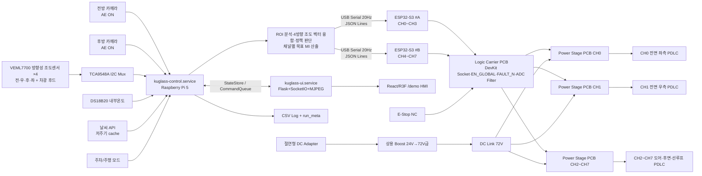

# 능동형 스마트 글라스 모빌리티 — 프로젝트 통합 문서

## 0. 문서 개요

이 문서는 능동형 스마트 글라스 모빌리티 프로젝트의 기준 사양, 확정 사항, 실측 후 확정 항목, 시스템 구조, 하드웨어/소프트웨어 구성, PDLC 8채널 독립 구동 계획, 개발·검증·안전 기준, 그리고 제24회 임베디드SW경진대회(자동차/모빌리티 부문) 예선·결선 심사 대응 논리를 하나로 정리한 프로젝트 통합 기준·참조 문서이다. 본 문서는 제출용 개발계획서가 아니라, 최종 개발계획서 작성과 프로젝트 진행을 위한 핵심 기술·대회 맥락 참조 문서이다.

### 0.0 현재 버전 핵심 결론

본 프로젝트는 **전면 2채널(CH0/CH1) MVP를 최소 성공 보장 기준**으로 두고, 검증된 동일 Power Stage PCB를 복제해 **최종 8채널 독립 PDLC 제어**로 확장한다. 8채널은 하나의 통합 정책 엔진으로 제어하되, 채널별 가중치·응답속도·안전 제한만 다르게 둔다. 즉 전면 유리와 나머지 유리를 완전히 분리하지 않고, **전면은 카메라 순간 강광·시야 안전 가중치가 큰 채널**, 도어·후면·선루프는 **열부하·프라이버시·방향성 조도 가중치가 큰 채널**로 다룬다.

v20.0의 핵심 변경은 **시간·위치 기반 광원 예측 입력을 제거**하고, 이를 **Vishay VEML7700 방향성 조도센서 4개 + 전방/후방 카메라 입력**으로 대체한 것이다. 방향성 조도센서는 모형 기준 전·우·후·좌 4방향에 장착하고, 각 센서에는 3D 프린팅 차광 후드/콜리메이터를 적용해 방위 선택성을 부여한다. 동일 주소 I2C 센서 4개를 안정적으로 읽기 위해 TCA9548A I2C 멀티플렉서를 사용한다.

본 작품의 핵심은 “**상황에 따라 어느 PDLC를 얼마만큼 능동적으로 조절할지 판단**”하는 것이며, 핵심 시연은 다음 **3가지**(시연·목적 우선순위 순)이다.

> 1. **열부하 경감 (최우선)** — 강한 햇빛/고온 조건에서 차량 내부 온도 상승을 줄이도록 PDLC를 능동 차광한다. 주행·주차를 모두 포괄하며, 차광 정도는 **썬루프→후면→후석→전석 옆유리→전면** 순으로 우선순위를 둔다.
> 2. **차박 프라이버시 보호** — 차박 모드 활성화 시 모든 PDLC 투명도를 최저로 낮춰(사실상 전원 OFF) 외부 시선을 차단한다. 주차 모드(시동 OFF)에서도 전 채널을 최대 불투명으로 전환해 실내 물품 도난 방지를 어필한다.
> 3. **강한 역광 입력 완화** — 카메라가 처리하기 어려운 **아주 강한 역광**이 들어올 때 전면 유리의 해당 영역 PDLC를 순간적으로 흐리게 만들어 카메라 과포화와 운전자 눈부심을 완화한다. 카메라 노출은 고정하지 않고 자동노출(AE)을 그대로 사용하며, 카메라 분석은 **전면 유리의 순간 강광 fast-attack 판단**에 집중한다.

제어 알고리즘은 복잡한 AI 최적화가 아니라 **상황 판단 규칙 기반 능동 차광(L1) + 방향성 광원 실측 융합(L2) + 로그 기반 보정(L3)**의 설명 가능한 구조를 채택한다. 자동노출(AE) 메타데이터·ROI 포화 지표·4방향 VEML7700 조도 벡터를 함께 사용해 “강한 빛이 어느 방향에서 들어오는지”를 추정하고, 채널별 가중치 기반으로 CH0~CH7 목표 MI를 산출한다. YOLO·MPC·강화학습 등 고급 기법은 구현 약속이 아닌 향후 발전 방향으로 분리한다. 3D HMI와 8채널 전체 제어는 최종 완성도 목표이며, 개발 리스크는 MVP 우선 검증과 control/UI 서비스 분리로 관리한다.

### 0.1 변경 이력 (요약)

상세 변경 이력은 직전 버전 문서를 참조한다. 누적 변경의 핵심만 요약한다.

| 버전 | 핵심 변경 요약 |
| --- | --- |
| v11~v16 | ESP32-S3-DevKitC-1 ×2 분담 확정, 릴레이/이중소스 미채택(단일 72V DC Link + SPWM MI 연속제어), 절연형 한 줄 전원·E-Stop, 소프트웨어 모듈·실행주기·검증 스택(pytest/HIL), 알고리즘을 되먹임+앞먹임+오프라인 보정 단일 제어기로 통합, 시연 UI(React/R3F 3D 디지털 트윈) 확정, Logic Carrier PCB / 단일 채널 Power Stage PCB 분리·8채널 PCB 구성 정책 확정 |
| v17 | 성공 기준 계층화(M0~M3), 채널별 제어 정밀도 계층화(전면 고정밀 폐루프·비전면 저속 상태제어), 카메라 입력 안정성 주장 정밀화(센서 전단 능동 광학 계층), 알고리즘 3계층(L1 영상 폐루프 / L2 환경·방향성 조도 융합 / L3 로그 보정) 재정의·고급 기법 Future Work 분리, control/UI 서비스 분리, `/demo` 단일 화면 우선, LIVE/REPLAY/MOCK 시연 신뢰성·안전 강화, 데이터 주기·영상 처리·환경정보 cache 분리, 검증·예산·팀·제출 전환성 정리 |
| v18 | 핵심 시연 3대 확장·우선순위 재정렬(①열부하 ②차박 프라이버시 ③역광 카메라 과포화), **카메라 노출 고정 폐지(확정)** — AE 메타데이터·조도·포화 지표 융합으로 빛세기·방향 추정, 상황 기반 능동 제어(주행/주행 중 정지/차박/주차)·시연 모드 5종 구체화, 투명도 변화 우선순위(열부하)·주행 편향성 명문화, 전면 순간 강광 fast-attack 예외 + 운전석 시야 안전 하한, 검증·KPI를 AE 동작 조건의 상대·정성 검증으로 교체 |
| **v19** | 문서 정합성 정리·중복 제거·버전 태그 정돈, 변경이력 요약, **PDLC 제어 기준 ↔ 소프트웨어/기술 스택 매핑(§17.3) 신설**. 하드웨어 구성(§7)·전력 구동 설계(§8) 및 v18 시연·알고리즘·UI 결정 사항은 불변 |
| **v19.1** | 검증·KPI의 ON/OFF 용어 모순 정리(전원 ON/OFF와 분리, “산란 미개입(투명) ↔ 산란 개입(DIM/SCATTER)” 축으로 통일 — §4.1·§10.3·§14.2·§14.3·§20.2), 제출용 변환 규칙을 공식 양식 5개 □ 섹션 구조로 재매핑(§31), 개발 일정 7~10월 주간 그리드 구체화(§13.2), 오픈소스·라이선스 준수 및 기존 구현 조사 신설(§17.4), 주차 모드 우선순위 라벨 정정(열부하·도난방지 — §6.3.2), 미사용 온습도 센서(SHT31) 제거(§17.1), 노출 미고정 서술 중복 축소(§2.2.1 중심), 예산 VAT·배송비 포함 기준·완충 경로 명시(§24), 표현 톤 정리(손전등 등). **DC Link 등 전력 설계 수치는 일절 변경하지 않음**. 하드웨어 구성(§7)·전력 구동 설계(§8)는 불변 |
| **v20.0** | 시간·위치 기반 광원 예측 입력 제거, **Vishay VEML7700 방향성 조도센서 4개(전·우·후·좌) + TCA9548A I2C 멀티플렉서** 확정, 전방/후방 카메라와 4방향 조도 벡터를 융합한 360° 손전등 시연 알고리즘 신설, 카메라 분석을 전면 유리 순간 강광 fast-attack 중심으로 정리, 전면/비전면 제어를 완전 분리가 아닌 통합 score 기반 가중치 차이 구조로 재정의, §5·§7·§9·§10·§14·§17·§20·§26~§32 정합성 갱신. 전력 구동 설계(DC Link·SPWM·LC·Power Stage) 수치는 변경하지 않음 |

> **불변 영역과 변경 영역:** PDLC 전력 구동 설계(§8: DC Link·SPWM·LC·Power Stage PCB)는 v17.1 이후의 기준을 유지한다. v20.0에서는 광원 방향 입력 체계를 기존 계산 기반 입력에서 **방향성 조도 실측 기반 입력**으로 바꾸기 때문에 하드웨어 센서 구성(§7)과 소프트웨어 알고리즘(§9·§10·§14·§17)은 갱신한다.

### 0.2 항목 상태 표기 원칙

| 상태 | 의미 | 문서 표현 |
| --- | --- | --- |
| 확정 | 현재 설계 기준으로 단정 가능 | “~로 구현한다”, “~를 사용한다” |
| 후보+선정기준 | 선정 단계에서 정하되 기준은 정해짐 | “~ 기준으로 선정한다” |
| 실측 후 확정 | PDLC 실물·모형·회로 실험 후 수치 확정 | “실측 절차에 따라 확정한다” |

---

## 1. 프로젝트 핵심 정의

### 1.1 한 줄 정의

**능동형 스마트 글라스 모빌리티**는 1:10 아이오닉5 도면 기반 3D 프린팅 자동차 모형에 총 8장의 PDLC Smart Film을 장착하고, 전방/후방 카메라 영상·차량 내부 센서·외부 날씨 정보·4방향 VEML7700 조도 벡터를 융합하여 차량 유리부의 투명도와 산란 상태를 능동·독립 제어하는 임베디드 스마트 글라스 모빌리티 시연 시스템이다.

### 1.2 기본 정보 및 구현 전략

| 항목 | 내용 |
| --- | --- |
| 팀명 / 작품명 | KUGLASS(쿠글) / 능동형 스마트 글라스 모빌리티 |
| 출전 부문 | 자동차/모빌리티 — 차량 내부 및 외부 정보를 활용한 사용자 체감 솔루션 |
| 적용 범위 | 실제 차량 주행용 제품이 아닌 차량 환경 모사형 시연 프로토타입 |
| 물리 시연 대상 | 1:10 아이오닉5 도면 기반 3D 프린팅 조립 모형 1대 |
| 메인 제어 | Raspberry Pi 5, Raspberry Pi OS 64-bit Lite |
| 실시간 제어 | ESP32-S3-DevKitC-1 ×2 (#A CH0~CH3 / #B CH4~CH7), ESP-IDF |

| 단계 | 구현 범위 | 목적 |
| --- | --- | --- |
| MVP | 전면 좌/우 2채널(CH0, CH1) 우선 검증 | 전면 순간 강광 지표, MI 제어, SPWM, H-Bridge, LC Filter, Fault 보호 검증 |
| 최종 | 전면·도어·후면·선루프 총 8채널 독립 PDLC 제어(통합 score 기반, 채널별 가중치 차등) | 차량 전체 유리부의 상황별 능동 제어 시연 |

MVP는 단순 축소판이 아니라 최종 8채널 구조의 기준 채널 검증 단계이다. 단일 채널 Power Stage PCB 1종을 CH0/CH1에서 검증한 뒤 동일 설계를 8장으로 복제한다.

### 1.2.1 성공 기준 분리 (M0~M3)

| 등급 | 단계 | 반드시 완성할 내용 | 심사 메시지 |
| --- | --- | --- | --- |
| M0 | 단일 채널 전력 검증 | 1채널 PDLC 전압 제어, MI-Vrms-투과도 측정 | 자체 PDLC 구동 가능성 입증 |
| M1 | 2채널 MVP (**최소 성공 보장**) | 전면 좌/우 독립 MI 제어, 카메라 포화 지표 감소, MVP UI | 핵심 기능 완성 |
| M2 | 8채널 확장 (**최종 목표**) | 동일 Power Stage PCB 복제, CH0~CH7 독립 제어(전면 고정밀+비전면 상태제어) | 차량 전체 유리부 확장성 입증 |
| M3 | 고급 HMI·Replay (**완성도 강화**) | 3D 디지털 트윈, Evidence View, Replay | 시연 완성도 강화 |

> 개발계획서에는 M1을 “성공 보장 기준”, M2를 “최종 목표”, M3를 “시연 완성도 확장”으로 서술한다. 일정이 지연되더라도 M1은 항상 완성·시연 가능하다.

### 1.3 중심 주장

본 작품은 단순 자동 선팅 장치가 아니다. 카메라 영상 지표, 내부 센서, 외부 날씨 정보, 4방향 조도 벡터, 주차/주행 차량 모드를 결합해 **어느 위치의 유리를 어느 정도 산란시킬지** 판단하고, 이를 자체 SPWM 전력 구동부로 실행하는 다채널 임베디드 제어 시스템이다.

---

## 2. 문제 정의와 개발 목적

### 2.1 해결하려는 문제

| 문제 상황 | 기존 방식의 한계 | 본 작품의 대응 |
| --- | --- | --- |
| 강한 역광·직사광 | 카메라 후처리만으로 포화 영역 복원 어려움 | 영상 ROI 포화 지표 기반 해당 PDLC 채널 산란 제어 |
| 부분적 고휘도 광원 | 전체 선팅은 과차광 유발 | 좌/우·도어·후면·선루프별 8채널 독립 제어 |
| 단순 조도 기반 제어 | 실제 영상 과포화와 불일치 가능 | 카메라 Saturation Ratio와 Edge Density를 직접 측정 |
| 주차 중 일사 열부하 | 에어컨 사전 가동은 전력 소모 증가 | 내부온도·날씨·방향성 조도 기반 능동 차광 |
| 고정 선팅 | 야간/상황별 시인성 조절 불가 | MI 기반 연속 투명도 제어 |
| 차박·정차 프라이버시 | 수동 가림막은 불편 | 차박/주차 모드에서 전 채널 산란 강화 |

### 2.2 개발 목적 (우선순위)

대회 부문 주제는 “차량 내부 및 외부 정보를 활용한 사용자 체감 솔루션”이다. 본 작품의 목적은 이 주제에 정면으로 대응하도록 다음 위계로 고정한다. 1~3번은 **3대 핵심 시연 목표**이며 우선순위 순서이다.

| 우선순위 | 목적 | 계획서 표현 |
| ---: | --- | --- |
| 1 | 주행·주차 중 일사 열부하 경감 (상황별 능동 차광) | **핵심 체감 가치 — 1순위 시연** |
| 2 | 차박 프라이버시 보호 및 주차 중 도난 방지 (전 채널 차광) | **핵심 체감 가치 — 2순위 시연** |
| 3 | 아주 강한 역광에서 카메라 입력 영상 과포화 완화·운전자 눈부심 완화 | **핵심 체감 가치 — 3순위 시연** |
| 4 | 내부 센서 + 외부 정보(날씨) + 방향성 조도 실측 융합 기반 상황 능동 제어 | **대회 주제 정합성 (내부+외부 정보+차량 센서)** |
| 5 | 2채널 MVP에서 8채널로 확장 가능한 자체 임베디드 전력 구조 | 기술성 |

> **시연 우선순위 맥락:** 사용자 체감이 가장 크고 시연 재현성이 높은 **열부하 경감**을 1순위, **차박/주차 프라이버시**를 2순위, **역광 카메라 과포화 방지**를 3순위로 둔다. 세 시연은 모두 “상황에 따라 어느 PDLC를 얼마만큼 능동 제어할지”라는 동일한 핵심 엔진(§10)으로 동작한다.

> **주제 정합성 앵커:** 외부 정보는 날씨 API(기온·구름량·강수·UV 등)로 유지하고, 빛의 실제 방향은 차량에 장착한 4방향 VEML7700 조도 벡터로 측정한다. 따라서 “외부 정보 + 차량 센서 + 영상 입력”이 모두 실제 제어에 연결되며, 뜨거운 여름·주차 열부하·360° 손전등 시연에서 이 융합 구조를 UI에 가시화한다.

### 2.2.1 카메라 자체 노출 제어와 PDLC 제어의 차별점 (노출 미고정)

본 작품은 **카메라 노출을 고정하지 않는다(확정 사항).** 카메라의 자동노출(AE)·HDR·ISP 보정은 그대로 동작시킨다. 본 작품은 카메라 자체 노출 제어를 **대체하지 않으며**, 그 위에서 보완적으로 동작하는 **센서 전단 능동 광학 계층**이다. 카메라의 조리개·셔터·gain·자동노출·HDR은 센서에 들어온 빛을 어떻게 기록·보정할지를 결정하는 **내부 처리 계층**이고, PDLC 제어는 카메라 센서에 빛이 도달하기 전, 차량 유리부에서 입력광 조건 자체를 바꾸는 **외부 광학 계층**이다.

| 구분 | 카메라 노출/HDR (AE 동작) | PDLC 기반 유리부 제어 |
| --- | --- | --- |
| 제어 위치 | 이미지 센서·ISP 내부 | 카메라 센서 전단의 유리부 |
| 제어 대상 | 기록된 영상 신호, exposure/gain, tone mapping | 센서에 도달하기 전의 직접광·산란광 조건 |
| 장점 | 별도 액추에이터 없이 빠른 보정 | 포화 발생 전 입력광 peak 완화 가능 |
| 한계 | 국소 초강광은 전체를 어둡게 누르며 해당 영역은 여전히 포화 | 과도 산란 시 대비·Edge Density 저하 가능 |
| 본 프로젝트 역할 | 항상 동작하는 기본 보정 계층 | 강광 peak를 줄여 AE가 회복하도록 돕는 보완 계층 |

**AE를 켜둔 상태에서 PDLC가 더하는 가치:** 일반적인 밝기 변화는 카메라 AE가 충분히 처리하므로 PDLC가 불필요하게 개입하지 않는다. 그러나 **아주 강한 국소 역광**(예: 전면 좌측으로 들어오는 강한 직사광)은 AE만으로 해결되지 않는다. AE가 전체 노출을 낮춰도 강광 영역은 여전히 포화되고, 그 대가로 장면의 나머지는 과도하게 어두워진다. 이때 해당 영역 PDLC를 흐리게 만들어 입력광 peak를 물리적으로 낮추면 포화 면적이 줄고 AE가 노출을 회복해 장면 전반의 활용도가 올라간다. 즉 PDLC는 “AE보다 좋은 노출”이 아니라 **AE가 감당하지 못하는 초강광 구간에서 AE를 보완**한다.

**노출을 고정하지 않고 빛의 세기를 추정하는 방법:** 노출 고정 없이도 빛 세기는 충분히 추정 가능하다. ① 카메라 AE 메타데이터(노출시간·아날로그/디지털 게인, 일부 센서의 Lux 추정값)는 AE가 얼마나 강하게 노출을 누르고 있는지를 알려준다. ② 방향성 조도센서(Vishay VEML7700 ×4)는 절대 조도와 방위별 광량 차이를 제공한다. ③ ROI 포화 픽셀 비율은 AE가 동작 중임에도 남는 초강광의 직접 신호다. 이 셋을 융합한 빛세기·방위 지표로 “강한 역광 상황”과 “일반 상황”을 구분하고, 어느 유리 채널을 우선 제어할지 결정한다(§10.3~§10.5).

따라서 본 프로젝트의 목표는 “카메라보다 좋은 노출 알고리즘”을 만드는 것이 아니라, AE가 동작하는 현실 조건에서 카메라가 감당하기 어려운 초강광을 유리부에서 물리적으로 완화해 ROI 과포화를 낮추고 동시에 Edge Density(시야 구조)를 보존하는 균형점을 찾는 것이다. 정량 비교가 어렵더라도 **PDLC 산란 개입 유무의 체감·상대 차이**로 카메라 안정성 기여를 입증한다.

### 2.2.2 개발 목적 상세

| 목적 | 설명 |
| --- | --- |
| 열부하 저감 (1순위) | 강한 일사·고온 조건에서 차량 내부 온도 상승률을 낮춘다. 차광 정도는 썬루프→후면→후석→전석 옆유리→전면 순으로 우선순위를 두며, 효과는 동일 조명 모형 챔버 상대 비교로 검증한다. |
| 프라이버시·도난 방지 (2순위) | 차박 모드에서 전 채널을 최저 투명도(사실상 전원 OFF)로 전환해 외부 시선을 차단하고, 주차 모드(시동 OFF)에서도 전 채널 최대 불투명으로 실내 물품 노출을 차단한다. |
| 카메라 입력 영상 안정성 보조 (3순위) | 자동노출(AE)이 동작하는 조건에서, 아주 강한 역광이 만든 과포화 픽셀 면적을 줄이고 영상 구조(Edge)를 보존한다. PDLC 산란 개입 유무의 상대·정성 비교로 입증한다. |
| 사용자 눈부심 완화 | 역광·측면 직사광·후방 헤드라이트 상황에서 유리부 산란 제어로 체감 눈부심을 낮춘다. |
| 8채널 자체 전력 구동 구현 | 상용 PDLC 전원에만 의존하지 않고 H-Bridge + LC Filter + SPWM으로 PDLC를 직접 제어한다. |
| 대회 주제 정합성 확보 | 차량 내부 정보(내부온도), 차량 외부 실측 정보(VEML7700 4방향 조도), 외부 정보(날씨 API)가 결합된 사용자 체감 솔루션임을 시연한다. |

---

## 3. 적용 범위

본 작품은 차량 환경을 모사한 시연용 프로토타입이다. 실차 전면 유리에 즉시 적용 가능한 양산 안전 장치나 자율주행 인지 성능 향상 장치를 표방하지 않으며, 카메라 관련 주장은 **카메라 자동노출이 동작하는 조건에서 아주 강한 역광**이 만든 ROI 과포화 면적을 낮추고 Edge Density 보존을 함께 확인하는 “입력 영상 품질 보조” 범위로 제한한다. 카메라 노출은 고정하지 않으며, 정량 비교가 어려운 경우 PDLC 산란 개입 유무의 상대·정성 비교로 효과를 제시한다. 열부하 효과는 “모형 챔버 기반 상대 비교”로 한정한다.

---

## 4. 기준 사양: PDLC Smart Film

### 4.1 동작 원리

본 프로젝트는 일반형 PDLC Smart Film을 기준으로 한다.

| 전원 상태 | 액정 상태 | 광학 상태 | 프로젝트 내 의미 |
| --- | --- | --- | --- |
| Power ON | 액정이 전계 방향으로 정렬 | 투명 | CLEAR, 카메라 시야 확보 |
| 중간 전압 | 부분 정렬 | 중간 산란 | DIM, 포화 완화와 시야 보존의 균형 |
| Power OFF | 불규칙 배열 | 불투명/산란 | SCATTER/OFF, 차광·프라이버시 |

> **용어 통일:** PDLC OFF는 검은 선팅처럼 빛을 흡수하는 상태가 아니라 빛을 강하게 **산란**시켜 뿌옇게 보이게 하는 상태이다. 본 문서 전체에서 ON=투명/CLEAR, OFF=산란/불투명/SCATTER로 통일한다. 무조건 최대 차광이 정답이 아니며, 포화 픽셀 감소와 Edge Density 보존 사이의 균형을 찾는 것이 MI 연속 제어의 핵심 근거다. 또한 검증·실험에서는 동일 장면을 **“산란 미개입(투명 baseline)” ↔ “산란 개입(DIM/SCATTER)”** 축으로 비교하며, 이 비교 축을 전원 ON/OFF 표기와 혼용하지 않는다(§10.3·§14.3).

### 4.2 적층 구조 및 특성 기준

```
PET → Conductive Film → PDLC Layer → Conductive Film → PET
```

전도성 필름 사이에 AC 전압을 인가하여 액정 배열을 제어한다. 주요 특성(투명도, 사용 전압 48V AC, 출력 60Hz, 소비전력, 응답시간, 등가 정전용량)은 구매할 PDLC 제품 실측으로 갱신한다. PDLC는 용량성 부하로 간주하고 정전용량을 측정한다.

### 4.3 크기·구매 형태 (실측 후 확정)

PDLC 정확한 크기/면적, 구매 형태(기성/주문 재단), 전극·배선 처리는 1:10 모형 유리부 실측 후 확정한다. 면적이 확정되면 채널별 소비전력·정전용량, LC 필터 값, 전류 정격, MOSFET 발열, PCB 패턴/절연 간격, 커넥터 정격을 재계산한다.

---

## 5. 전체 시스템 구조

### 5.1 시스템 블록도



> 핵심 구조는 Raspberry Pi 내부를 **control 서비스와 UI 서비스로 분리**한 것이다. UI 장애가 발생해도 제어 루프와 ESP32 명령은 유지된다.

### 5.2 데이터 흐름

1. 전방/후방 카메라가 차량 시야 영상을 수집한다(자동노출(AE) 동작, AE 메타데이터인 노출시간·게인을 함께 수집).
2. control 서비스가 영상을 채널별 ROI로 분할하고 Saturation Ratio, Mean Brightness, Edge Density를 계산하며, AE 메타데이터를 이용해 전면 순간 강광 여부를 산출한다.
3. VEML7700 4개는 전·우·후·좌 조도를 저주기로 측정하고, 방향성 차광 후드 보정값을 적용해 `DirectionalLuxVector`와 광원 방위 신뢰도를 산출한다. 내부온도와 날씨 API는 저주기 cache task가 갱신한다.
4. 정책 모듈이 차량 모드, ROI 지표, 4방향 조도 벡터, 내부온도, 날씨 cache를 참고해 채널별 목표 광학 상태(CLEAR/DIM/SCATTER)와 목표 MI를 산출한다.
5. MI Servo가 rate limit, hysteresis, low-pass로 깜빡임을 억제한다.
6. control 서비스가 ESP32 #A/#B에 20Hz JSON Lines 명령을 전송한다.
7. ESP32가 Fault 상태를 우선 확인한 뒤 `PWM_MAG`, `DIR/POLARITY`, `EN_LOCAL`을 생성한다.
8. Logic Carrier PCB가 신호를 CH0~CH7 Power Stage PCB로 분배하고 E-Stop·Fault·ADC 경로를 정리한다.
9. 각 Power Stage PCB가 72V DC Link로 H-Bridge + LC Filter 출력을 만들어 PDLC를 구동한다.
10. 전압·전류·온도·Fault 상태가 ESP32→control로 보고되고 StateStore에 기록되며 UI 서비스가 이를 읽어 표시한다. 핵심 데이터는 CSV에 저장된다.

### 5.3 제어 흐름

```text
영상/4방향 조도/내부온도/날씨/모드 입력
→ ROI 지표 및 환경 cache 산출
→ 차량 모드별 규칙으로 채널 목표 상태(CLEAR/DIM/SCATTER) 결정
→ LUT 기반 목표 MI 변환
→ MI Servo 안정화(rate limit·hysteresis·low-pass)
→ ESP32 20Hz 명령 전송
→ ESP32 Fault 우선 확인 → Carrier PCB 신호 분배 → H-Bridge + LC Filter PDLC 출력
→ 영상·센서 재측정 → 폐루프 반복
```

---

## 6. 물리 시연 구조

### 6.1 시연 구성

| 구성 | 내용 |
| --- | --- |
| 자동차 모형 | 1:10 아이오닉5 도면 기반 3D 프린팅 조립 구조 |
| 유리부 | 전면 2장, 4도어 4장, 후면 1장, 선루프 1장 PDLC 부착 |
| 카메라 | 전방 블랙박스 위치 1개, 후방 카메라 1개 |
| 센서 | VEML7700 방향성 조도센서 ×4, 내부온도, 전압, 전류, 전력부 온도 |
| 외부 광원 | 역광·측면광·후방 헤드라이트·상부 일사를 모사하는 고휘도 LED |
| 전력부 | 모형 외부 제어박스에 격리 배치 |
| 시연 UI | 태블릿 가로 브라우저에서 `/demo` 3D 디지털 트윈 HMI |

### 6.2 8채널 PDLC 구성

| 채널 | 위치 | 제어 목적 | 통합 score 내 역할 | 구현 단계 |
| :---: | --- | --- | --- | --- |
| CH0 | 전면 유리 좌측 | 전방 좌측 역광 대응 | 전면 순간 강광·시야 안전 가중치 큼 | MVP + 최종 |
| CH1 | 전면 유리 우측 | 전방 우측 역광 대응 | 전면 순간 강광·카메라 보조 가중치 큼 | MVP + 최종 |
| CH2 | 좌측 전방 도어 | 좌측 측면 일사·프라이버시 | 방향성 조도·측면 시야 가중치 | 최종 |
| CH3 | 우측 전방 도어 | 우측 측면 일사·프라이버시 | 방향성 조도·측면 시야 가중치 | 최종 |
| CH4 | 좌측 후방 도어 | 후방 측면 일사·프라이버시 | 방향성 조도·열부하 가중치 | 최종 |
| CH5 | 우측 후방 도어 | 후방 측면 일사·프라이버시 | 방향성 조도·열부하 가중치 | 최종 |
| CH6 | 후면 유리 | 후방 광원·헤드라이트 대응 | 후방 조도·후방 카메라 cue 가중치 | 최종 |
| CH7 | 선루프 | 상부 일사·열부하 대응 | 조도 합계·내부온도 가중치 | 최종 |

### 6.3 차량 상황 정의 및 시연 구조

#### 6.3.1 차량 상황 4가지

본 작품은 차량 상황을 4가지로 정의하고, 상황마다 8채널 PDLC 목표 투명도를 다르게 능동 산출한다(제어 로직은 §10).

| 상황 | 정의 | 진입 방식 | 전면 시야 제약 |
| --- | --- | --- | --- |
| **주행(Driving)** | 차량이 주행 중인 기본 상태 | **기본값** — 시연 버튼이 없고 태블릿 UI가 홈이면 주행으로 가정 | 운전 시야 보호(전면 강제 하한) 적용 |
| **주행 중 정지(Driving-Stopped)** | 신호 대기 등으로 정차한 상태 | 시연 버튼 | 전면 시야 보호 유지(신호 변경 대비), 비전면 차광은 약간 더 허용 |
| **차박(Camping)** | 정차 후 차내 체류, 프라이버시 필요 | 시연 버튼 | 없음 — 전 채널 최저 투명도 허용 |
| **주차(Parked)** | 시동 OFF, 차량만 주차된 상태 | 시연 버튼 | 없음 — 전 채널 최대 불투명 허용 |

> 4가지 중 주행 중 정지·차박·주차는 시연 버튼을 눌렀을 때만 발생한다. 버튼이 없으면 항상 주행으로 동작한다.

#### 6.3.2 시연 모드 5종 (실제 동작)

아래 5개 시연은 “모든 조건을 받아 능동 판단하는 동일 엔진(§10)”이 특정 상황·입력에서 어떻게 동작하는지를 보여준다. 시연 장면은 반드시 실제로 동작해야 하며, 명시된 시연 외의 일반 변수(예: 비/구름)에도 정상 동작한다.

| # | 시연 모드 | 진입(버튼) | 핵심 동작 | 우선순위 매핑 |
| ---: | --- | --- | --- | --- |
| 1 | **360° 손전등 시연** | 대시보드 손전등 시연 버튼 | 손전등이 모형을 기준으로 360° 회전하면 4방향 VEML7700 조도 벡터와 전방/후방 카메라 highlight cue를 융합해 빛의 방위를 추정하고, 해당 방향의 PDLC가 따라 돌며 불투명해진다. **빛의 위치에만 의존**(온도·날씨·시야 하한 등 일반 조건 제거)하는 상징적 시연으로, 방향 추정과 채널 매핑 능력을 직관적으로 보여준다. | (기술 상징) |
| 2 | **카메라 포화도 시연** | 카메라 포화도 시연 버튼 | PDLC가 없을 때를 상정한 화면과 PDLC가 있을 때의 화면을 나란히 보여준다(**사전 준비 영상**). UI 홈에서는 실시간 전방 카메라 화면을 볼 수 있고(버튼 미입력=주행 상황), 비교 화면은 없지만 손전등을 비췄을 때 과포화가 덜함을 체험자가 직관적으로 확인 | 3순위(역광) |
| 3 | **뜨거운 여름** | 시연 모드 뜨거운 여름 버튼 | 체험자가 태블릿 UI에서 현재 날씨 온도를 임의 조절하면 PDLC 투명도가 적절히 조절된다. 강한 햇빛 속 내부 온도 상승 상황에서 차광 우선순위(썬루프→후면→후석→전석 옆유리→전면)에 따라 PDLC가 흐려짐 | **1순위(열부하)** |
| 4 | **차박 모드** | 태블릿 차박 모드 버튼 | 모든 PDLC 투명도를 최저로 낮춤(사실상 전원 OFF). 외부 시선 차단으로 프라이버시 보호 | **2순위(프라이버시)** |
| 5 | **주차 모드** | 태블릿 주차 모드 버튼 | 차량 시동 OFF → 전 채널 투명도를 최대로 낮춤(최대 불투명). 실내 물품 도난 방지 어필(차량 내 물품 도난이 잦은 환경에서 특히 유효) | 1·2순위(열부하·도난방지) |

> **주의:** 본 시연 상황들은 반드시 작동해야 하는 상황일 뿐, 이 시연만 작동하면 안 된다. 실제로 받는 모든 변수에 따라 정상 동작하는 작품이어야 한다. 예) 비 오는 날에는 일사가 약하므로 PDLC의 전반적 투명도가 덜 낮아진다.

#### 6.3.3 결선 3분 시연 흐름 (우선순위 순)

| 단계 | 시연 | 핵심 메시지 | 필수 여부 |
| ---: | --- | --- | --- |
| 1 | **뜨거운 여름(열부하)** | 날씨 온도 슬라이더 → 우선순위 차광 → 내부 온도 상승 완화(모형 상대 비교) | **필수(1순위)** |
| 2 | **차박/주차(프라이버시·도난방지)** | 차박/주차 버튼 → 전 채널 최대 불투명 → 프라이버시·도난 방지 | **필수(2순위)** |
| 3 | **카메라 포화도(역광)** | 사전 영상 PDLC 산란 개입 유무 비교 + 라이브 손전등 체감 | **필수(3순위)** |
| 4 | 360° 손전등 시연 | 빛 방향 추적 기반 PDLC 제어 기술 상징 | 권장(임팩트) |

> 세 핵심 시연은 모두 동일 제어 엔진(§10)으로 동작하며, “상황에 따라 어느 유리를 얼마만큼 차광할지 스스로 판단”함을 보여준다. 특히 열부하·프라이버시 시연은 “내부+외부 정보 융합”이라는 대회 주제를 직접 보여주므로 시연 영상·발표에 반드시 포함한다.

> **360° 시연 타당성 점검:** 전방/후방 카메라만으로는 측면 입사광에 사각이 생기고, 조도센서만으로는 전면 ROI 포화 정도를 알기 어렵다. 따라서 VEML7700 4개로 전·우·후·좌 광량 벡터를 만들고, 전/후방 카메라 highlight cue를 해당 FOV에서만 보정 입력으로 쓰는 구조가 가장 현실적이다. 4개보다 적은 센서(예: 좌·우 2개)는 전방/후방 카메라와 결합해도 대각선·측후방 구간 구분력이 떨어져 360° 시연 신뢰성이 낮다. 그러므로 v20.0에서는 **4개가 최소 안정 구성**이다.

### 6.4 부스·대시보드 전략

심사위원이 손전등(고휘도 광원)을 직접 움직이면 시스템이 위치별로 반응하는 장면을 즉시 체감할 수 있도록, 부스용 손전등·고정 고휘도 광원과 태블릿 가로 `/demo` 화면 1개를 중심으로 구성한다. `/demo`는 3D 자동차 상태·카메라 Evidence(실시간 전방 카메라)·빛세기/포화 지표·채널 투명도(MI)·시연 모드 버튼(뜨거운 여름·차박·주차·카메라 포화도·360° 손전등)·날씨 온도 슬라이더를 한 화면에 통합하여, 전체 설명의 대부분을 단일 화면에서 가능하게 한다.

---

## 7. 하드웨어 구성

### 7.1 Raspberry Pi 5

| 항목 | 기준 |
| --- | --- |
| 역할 | 영상처리, 센서융합, 날씨 API, 4방향 조도 벡터 계산, 제어 정책, UI 백엔드, 로그 저장 |
| OS | Raspberry Pi OS 64-bit Lite |
| 주요 SW | Python, OpenCV, Flask, Flask-SocketIO, pyserial |
| 통신 | ESP32 #A/#B와 USB Serial 2포트 연결 |
| 서비스 구조 | `kuglass-control.service`(제어)와 `kuglass-ui.service`(UI) 분리 — §9.2 |
| 비고 | 고주파 PWM을 직접 생성하지 않으며, 실시간 전력 제어는 ESP32가 담당 |

### 7.2 ESP32-S3 실시간 제어부

| 항목 | 기준 |
| --- | --- |
| MCU | ESP32-S3-DevKitC-1 ×2 |
| 개발환경 | ESP-IDF, MCPWM(16kHz carrier) |
| 분담 | #A: CH0~CH3, #B: CH4~CH7 |
| 역할 | JSON Lines 명령 수신, 16kHz SPWM 생성, MI 반영, 전압·전류·온도 측정, Fault 보호 |
| Dead-time | raw gate를 ESP32가 모두 만들지 않고 각 Power Stage PCB gate driver 내부 dead-time 활용 |
| 안전 | Fault 발생 시 Raspberry Pi 판단을 기다리지 않고 로컬에서 출력 차단 |

ESP32 2개 분산 구조는 MCU당 SPWM 부하를 절반으로 낮추고, 한 컨트롤러 장애가 4채널에만 영향을 주도록 장애를 격리한다. 채널 간 위상 동기화는 필요하지 않다. 각 PDLC 채널은 독립 H-Bridge + LC Filter + 필름으로 구성되며, 공유 DC Link 리플은 DC Link 커패시터로 대응한다.

> **채널별 제어 가중치 계층화:** CH0~CH7은 하나의 통합 score 기반 정책으로 제어한다. 다만 전면 CH0/CH1은 카메라 순간 강광·시야 안전 가중치가 높고 응답 주기가 빠르며(10~20Hz target update), 도어·후면·선루프 CH2~CH7은 방향성 조도·열부하·프라이버시 가중치가 높고 응답 주기가 낮다(약 0.5~5Hz 또는 event 기반). 8채널을 완전히 분리하지 않고, 같은 알고리즘 안에서 가중치와 제한만 다르게 둔다.

### 7.3 Logic Carrier PCB

Carrier PCB는 PDLC를 직접 구동하지 않고, ESP32 DevKitC-1 ×2를 고정하고 CH0~CH7 제어 신호를 Power Stage PCB로 정리해 전달하는 **저전압 Logic Backplane**이다.

| 포함 기능 | 내용 |
| --- | --- |
| DevKit socket | ESP32-S3-DevKitC-1 #A/#B 장착(female header/socket) |
| 채널 커넥터 | CH0~CH7 동일 pinout locking connector |
| 신호 분배 | `PWM_MAG`, `DIR/POLARITY`, `EN_LOCAL`, `EN_GLOBAL`, `FAULT_N`, `ADC_V`, `ADC_I`, `ADC_TEMP` |
| E-Stop | NC E-Stop 기반 `EN_GLOBAL` 분배, 단선 또는 E-Stop 시 LOW로 fail-safe 차단 |
| Fault 표시 | 채널별 active-low `FAULT_N` 입력과 fault LED |
| ADC 보호 | series resistor + RC filter + test point |
| 디버깅 | status LED, test point, 실크 라벨, 전원 선택 jumper, 역급전 방지 |

Carrier PCB에는 72V DC Link, MOSFET H-Bridge, LC Filter, PDLC 48Vrms AC 출력선, Boost Converter를 포함하지 않는다. 이는 저전압 제어부와 고전압 전력부를 분리하는 전력전자 안전 원칙이다.

Carrier PCB 채택 이유: DevKit 안정성 유지(USB flashing/monitor·교체 용이), 점퍼선 대비 커넥터·실크 라벨로 핀 착오·접촉 불량 감소, `EN_GLOBAL`/`EN_LOCAL` pull-down/`FAULT_N`/LED로 안전 구조 명확화, ADC RC filter로 센싱 안정화, test point로 계측 경로 확보.

### 7.4 단일 채널 Power Stage PCB

| 블록 | 역할 |
| --- | --- |
| Gate Driver | Carrier 신호를 MOSFET gate 구동 신호로 변환, dead-time·UVLO·enable/fault |
| MOSFET H-Bridge | 72V DC Link로 60Hz AC 상당 출력 생성 |
| LC Filter | 16kHz SPWM 스위칭 성분 감쇠, 60Hz 성분 통과 |
| 전압/전류/온도 센싱 | Vrms 추정·과전압, 과전류, MOSFET·인덕터·PCB 발열 감시 |
| Enable/Shutdown | Fault 시 채널 출력 차단 |
| PDLC 커넥터 | 해당 채널 PDLC 연결 |

Power Stage PCB는 채널당 1장으로 설계하고, MVP에서 CH0/CH1용 2장을 검증한 뒤 최종 8장으로 복제한다. 이 “단일 보드 1종 복제” 구조는 검증 일관성·모듈 격리·재제작 비용 통제의 핵심이다.

### 7.5 센서·입력 장치

| 장치 | 후보/기준 | 역할 |
| --- | --- | --- |
| 전방 카메라 | Raspberry Pi Camera Module | 전방 ROI 과포화·시야 지표 측정 |
| 후방 카메라 | Raspberry Pi Camera Module | 후방 광원·헤드라이트 대응 |
| 방향성 조도센서 | **Vishay VEML7700 ×4** + TCA9548A I2C Mux + 3D 프린팅 차광 후드 | 전·우·후·좌 조도 벡터, 360° 광원 방위 추정 |
| 내부 온도 센서 | DS18B20 | 모형 내부 온도 상승률 |
| 전압/전류 센서 | 분압·차동/Hall·션트+절연 증폭 후보 | 채널 Vrms·DC Link·과전류 보호 |
| 전력부 온도 | NTC 또는 디지털 온도센서 | MOSFET·인덕터 발열 보호 |
| 물리 버튼 | Auto/Manual, E-Stop, Fault Clear, Test CH | 사용자 조작·안전 제어 |

### 7.6 전원 구조

| 항목 | 기준 |
| --- | --- |
| 외부 인입 | 절연형 DC Adapter 1개 기반 한 줄 전원 구조 |
| 로직 전원 | 24V 입력 후보 → Buck 5V → Raspberry Pi, ESP32, Carrier PCB |
| 고전압 생성 | 상용 Boost 모듈로 72V DC Link 생성 |
| DC Link | 72V nominal, 커패시터 100V 이상 권장(여유 시 160V) |
| MOSFET | 150~200V급 기준 |
| 보호 | 메인 퓨즈, DC Link 퓨즈, 채널별 퓨즈, E-Stop, 방전저항, HV 표시 LED |
| 배치 | 고전압부는 닫힌 제어박스 내부 배치 |

---

## 8. PDLC 전력 구동 설계

### 8.1 전력 구동 목표

| 항목 | 기준 |
| --- | --- |
| PDLC 기준 전압 | 48V AC |
| 기본파 주파수 | 60Hz |
| 출력 파형 | LC Filter 후 sine-wave equivalent output |
| 출력 조절 방식 | SPWM의 MI(Modulation Index) 조절 |
| 출력 전압 범위 | 채널별 0~48Vrms 목표 |
| DC Link | 72V nominal |
| 스위칭 주파수 | 16kHz |
| 최종 채널 수 | 8채널 독립 구동 |

### 8.2 DC Link 산정

이상적인 단상 Full-Bridge SPWM 선형 영역에서 출력 RMS는 `Vout,rms ≈ MI × Vdc / √2`로 근사한다. 48Vrms를 얻기 위한 최소 DC Link는 `Vdc_min ≈ 48 × √2 ≈ 67.9V`이므로 여유를 두어 72V nominal로 설정한다. Boost overshoot, 스위칭 링잉, LC 공진, 리플전류를 고려해 핵심 부품은 정격 여유를 둔다.

### 8.3 SPWM 및 MI 제어

채택 방식은 Carrier-based Simplified Unipolar(Sign-Magnitude 계열) SPWM이다. 양/음 반주기에서 `DIR/POLARITY`를 전환하고 `PWM_MAG = MI × |sin(ωt)|` 형태로 duty를 생성한다.

| MI 상태 | 출력 전압 | PDLC 상태 경향 | 용도 |
| --- | --- | --- | --- |
| MI 높음 | Vrms 높음 | 투명에 가까움 | CLEAR, 시야 확보 |
| MI 중간 | Vrms 중간 | 부분 산란 | 역광 완화와 시야 보존 균형 |
| MI 낮음 | Vrms 낮음 | 산란 증가 | 강한 차광·열부하 저감 |
| MI = 0 / disable | 0V | 불투명/강한 산란 | OFF 또는 Fault |

### 8.4 DC bias 방지 및 LC Filter

PDLC 보호를 위해 구동 파형은 양·음 반주기 대칭을 유지하고 H-Bridge 출력 평균 전압을 0V에 가깝게 관리한다. Fault 시 gate driver disable을 우선 적용해 DC bias 누적을 방지한다.

H-Bridge 출력은 고주파 PWM 펄스이므로 LC Filter로 16kHz 성분을 줄인다(`60Hz ≪ f_cutoff ≪ 16kHz`, `C_effective = C_filter + C_PDLC`). LC 값은 PDLC 면적·정전용량 실측 후 확정한다: 유리부 실측 → 정전용량 측정 → 16kHz 기준 적용 → 1~3kHz 후보 차단주파수 → L/C 계산 → 저전압 더미 부하 → 파형·공진·온도 확인 → PDLC 연결 후 Vrms·Irms·온도·광학상태 측정 → 필요 시 damping/snubber → 최종 부품 정격·layout 확정.

### 8.5 LC Filter 적용 범위 (실측 비교 후 결정)

8채널 전체에 동일 SPWM+LC Filter를 적용하는 단일 보드 복제(전 채널 SPWM+LC)를 baseline으로 유지하되, 채널별 요구 성능을 실측으로 검증하는 절차를 둔다.

| 테스트 | 방식 | 비교 항목 | 판단 기준 |
| --- | --- | --- | --- |
| A안 | SPWM + LC Filter (baseline) | Vrms 안정성, EMI, 카메라 노이즈, 필름 발열 | 전면 카메라 포화 개선에 유리하면 CH0/CH1 유지 |
| B안 | bipolar square wave 또는 간소 필터 | 부품 수, 부피, 발열, 구현 난도 | 비전면 채널에 충분하면 비용·부피 절감 대안 |
| C안 | 상용 PDLC 드라이버 fallback | 시연 안정성 | 자체 전력부 장애 시 최소 시연 보장 |

> **설계 판단:** 전면 CH0/CH1은 영상 품질·EMI 저감을 위해 SPWM+LC를 우선 유지한다. 비전면 채널의 간소 구동 전환은 **사전 확정하지 않는다.** “단일 보드 1종 복제”의 검증 우위와 전력전자 차별성을 우선하기 때문이다. B안은 §14 검증 실험으로 효과를 측정하고, 일정·예산 압박 시에만 비전면 채널에 적용하는 문서화된 백업 경로로 둔다.

### 8.6 릴레이/이중 전압 소스 미채택

“30V 이하 MI 제어, 30V 이상 별도 전원+릴레이” 구조는 채택하지 않는다. 72V DC Link와 SPWM MI만으로 0~48Vrms 전 구간을 연속 제어한다(릴레이는 출력 불연속·글리치·돌입전류·수명 한계, 8채널 시 고장점·검증 난이도 증가). 단일 제어 방식이 보드 복제·검증 일관성에 유리하다.

### 8.7 MI-Vrms-투과도 보정

`MI → 출력 Vrms → PDLC 광학 상태 → 영상 지표` 관계는 비선형일 수 있으므로 MI sweep 실험으로 룩업 테이블을 작성한다. UI slider도 `MI = slider/100`이 아니라 목표 투명도 → LUT inverse → 목표 MI로 변환한다.

### 8.8 개발계획서용 전력부 요약

| 항목 | 제출용 설명 |
| --- | --- |
| 전력 구조 | 절연형 DC 어댑터와 상용 Boost 모듈로 DC Link를 만들고, 채널별 H-Bridge로 PDLC를 구동한다. |
| 제어 방식 | ESP32-S3가 16kHz SPWM을 생성하고 MI를 조절해 PDLC 투과/산란 정도를 연속 제어한다. |
| 안전 구조 | 고전압부는 제어 박스 내부에 격리하고, E-Stop 및 Fault 발생 시 gate driver enable을 차단한다. |
| 확장 방식 | MVP에서 검증한 단일 채널 Power Stage PCB를 동일 구조로 복제해 8채널로 확장한다. |

---

## 9. 소프트웨어 구조

### 9.1 Raspberry Pi 소프트웨어 계층

| 계층 | 역할 |
| --- | --- |
| L1 Perception | 카메라 영상에서 ROI별 Saturation Ratio, Mean Brightness, Edge Density 산출 |
| L2 Context | 4방향 VEML7700 조도 벡터·내부 센서·외부 날씨 정보를 저주기 cache로 수집 |
| L3 Policy | 차량 모드별 규칙으로 채널 목표 상태(CLEAR/DIM/SCATTER)와 목표 MI 산출 |
| L4 Safe MI Servo | LUT inverse, rate limit, hysteresis, low-pass, command queue |

### 9.2 control / UI 서비스 분리

영상처리·센서융합·날씨 API·UI·로그·ESP32 명령을 한 프로세스에 통합하면 OpenCV 처리 지연, MJPEG 인코딩, SocketIO broadcast, CSV I/O, UI 요청이 20Hz 제어 루프를 막을 수 있다. 이를 막기 위해 Raspberry Pi 내부를 두 서비스로 분리한다.

```text
kuglass-control.service          kuglass-ui.service
- camera capture                 - Flask API
- ROI analysis                   - SocketIO/WebSocket
- sensor/weather cache           - React static serving
- decision/policy                - MJPEG/frame proxy
- ESP32 serial 20Hz              - UI command validation
- core CSV logging               - StateStore read
- StateStore write               - CommandQueue write
```

> **원칙: UI가 죽어도 제어는 계속 살아 있어야 한다.**

프로세스 간 데이터 구조:

| 객체 | 생산자 | 소비자 | 설명 |
| --- | --- | --- | --- |
| `StateStore` | control | ui | 최신 채널 상태, 센서, camera metric, fault |
| `CommandQueue` | ui | control | manual override, scenario trigger, return auto |
| `LogWriterQueue` | control | logger thread | CSV 로그 저장 요청 |
| `FrameBuffer` | control/camera worker | ui | MJPEG/snapshot |

구현 방식 후보: multiprocessing + shared file/Unix socket(MVP 적합), Redis pub/sub(최종 후보), SQLite polling(로그 보조). HTTP loopback은 제어 루프 의존성 증가로 비권장.

### 9.3 Raspberry Pi 주요 모듈

실제 구현 흐름에 맞춰 모듈명을 정리한다.

| 모듈 | 역할 | 우선순위 |
| --- | --- | --- |
| `camera_service.py` | 카메라 입력(자동노출 동작), AE 메타데이터(노출시간·게인) 수집, 프레임 공급 | 필수 |
| `roi_analyzer.py` | ROI 분할, Saturation/MeanBrightness/EdgeDensity 계산 | 필수 |
| `front_glare_estimator.py` | 전방 카메라 AE 메타데이터 + ROI 포화 지표 → 전면 순간 강광 여부 판정 | 필수 |
| `sensor_service.py` | VEML7700×4, TCA9548A, 내부온도 수집 | 필수 |
| `directional_lux_service.py` | 4방향 조도 보정, `DirectionalLuxVector`, `theta_lux`, `conf_lux` 산출 | 필수 |
| `external_context.py` | 날씨 API(기온·구름량·강수·UV) 저주기 cache | 필수 |
| `mode_manager.py` | 차량 상황(주행/주행 중 정지/차박/주차) + Manual 상태 관리 | 필수 |
| `demo_director.py` | 시연 모드(360° 손전등/카메라 포화도/뜨거운 여름/차박/주차) 진입·해제, 사전영상 재생 트리거 | 필수 |
| `policy_engine.py` | 상황·전면 순간 강광·방향성 조도·온도·외부정보 기반 채널별 목표 투명도 결정(rule-based score) | 필수 |
| `lut_mapper.py` | 목표 상태/투과도 → MI 변환 | 필수 |
| `mi_servo.py` | hysteresis, rate limit, low-pass, 전면 fast-attack 예외 | 필수 |
| `serial_gateway.py` | ESP32 JSON Lines 송수신 | 필수 |
| `state_store.py` | UI와 제어 루프 공유 상태 | 필수 |
| `logger.py` | CSV 로그 | 필수 |
| `replay_tool.py` | 시연/디버깅용 로그 재생 | 선택 |

고급 모듈(`shadow_estimator`, `blob_tracker`의 tracking, `ablation_runner`, `offline_model_trainer`, YOLO/MPC/RL 관련)은 확정 구현이 아니라 Optional 또는 Future Work로 분리한다(§10.7).

### 9.4 ESP32 펌웨어 구조

| 모듈/task | 역할 |
| --- | --- |
| MCPWM timer/ISR | 16kHz carrier 기준 duty 갱신 |
| Serial RX task | USB Serial JSON Lines 수신 |
| Protocol parser | `seq`, `ttl_ms`, `ch[]`, MI 범위 검증 |
| Channel Manager | #A CH0~CH3, #B CH4~CH7 MI·enable·state 관리, local rate limit/ramp |
| SPWM Generator | Simplified Unipolar SPWM 생성 |
| ADC task | 전압·전류·온도 샘플링, moving RMS/필터링 |
| Fault task | OC/OV/OT/COMM_TIMEOUT/ADC_FAIL/E-Stop 감지·latch |
| Status TX task | 상태 JSON 주기 보고, fault 즉시 보고 |
| Watchdog | task hang 대응, 안전 상태 전환 |

### 9.5 Pi-ESP32 통신

| 항목 | 기준 |
| --- | --- |
| 물리 통신 | USB Serial, 포트 고정(udev alias) |
| 주기 | 20Hz, 50ms |
| 포맷 | JSON Lines, 시연 firmware는 compact schema |
| 명령값 | 채널별 target MI와 enable |
| timeout | `ttl_ms` 기반(기본 200ms 후보), 초과 시 출력 차단 |
| 우선순위 | E-Stop > Fault latch > Manual > Auto |

compact 명령 예시(target MI만 전송, ramp는 ESP32 로컬 처리):

```json
{"seq":1240,"ttl_ms":200,"ch":[[0,0.72],[1,0.55],[2,0.90]]}
```

상태 보고 예시:

```json
{"type":"status","controller_id":"A","seq":205,"mode":"RUN","fault":false,"global_en":true,"dc_v":72.1,"ch":[{"id":0,"mi":0.82,"vrms":47.8,"irms":0.018,"temp_c":34.1,"state":"ACTIVE"}]}
```

Fault 보고 예시:

```json
{"type":"fault","controller_id":"A","seq":206,"fault":true,"code":"OC_CH0","severity":"LATCHED","action":"HV_DISABLED"}
```

### 9.6 데이터 갱신 주기 분리

| 입력 | 갱신 주기 | 제어 루프 사용 방식 |
| --- | --- | --- |
| 카메라 포화·Edge 지표 | 10~15Hz | 직접 사용 |
| AE 메타데이터(노출시간·게인) + 전면 순간 강광 지표 | 10~15Hz | 직접 사용(CH0/CH1 fast-attack 판정) |
| 센서값(VEML7700×4·내부온도) | 2~10Hz(조도), 1~2Hz(온도) | 최근 cache 사용 |
| 날씨 API | 1~5분 | 최근 cache 사용, stale 표시 |
| 차량 상황·시연 모드 | 이벤트 기반 | 상태/모드 변경 시 즉시 반영 |
| MI 최종 합성 | 20Hz | cached scalar만 참조 |

날씨 API 호출과 조도 벡터 보정은 빠른 제어 루프 내부에서 직접 수행하지 않는다. 별도 worker가 최신 cache scalar를 갱신하고 20Hz 루프는 최근 값만 참조한다. 외부 정보가 오래되거나 일부 센서가 결측되면 UI에 stale/degraded를 표시하고 제어기는 카메라·남은 로컬 센서 fallback으로 동작한다.

### 9.7 개발환경

| 대상 | 환경 |
| --- | --- |
| Raspberry Pi 개발 | macOS → VS Code Remote SSH → Raspberry Pi 5 |
| ESP32 개발 | macOS → VS Code + ESP-IDF → ESP32-S3-DevKitC-1 USB |
| 통합 테스트 | Raspberry Pi 5 + ESP32 USB Serial + pyserial |
| 재현성 | `venv`+`requirements.txt`, `config.yaml`, `carrier_pinmap.yaml`, `.env` |
| 배포 | systemd service(control/ui 분리), local Wi-Fi/travel router 태블릿 접속 |
| 테스트 | pytest, mock serial, protocol test vector, ESP-IDF Unity 후보, HIL 체크리스트 |

---

## 10. 제어 알고리즘 (상황 기반 능동 제어)

### 10.1 핵심 제어 알고리즘 철학

본 작품의 핵심은 “**상황에 따라 어느 PDLC를 얼마만큼 능동적으로 조절할지 스스로 판단**”하는 것이다. v20.0에서는 기존 계산 기반 광원 예측 입력을 제거하고, **전방/후방 카메라 + VEML7700 방향성 조도센서 4개**로 실제 빛의 세기와 방향을 측정한다. 이 변경은 360° 시연 재현성을 높이고, 시각·위치 입력 없이도 손전등·측면광·후방광 같은 현장 광원을 직접 추적할 수 있게 만든다.

제어기는 CH0~CH7을 별도 알고리즘으로 완전히 나누지 않는다. 모든 채널은 하나의 통합 `ChannelScore`로 목표 투명도를 계산하고, 전면/비전면의 차이는 **가중치·응답속도·안전 제한**으로만 표현한다. 전면 CH0/CH1은 카메라 순간 강광과 운전석 시야 안전 가중치가 높고, 비전면 CH2~CH7은 방향성 조도·열부하·프라이버시 가중치가 높다. 이 구조가 “전면과 그 외 유리를 구분하되 완전히 분리하지 않는다”는 v20.0 기준이다.

카메라 노출은 고정하지 않는다. AE/HDR/ISP는 그대로 동작시키고, 카메라 분석은 카메라 자체 노출을 대체하지 않는다. 전방 카메라는 **전면 유리 순간 강광 fast-attack** 판단에 집중한다. 후방 카메라는 360° 시연에서 후방 highlight cue를 보조하고, 장기 열부하·프라이버시 판단은 조도·온도·날씨·차량 모드가 담당한다.

### 10.2 입력 신호와 역할 분리

| 입력 | 주 역할 | 제어 영향 |
| --- | --- | --- |
| 전방 카메라(AE ON) | 전면 ROI 포화·highlight·AE state 측정 | CH0/CH1 순간 fast-attack, 카메라 포화도 시연 |
| 후방 카메라(AE ON) | 후방 highlight cue 측정 | CH6 후방광 보조, 360° 시연 방위 보정 |
| VEML7700 방향성 조도 ×4 | 전·우·후·좌 광량과 방위 벡터 산출 | CH0~CH7 방향성 차광, 360° 손전등 시연 핵심 입력 |
| DS18B20 내부온도 | 내부 열부하 추정 | 열부하 경감 score 증가 |
| 날씨 API | 기온·구름량·강수·UV 등 외부 맥락 | 뜨거운 여름·주차 열부하 시나리오, 외부정보 활용성 확보 |
| 차량 상황/시연 모드 | 주행/정지/차박/주차/360° 등 정책 전환 | score 가중치와 안전 제한 전환 |

### 10.3 영상 지표

| 지표 | 의미 | 사용 목적 | 상태 |
| --- | --- | --- | --- |
| Mean Brightness | ROI 평균 밝기 | 기본 밝기 수준 판단 | 확정 |
| Saturation Ratio | 포화 픽셀 비율 | 영상 정보 손실 판단 | 확정 |
| Edge Density | 영상 구조 보존 정도 | 과차광 여부 판단 | 확정 |
| AE State | 카메라 노출시간·아날로그/디지털 게인(가능 시 Lux 추정값) | AE가 노출을 누르는 정도 = 빛 세기 보조 추정 | 확정 |
| Front Instant Glare | 전면 ROI saturation + AE state + highlight area | CH0/CH1 fast-attack 진입 조건 | 확정 |
| Rear Highlight Cue | 후방 highlight area·위치 | 후방광/360° 방위 보조 | 확정 |
| Saturation Area Reduction | 동일 장면에서 산란 미개입(투명) 대비 산란 개입의 포화 면적 감소 | A1′ 산출(AE 동작) | 확정 |
| Edge Retention | 산란 미개입(투명) 대비 산란 개입 시 Edge Density 보존율 | A2 산출 | 확정 |
| AE Headroom Recovery | PDLC 개입 후 AE 노출/게인 여유 회복 | 카메라 회복 보조 지표(선택) | 후보 |

```text
FrontInstantGlare = f(SaturationRatio_front, HighlightArea_front, 1/ExposureTime_front, 1/Gain_front)
StrongFrontLight  = FrontInstantGlare > Th_front_strong
SaturationAreaReduction = (SatArea_clear − SatArea_scatter) / max(SatArea_clear, ε)
EdgeRetention           = Edge_scatter / max(Edge_clear, ε)
```

노출을 고정하지 않으므로 기준값은 “동일 노출”이 아니라 **동일 장면·동일 광원에서 산란 미개입(투명)→산란 개입의 상대 변화**로 정의한다. 일반 밝기 변화는 AE가 처리하므로 카메라 기반 차광은 과도하게 개입하지 않는다. 단, 전면 ROI가 AE 동작 후에도 포화되는 순간에는 전면 채널 fast-attack을 허용한다.

### 10.4 방향성 조도 벡터 산출

방향성 조도센서는 **Vishay VEML7700 ×4**로 확정한다. 센서 자체는 일반 ambient light sensor이므로, 모형 전·우·후·좌 방향에 각각 장착하고 검은색 3D 프린팅 차광 후드/짧은 튜브를 적용해 방위 선택성을 만든다. 4개 센서의 I2C 주소가 동일하므로 TCA9548A I2C 멀티플렉서를 사용한다.

| 센서 | 장착 방향 | 기준 방위각 | 역할 |
| --- | --- | ---: | --- |
| LUX_F | 전방 | 0° | 전면 강광·전면 유리 보조 |
| LUX_R | 우측 | 90° | 우측 도어·우측 측면광 |
| LUX_B | 후방 | 180° | 후면 유리·후방 헤드라이트 |
| LUX_L | 좌측 | 270° | 좌측 도어·좌측 측면광 |

처리 절차는 다음과 같다.

```text
lux_i_raw      = VEML7700_i.read_lux()
lux_i_filtered = median_filter(lux_i_raw) → low_pass
ambient_floor  = percentile20(lux_F, lux_R, lux_B, lux_L)
dir_i          = max(0, lux_i_filtered − ambient_floor − dark_offset_i)
V_lux          = Σ dir_i · unit_vector(theta_i)
theta_lux      = atan2(V_lux.y, V_lux.x)
conf_lux       = (max(dir_i) − median(dir_i)) / (sum(dir_i) + ε)
```

`theta_lux`는 빛이 어느 방향에서 들어오는지 나타내는 방위각이고, `conf_lux`는 특정 방향성이 얼마나 뚜렷한지 나타낸다. 4개만으로도 360° 전체를 연속 각도로 추정할 수 있으나, 센서 사이 45° 부근에서는 각도 해상도가 낮아질 수 있다. 이 약점은 전방/후방 카메라 highlight cue와 채널별 angular kernel로 보정한다.

### 10.5 카메라·방향성 조도 융합

360° 손전등 시연은 카메라만으로는 측면 사각이 생기고, 조도센서만으로는 전면/후면 내부 ROI 포화 정도를 알기 어렵다. 따라서 다음과 같은 원칙으로 융합한다.

| 구간 | 주 입력 | 보조 입력 | 이유 |
| --- | --- | --- | --- |
| 전방 ±60° | 전방 카메라 highlight/ROI + LUX_F | 방향성 조도 벡터 | 전면 유리 순간 반응과 카메라 포화 판단이 핵심 |
| 후방 ±60° | 후방 카메라 highlight + LUX_B | 방향성 조도 벡터 | 후면광·후방 헤드라이트 시연 보조 |
| 좌·우 측면 | LUX_L/LUX_R 중심 | 카메라 신뢰도 낮음 | 전후방 카메라 FOV 밖을 조도 벡터가 담당 |
| 상부/확산광 | LUX 합계 + 내부온도 + 날씨 | 카메라 사용 최소 | 선루프·열부하 판단 |

```text
CameraCue_front = confidence_front · unit(theta_front)   # front camera FOV 내부일 때만
CameraCue_rear  = confidence_rear  · unit(theta_rear)    # rear camera FOV 내부일 때만
LuxCue          = conf_lux · unit(theta_lux)

V_fused = w_front·CameraCue_front + w_rear·CameraCue_rear + w_lux·LuxCue
theta_fused = atan2(V_fused.y, V_fused.x)
conf_fused  = norm(V_fused)
```

`w_front`, `w_rear`, `w_lux`는 시연 모드와 차량 상황에 따라 달라진다. 일반 주행에서는 전방 카메라가 강한 순간광을 감지할 때만 전면 fast-attack 가중치를 크게 주고, 측면·후면·열부하 판단은 방향성 조도와 내부온도 중심으로 한다. 360° 손전등 시연에서는 방향성 조도 벡터를 기본값으로 사용하고, 전방/후방 카메라가 highlight를 확실히 감지할 때만 각도 보정에 반영한다.

### 10.6 채널별 통합 score

각 채널의 목표 투명도는 하나의 score 함수로 계산한다.

```text
ChannelScore[ch] =
    W_mode[ch]      · ModeNeed
  + W_thermal[ch]   · ThermalRisk
  + W_dir[ch]       · DirectionHit(ch, theta_fused, conf_fused)
  + W_camera[ch]    · FrontInstantGlare
  + W_privacy[ch]   · PrivacyNeed
  - W_visibility[ch]· VisibilityPenalty(ch)
```

| 가중치 | 전면 CH0/CH1 | 비전면 CH2~CH7 |
| --- | --- | --- |
| `W_camera` | 높음. 순간 강광 fast-attack에 직접 반영 | 낮음. 후방/측면 cue 보조 수준 |
| `W_visibility` | 매우 높음. 운전석 시야 안전 하한 적용 | 낮음~중간. 상황별 시야 영향 반영 |
| `W_dir` | 중간. 전방 방향일 때만 의미 큼 | 높음. 측면·후방·선루프 방향성 제어 핵심 |
| `W_thermal` | 낮음~중간. 전면 변화 폭 제한 | 높음. 썬루프·후면·도어 중심 |
| `W_privacy` | 차박/주차 시 높음 | 차박/주차 시 높음 |

`DirectionHit(ch, theta_fused, conf_fused)`는 빛 방향과 채널 방향 중심각의 거리가 가까울수록 커지는 angular kernel이다. 예를 들어 손전등이 우측으로 이동하면 CH3·CH5 score가 먼저 커지고, 후방으로 이동하면 CH6 score가 커진다. 선루프 CH7은 특정 방위각보다 `sum_lux`, 내부온도, 날씨 온도에 더 크게 반응한다.

### 10.7 차량 상황별 제어 규칙

| 상황 | 제어 정책 |
| --- | --- |
| 주행 (기본) | 통합 score를 사용하되 전면 시야 안전 가중치가 가장 크다. CH0는 운전석 시야 하한 `T_floor`를 유지하고, CH1도 과차광을 제한한다. |
| 주행 + 내부온도 상승 | 열부하 score 증가. 썬루프(CH7)→후면(CH6)→후방 도어(CH4/CH5)→전방 옆유리(CH2/CH3)→전면(CH0/CH1) 순으로 산란 변화 폭을 크게 둔다. |
| 주행 + 전면 순간 강광 | `StrongFrontLight`가 참이면 전면 CH0/CH1만 fast-attack으로 즉시 산란한다. 회복은 rate limit을 유지한다. |
| 주행 + 측면/후방 강광 | 4방향 조도 벡터와 후방 카메라 cue를 반영해 해당 방향 도어/후면 채널 score를 올린다. 전면 카메라 분석은 불필요하게 확장하지 않는다. |
| 주행 중 정지 | 주행 정책을 유지하되 전면 fast-attack 지속시간 제한을 주행보다 완화 가능하다. |
| 차박 | 전 채널 목표 투과도를 최저로 낮춘다(MI≈0). 프라이버시 score가 모든 입력보다 우선한다. |
| 주차 (시동 OFF) | 전 채널을 최대 불투명으로 유지한다. 도난 방지와 주차 열부하 경감이 목적이다. |
| Manual | UI slider 명령 우선, TTL 만료 후 Auto 정책으로 복귀한다. |
| 센서/API 결측 | 카메라 ROI·남은 조도센서·내부온도 기반으로 폴백한다. |
| Pi 통신 끊김 | ESP32가 마지막 명령 유지시간(TTL) 초과 후 안전 상태로 전환한다. |
| Fault 발생 | ESP32가 해당 채널 또는 전체 출력을 즉시 차단한다. |

### 10.8 MI 변환 및 안정화

PDLC는 인가 전압과 투과도가 비선형이므로 실측 기반 `MI-Vrms-투과도 LUT`를 사용한다. 제어기는 score를 목표 광학 상태/투과도로 변환한 뒤 LUT inverse로 MI를 산출한다.

| 안정화 항목 | 목적 |
| --- | --- |
| hysteresis | 임계값 근처 CLEAR/DIM/SCATTER 반복 전환 방지 |
| rate limit | MI 급변으로 인한 깜빡임·전력부 과도응답 완화 |
| low-pass filter | 영상·조도 노이즈가 곧바로 PDLC 변화로 이어지는 문제 완화 |
| minimum hold time | 상태 진입 후 최소 유지시간 보장으로 시연 안정성 확보 |
| fast-attack 예외 | 순간 강광 시 전면 채널에 한해 어두워지는 방향의 rate limit을 우회 |

### 10.9 시연 모드별 제어 로직

| 시연 모드 | 진입 | 핵심 제어 로직 | 비고 |
| --- | --- | --- | --- |
| ① 360° 손전등 | 대시보드 버튼 | 온도·날씨·차박·시야 하한 등 일반 조건을 제거하고, 4방향 VEML7700 벡터 + 전/후방 카메라 highlight cue만으로 `theta_fused`를 산출한다. 빛 방향과 가장 가까운 채널 score가 올라가며, 손전등이 한 바퀴 돌면 PDLC 반응도 전면→측면→후면→측면→전면으로 이어진다. | 기술 상징. 전면도 이 모드에서는 시연을 위해 0%에 가까운 불투명까지 허용 가능 |
| ② 카메라 포화도 | 태블릿 버튼 | 사전 녹화된 산란 미개입 vs 산란 개입 비교 영상을 UI에 재생하고, 홈 화면에서는 전방 카메라 live feed와 전면 fast-attack을 보여준다. | 카메라 분석은 전면 순간 반응 중심 |
| ③ 뜨거운 여름 | 태블릿 버튼 | 날씨 온도 슬라이더와 내부온도·조도 합계를 이용해 ThermalRisk를 높이고, 열부하 우선순위에 따라 CH7→CH6→CH4/5→CH2/3→CH0/1 순으로 score를 키운다. | 1순위 체감 시연 |
| ④ 차박 | 태블릿 버튼 | PrivacyNeed를 최대로 두고 전 채널 MI를 낮춰 프라이버시를 확보한다. | 2순위 체감 시연 |
| ⑤ 주차 | 태블릿 버튼 | 시동 OFF를 가정해 전 채널을 최대 불투명으로 유지한다. | 도난 방지 + 열부하 경감 |

### 10.10 투명도 변화 우선순위와 주행 편향성

**(1) 열부하 경감 — 산란 변화 폭 우선순위 (큰 쪽부터)**

| 순위 | 채널 | 근거 |
| --- | --- | --- |
| 1 | 썬루프 CH7 | 상단 직사광·확산광 유입이 크고 시야 영향이 없음 |
| 2 | 후면 CH6 | 운전 시야와 직접 충돌이 작고 후방 열유입 차단 가능 |
| 3 | 후방 도어 CH4·CH5 | 뒷좌석 측면 일사 차단, 전방 시야 영향 적음 |
| 4 | 전방 옆유리 CH2·CH3 | 측면 일사 차단하되 운전자 측방 시야 일부 고려 |
| 5 | 전면 CH0·CH1 | 전방 시야 제약이 가장 크므로 변화 폭을 가장 작게 |

**(2) 주행 투명도 편향성 — 투명한 정도 순위 (투명한 쪽부터)**

| 순위 | 채널 | 근거 |
| --- | --- | --- |
| 1 | 전면 좌측 CH0 | 운전석 직접 시야, 항상 가장 투명하게 + 투과도 하한 보장 |
| 2 | 전면 우측 CH1 | 전방 시야 보조 |
| 3 | 전방 도어 CH2·CH3 | 좌·우 측방 확인 시야 |
| 4 | 나머지 CH4~CH7 | 주행 시야 기여가 작아 차광 우선 대상 |

전면 유리는 전방 카메라와 순간 강광에 대한 가중치가 높지만, 별도 알고리즘으로 분리하지 않는다. 동일 score 함수에서 `W_camera`와 `W_visibility`가 전면에서 더 클 뿐이다.

### 10.11 전면 순간 강광 즉각 응답과 운전석 시야 안전 하한

**문제.** 순간적으로 아주 강한 빛이 전면으로 들어오면 카메라 과포화와 운전자 눈부심이 동시에 발생한다. 일반 rate limit은 깜빡임을 막는 대신 반응이 느리므로, 이 순간에는 전면만 예외 처리가 필요하다.

**해법(fast-attack 예외).** `StrongFrontLight`가 참이면 전면 CH0·CH1은 MI Servo의 rate limit을 우회해 **즉시 산란(어두워지는) 방향으로** 반응한다. 회복(밝아지는) 방향은 기존 rate limit을 유지해 깜빡임을 막는다. 이때 전방 카메라 분석은 전면 유리의 순간 반응에만 집중하며, 측면·후면 장기 제어는 방향성 조도 벡터가 담당한다.

**운전석 시야 안전 하한.** CH0는 두 가지 제약을 둔다.

| 제약 | 정의 | 값 |
| --- | --- | --- |
| 투과도 하한 `T_floor` | 평상시 CH0가 이보다 더 불투명해지지 않는 하한선 | **실측으로 확정** |
| 하한 미만 허용 시간 `t_floor_max` | 순간 강광 시 CH0가 `T_floor` 미만으로 머무를 수 있는 최대 시간 | **약 0.3~0.5초(실측으로 확정)** |

차박·주차 상황과 360° 손전등 시연 모드는 주행 시야가 필요 없거나 기술 상징 시연이므로 이 하한을 적용하지 않는다. 실제 주행 정책에서는 CH0가 `t_floor_max`를 넘으면 강제로 `T_floor` 이상으로 복귀한다.

### 10.12 결측·오류 폴백

| 입력 | 결측/저신뢰 시 처리 |
| --- | --- |
| VEML7700 일부 채널 | 남은 센서 3개 이하로 vector 재계산, conf 하향, UI에 degraded 표시 |
| TCA9548A 전체 오류 | 카메라 front/rear + 내부온도 + 날씨 기반 폴백, 360° 시연 비활성 |
| 날씨 API | 마지막 cache → 내부온도·조도 단독 판단 |
| 전방 카메라 | 전면 fast-attack 비활성 또는 보수적 조도 기반 제어 |
| 후방 카메라 | 후방 highlight 보정 비활성, LUX_B 중심 판단 |
| Pi 통신 | ESP32가 TTL 초과 후 출력 차단 |

## 11. 사용자 인터페이스와 데이터 기록

### 11.1 UI 설계 원칙

UI는 알고리즘 복잡도를 보여주는 화면이 아니라, **“시스템이 무엇을 보고 어떻게 반응했는지”를 설명하는 Evidence View** 중심으로 구성한다. 심사위원에게 가장 중요한 것은 ① 실제 PDLC가 반응하는가, ② 카메라 포화 지표가 줄어드는가, ③ 왜 그 채널을 제어했는지 설명되는가, 이 3가지다.

### 11.2 UI 구현 계층

| UI 단계 | 구현 기능 | 필요도 |
| --- | --- | --- |
| MVP UI | 카메라 화면, ROI overlay, 포화 지표, CH0/CH1 MI, Auto/Manual, Fault 표시 | 필수 |
| Final UI | 8채널 상태 카드, 시나리오 버튼, 로그 저장, 간단 replay | 높음 |
| Premium UI | React/R3F 3D 자동차 디지털 트윈, Evidence/Engineering View | 선택·완성도 강화 |

> 3D 디지털 트윈 HMI는 최종 시연 완성도를 높이는 프론트엔드 계층이며 최소 성공 조건은 아니다. 최소 성공 조건은 카메라 ROI·포화 지표·채널 MI·Fault 상태를 실시간으로 보여주는 MVP UI이다.

### 11.3 route 구조

| route | 역할 |
| --- | --- |
| `/demo` | 결선 시연 메인. 전체 설명의 대부분을 여기서 수행 |
| `/simple` | 3D 실패 시 백업. 버튼 + 채널 상태 + 최소 카메라 |
| `/engineering` | 개발자 진단. ESP32, fault, latency, queue |
| `/calibration` | LUT 확인(심사 중 거의 사용 안 함) |
| `/logs` | CSV 다운로드(질의응답용) |
| `/health` | 서비스 상태 확인 |

### 11.4 `/demo` 화면 레이아웃

```text
[상단] LIVE/REPLAY/MOCK · AUTO-MANUAL · Fault · Weather(cached/live) · 현재 차량 상황(주행/정지/차박/주차) · 전면 순간 강광 지표(AE 동작) · 4방향 조도 벡터
[좌측] 3D 자동차 — CH0~CH7 유리 상태, 선택 채널 highlight, applied_mi 기준 표시
[중앙] 카메라 Evidence — 전방 live feed, ROI overlay, Saturation before→after, Edge Retention, 판단 이유 문장
       예: "CH0 dimmed because front-left saturation increased while edge stayed safe."
       카메라 포화도 시연 버튼 시: 산란 미개입 vs 산란 개입 사전 준비 비교 영상 재생
[우측] Control Panel — 선택 채널(전면 좌측 등 사용자 친화 이름), Clear↔Frost slider, "Auto resumes in 14s", Return Auto, Fault 시 비활성화
       날씨 온도 슬라이더(뜨거운 여름 시연 입력)
[하단] 시연 모드 버튼 — 뜨거운 여름(열부하) · 차박 · 주차 · 카메라 포화도 · 360° 손전등
       (360° 손전등은 대시보드 버튼, 나머지는 태블릿 버튼)
```

> 카메라 노출을 고정하지 않으므로(§2.2.1) 상단 배지에 “Exposure Locked”를 두지 않는다. 대신 현재 차량 상황, AE가 동작 중인 전면 순간 강광 지표, 4방향 조도 벡터를 표시한다.

### 11.5 상태 스트림 주기 분리

| 스트림 | 주기 | 내용 | 소비 화면 |
| --- | ---: | --- | --- |
| `state:fast` | 10Hz | CH0~7 applied/target MI, optical_state, fault, mode | `/demo`, `/simple` |
| `camera:metrics` | 5Hz | ROI saturation, edge, glare, frame_id, timestamp | `/demo` |
| `sensor:update` | 1Hz | 조도, 내부온도 | `/demo`, `/engineering` |
| `weather:update` | 60~300초 | 날씨 API, UV, 구름량, cached/live | `/demo` |
| `engineering:update` | 1Hz 이하 | ESP32 ADC, queue depth, latency, health | `/engineering` |

MJPEG 영상과 ROI metric 어긋남을 막기 위해 camera metric에 `frame_id`/`timestamp_ms`를 포함하거나, 서버에서 ROI overlay를 합성한 MJPEG를 제공한다.

### 11.6 Manual UX 및 시연 신뢰성

| UI 기능 | 기본 `/demo` | Engineering |
| --- | --- | --- |
| 15초 TTL slider override | 표시 | 표시 |
| Return Auto | 표시 | 표시 |
| Manual Hold | **숨김** | 허용 후보 |
| Fault 중 조작 | 비활성화 | 비활성화 |
| Mock/Replay 중 실제 출력 | **차단** | 차단 |

UI는 ESP32를 직접 제어하지 않고 backend CommandQueue를 통해 20Hz 제어 루프에 요청을 전달한다. LIVE/REPLAY/MOCK 배지를 명확히 표시하고, mock/replay 상태에서는 실제 Power Stage 출력 명령을 차단해 시연 정직성을 보장한다.

### 11.7 투명도 표현 및 기술 스택

사용자는 전압·MI보다 상태를 이해하기 쉬우므로 UI는 `Clear ↔ Frost`(또는 차광 강도 낮음↔높음)로 표현하고, `MI`/`Vrms`/`estimated transmittance`는 고급 정보로 작게 표시한다. 프론트엔드는 React + TypeScript + Vite + React Three Fiber(low-poly GLB, shadow off, material update 중심, FPS cap), 백엔드는 Flask API + SocketIO/WebSocket + MJPEG이다.

### 11.8 로그

| 요소 | 기준 |
| --- | --- |
| 형식 | CSV 우선 + `run_meta.json`, replay JSONL(선택) |
| 내용 | 영상지표·4방향 조도·방위각·센서·날씨·MI·Vrms·Fault 동시 기록, 실험 조건(E0~E3) 식별 |
| 영상 | metric만 저장, 원본 영상 저장 금지(I/O·프라이버시) |

CSV 핵심 필드: `timestamp, frame_id, experiment_id, vehicle_situation, demo_mode, ae_exposure_time, ae_gain, lux_f, lux_r, lux_b, lux_l, theta_lux, conf_lux, theta_fused, front_instant_glare, roi_id, channel_id, channel_score, mi_cmd, mi_out, pdlc_state, sat_clear, sat_after, saturation_reduction, sat_area_reduction, edge_clear, edge_after, edge_retention, mean_brightness, t_floor_flag, decision_reason`.

> 노출 고정 여부(`exposure_mode`/`awb_locked`) 대신 **AE 메타데이터(노출시간·게인)·전면 순간 강광 지표·4방향 조도 벡터·차량 상황·시연 모드**를 기록한다. 전면 안전 하한 진입 여부(`t_floor_flag`)도 함께 남겨 §10.11 동작을 사후 검증한다.

---

## 12. 기능 요구사항

### 12.1 필수 기능

| ID | 요구사항 |
| --- | --- |
| FR-01 | Raspberry Pi 5가 전방/후방 카메라 영상을 수집한다(자동노출(AE) 동작, AE 메타데이터 수집). |
| FR-02 | 전방 영상은 최소 좌/우 ROI로 분할된다. |
| FR-03 | ROI별 Saturation Ratio와 Edge Density를 계산한다. |
| FR-04 | VEML7700 4방향 조도·내부온도·날씨 API를 저주기로 수집한다. |
| FR-05 | Raspberry Pi가 채널별 목표 MI를 계산한다(rule-based 상태 결정). |
| FR-06 | Raspberry Pi와 ESP32는 USB Serial JSON Lines로 20Hz 통신한다. |
| FR-07 | ESP32는 명령 TTL을 검사하고 timeout 시 출력 차단한다. |
| FR-08 | MVP는 CH0/CH1 고정밀 독립 제어를 구현한다. |
| FR-09 | 최종 작품은 CH0~CH7 독립 제어(전면 고정밀+비전면 상태제어)를 구현한다. |
| FR-10 | 각 PDLC 채널은 H-Bridge + LC Filter로 구동된다(비전면 LC 적용범위는 §8.5 실측 결정). |
| FR-11 | Power Stage PCB는 채널당 1장 구조로 구현한다. |
| FR-12 | ESP32 DevKitC-1 ×2는 Logic Carrier PCB에 장착한다. |
| FR-13 | Fault 발생 시 ESP32가 고전압 출력을 즉시 차단한다. |
| FR-14 | 영상·센서·날씨·MI·출력·Fault 데이터를 CSV로 저장한다. |
| FR-15 | `/demo` UI는 채널 상태, 카메라 ROI, 포화 지표, 수동 제어, Fault를 표시한다. |
| FR-16 | control 서비스와 UI 서비스를 분리해 UI 장애가 제어 루프를 막지 않는다. |

### 12.2 비기능 요구사항

| ID | 요구사항 |
| --- | --- |
| NFR-01 | 고전압부와 저전압 제어부를 명확히 분리한다. |
| NFR-02 | Carrier PCB에는 72V DC Link, H-Bridge, LC Filter, PDLC 출력선을 포함하지 않는다. |
| NFR-03 | 고전압부는 닫힌 제어박스 내부에 배치한다. |
| NFR-04 | 시연 중 Fault 발생 시 출력 차단을 최우선으로 한다. |
| NFR-05 | MVP 코드·보드 설계는 최종 8채널로 확장 가능해야 한다. |
| NFR-06 | 날씨 API 또는 일부 방향성 조도센서 결측 시 카메라·남은 센서 단독 판단으로 폴백한다. |
| NFR-07 | UI 오류·mock/replay가 전력부 안전 제어에 영향을 주지 않아야 한다. |

---

## 13. 개발 계획

### 13.1 Critical Path (무엇을 먼저 검증하는가)

> 문서 수정보다 **카메라 Gate 실험이 먼저다.** 3D부터 만들지 않는다. 먼저 “실제 PDLC가 움직이고 카메라 포화 지표가 줄어드는 UI”를 확보한다.

| 순서 | 작업 | 실패 시 영향 | 완료 기준 |
| ---: | --- | --- | --- |
| 1 | PDLC 단품 전압-투과 특성 측정(M0) | 제어 범위 불명확 | MI/Vrms/투과 LUT 초안 확보 |
| 2 | **강한 역광 카메라 포화 Gate 실험(AE 동작)** | 핵심 가치 불확실 | 동일 강광 장면 산란 미개입→개입 포화 면적 감소·Edge 보존 확인(§14.2) |
| 3 | 1채널 Power Stage 안전 구동 | 전력부 전체 지연 | 48Vrms급 출력, 과열·과전류 없음 |
| 4 | CH0/CH1 2채널 MVP 통합(M1) | 핵심 시연 불가 | 좌/우 ROI 기반 독립 제어 성공 |
| 5 | control/ui 서비스 분리 | 시연 안정성 저하 | UI 종료에도 제어 지속 |
| 6 | `/demo` 2D + 상태 스트림 분리 | 심사 전달력 약화 | 포화 지표·MI·상태 실시간 표시 |
| 7 | TTL manual override | 안전한 수동 조작 미비 | slider override + Auto 복귀 |
| 8 | 3D GLB/R3F 연결 | 완성도 저하 | 8채널 유리 상태 시각화 |
| 9 | CH2~CH7 저속 상태 제어(M2) | 8채널 체감 시연 축소 | 동일 보드 복제, 상태 제어 |
| 10 | Engineering/Calibration/Logs 정리(M3) | 질의응답 근거 약화 | 보고서·질의 근거 확보 |

### 13.2 개발 일정 (2026년 7월~10월, 결선 준비 기준)

예선(서류, ~6/10) 통과 후 결선 장비 지원이 7~9월에 이루어지므로, 물리 제작·통합·검증 일정은 공식 개발계획서 양식의 **7월~10월 주간 그리드**에 맞춰 편성한다. 아래 표의 단계 번호는 §13.1 Critical Path와 대응한다(대회 일정은 홈페이지 공지 기준으로 재확인한다).

| 단계 | 기간 | 핵심 작업 | 완료 기준 |
| ---: | --- | --- | --- |
| 1 | 7월 1~2주 | 요구사항·채널 매핑·통신 프로토콜 확정, PDLC 단품 전압-투과 특성 측정(M0), 강한 역광 카메라 포화 Gate 실험 | MI-Vrms-투과 LUT 초안, Gate go/no-go 판정 |
| 2 | 7월 3~4주 | 1:10 모형 제작(유리부 실측, 카메라·센서 위치), R0 점퍼선 2채널 임시 검증 | 모형 유리부 치수 확정, 2채널 점퍼 구동 확인 |
| 3 | 8월 1~2주 | R1 Logic Carrier PCB 검증, 단일 채널 Power Stage PCB 2장 제작·검증, ESP32 펌웨어(16kHz SPWM·parser·channel/fault manager) | 1채널 안전 구동(과열·과전류 없음), Carrier 신호 분배 확인 |
| 4 | 8월 3~4주 | Raspberry Pi SW(전면 ROI 순간 강광 L1·4방향 조도 벡터 L2·MI servo), CH0/CH1 2채널 MVP 통합(**M1**) | 좌/우 ROI 기반 독립 제어 + 조도 벡터 산출 성공(최소 성공 보장) |
| 5 | 9월 1~2주 | control/ui 서비스 분리, `/demo` 2D + 상태 스트림 분리, TTL manual override | UI 종료에도 제어 지속, 포화 지표·MI·상태 실시간 표시 |
| 6 | 9월 3~4주 | 단일 보드 8장 복제, CH2~CH7 저속 상태 제어(**M2**), 3D GLB/R3F HMI 연결 | 8채널 독립 제어 + 8채널 유리 상태 시각화 |
| 7 | 10월 1~2주 | 성능 검증(영상·열부하·전기·Fault injection), Engineering/Calibration/Logs 정리(**M3**) | KPI 측정 로그 확보, 질의 근거 정리 |
| 8 | 10월 3~4주 | 시연 리허설(열부하·프라이버시·역광 핵심 시연 + 보조 시나리오), 3분 시연 영상, 결선 제출물 준비 | 3분 시연 영상·개발완료보고서·작품소개서 초안 |

> **일정 위험 방어:** 지연 시 우선순위는 M1(2채널 MVP) > control/UI 분리 > 8채널 확장(M2) > 3D HMI(M3) 순이다. M1은 어떤 경우에도 8월 내 완성해 항상 시연 가능 상태를 유지한다. 양식 일정표 변환 시 위 8단계를 “기능 설계·분석 / 기능 구현·개발 / 시험 평가·테스트” 3구분에 맞춰 주차 칸을 채운다.

### 13.3 MVP 우선순위

MVP에서 반드시 완성할 것은 CH0/CH1 2채널 고정밀 독립 제어다. 일정 지연 시에도 다음을 완결하면 핵심을 시연할 수 있다: 전방 좌/우 ROI 분석 → CH0/CH1 목표 MI 계산 → ESP32 #A 20Hz 수신 → 16kHz SPWM → H-Bridge+LC 출력 → PDLC 좌/우 독립 산란 → Fault 차단 → CSV 로그·MVP UI.

---

## 14. 성능 검증 계획

### 14.1 기본 검증

| 항목 | 검증 기준 |
| --- | --- |
| 통신 안정성 | 20Hz JSON Lines 유지, seq 누락률 기록 |
| MVP/최종 제어 | CH0/CH1 고정밀, CH0~CH7 독립 enable/MI/state |
| 출력 파형 | LC Filter 후 60Hz AC 상당 출력 |
| Fault 보호 | E-Stop, COMM_TIMEOUT, OC/OV/OT 시 출력 차단 |
| 외부 정보 | 날씨 API 수신·캐싱·폴백, 방향성 조도 결측 degraded 표시 |
| UI 격리 | UI 서비스 강제 종료 시 제어 지속 |

### 14.2 카메라 개선 가능성 Gate 실험 (최우선)

PDLC 산란 제어가 실제로 **아주 강한 역광** 조건에서 포화 면적 감소와 영상 구조 보존에 기여하는지 **조기에 판정**하는 go/no-go 실험이다. 노출을 고정하지 않으므로(§2.2.1), **AE를 켜둔 동일 장면에서 산란 미개입→개입의 상대 차이**를 본다.

| 항목 | 기준 |
| --- | --- |
| 목적 | 강한 역광 조건에서 PDLC의 카메라 보조 효과를 데이터로 확정 |
| 조건 | **자동노출(AE) 동작 유지**, 초점 고정, 동일 광원(고휘도)·거리·각도, 동일 장면 |
| 비교 | 같은 강광 장면에서 산란 미개입(CLEAR) vs 산란 개입(DIM/SCATTER) |
| 측정값 | Saturated Area Ratio, AE 노출시간·게인 변화, Edge Density, Local Contrast, 전면 순간 강광 지표 |
| 성공 기준 | 산란 개입에서 포화 면적 감소 + AE 노출 회복(headroom 확보) + Edge/Contrast 손실 허용 범위 |

> 노출을 고정하지 않으므로 “절대 30%” 같은 고정 수치 대신, **동일 강광 장면에서 PDLC 산란 개입 유무의 상대·정성 차이**(포화 면적 축소, AE가 노출을 되돌리는 정도, 시야 구조 보존)를 근거로 쓴다. 강한 빛은 광원 부위뿐 아니라 센서 전체를 들뜨게 하므로, 가림막(PDLC) 유무 차이가 체감·측정 가능하다(§2.2.1).

실험 결과별 문서 전략: 포화 면적↓·Edge 양호 → 카메라 보조를 핵심 시연 중 하나로 유지 / 포화는↓지만 Edge 손실 큼 → “눈부심 완화·포화 억제” 중심으로 좁힘 / 강광에서도 차이 미미 → 카메라를 보조 가치로 낮추고 열부하·프라이버시·다채널 제어 중심으로 전환(열부하·프라이버시가 이미 1·2순위).

### 14.3 실험 매트릭스 (AE 동작 조건 — 상대·정성 검증)

카메라 노출을 고정하지 않으므로, 노출 고정 기반 매트릭스를 두지 않고 **AE를 켜둔 상태에서 강광/일반 상황을 구분(빛세기·방향 추정)하고 산란 미개입→개입 상대 효과를 보는** 매트릭스를 사용한다.

| 조건 ID | 카메라 설정 | 광 조건 | PDLC 상태 | 목적 | 사용 |
| --- | --- | --- | --- | --- | --- |
| E0 | AE ON | 일반 조도 | CLEAR/미제어 | 일반 상황 기준, PDLC 불개입 확인 | 기준값 |
| E1′ | AE ON | **아주 강한 역광** | CLEAR(산란 미개입) | 강광에서 포화 면적·AE 상태 기준 확보 | 상대 기준 |
| E2′ | AE ON | **아주 강한 역광** | MI sweep(DIM/SCATTER) | 동일 강광 장면 PDLC 효과(포화 면적↓·AE 회복) | 핵심(상대) |
| E3 | AE ON | 혼합/실사용 | 자동 MI 제어 | AE와 PDLC 충돌 없는지, 일반 상황 과개입 없는지 | 안정성 검증 |
| E4 | AE ON | 강·약 광 스윕 | 자동 MI 제어 | **전면 순간 강광 지표가 강광/일반을 정확히 구분**하는지 | 추정 검증 |

핵심 주장(A1′/A2)은 **E1′ vs E2′의 동일 강광 장면 상대 비교**로 산출한다. E3는 일반 상황에서 PDLC가 불필요하게 개입하지 않는지를, E4는 전면 순간 강광 지표가 강광 상황을 제대로 분류하는지를 확인한다. 절대 고정 수치가 아니라 상대·정성 근거임을 보고서에 명시한다.

### 14.3.1 360° 방향 추정 Gate 실험

| 항목 | 기준 |
| --- | --- |
| 목적 | VEML7700 4방향 조도 벡터와 전/후방 카메라 cue만으로 손전등 방위를 추정하고, 해당 PDLC 채널이 순차 반응하는지 검증 |
| 조건 | 모형 중심에서 일정 거리로 손전등을 0°→90°→180°→270°→360° 이동, 주변 조명 고정, 차광 후드 장착/미장착 비교 |
| 측정값 | `lux_f/r/b/l`, `theta_lux`, `theta_fused`, `conf_fused`, 선택 채널, channel_score, 응답시간 |
| 성공 기준 | 주요 4방향에서 올바른 채널 반응, 대각선 구간에서 인접 채널 간 부드러운 전환, 센서 후드 장착 시 방향 구분도 향상 |
| 실패 시 대응 | 차광 후드 길이·각도 조정, sensor gain/integration time 조정, angular kernel 폭 보정, 카메라 cue 가중치 조정 |


### 14.4 전기·열·시스템 검증

| 항목 | 검증 내용 |
| --- | --- |
| Carrier PCB | 5V/3.3V rail, 신호(`PWM_MAG`/`DIR`/`EN`/`FAULT_N`/ADC), USB 역급전 |
| DC Link | 72V 안정성, 리플, 방전 시간 |
| H-Bridge / LC | 16kHz 파형, shoot-through 없음, 출력 리플·공진, 60Hz 성분 |
| 채널 Vrms/전류/온도 | MI별 출력 변화, 과전류 기준, MOSFET·인덕터 발열 |
| Fault 10ms | OC/OV/UV/OT/COMM_TIMEOUT/E-Stop fault injection, scope/timestamp 응답시간 |
| 채널 독립성 | 한 채널 MI sweep 중 타 채널 Vrms 변동·fault 전파 |
| LC vs 구형파 A/B | CH 더미 PDLC에서 SPWM+LC vs 구형파 비교 — 카메라 노이즈·발열·Vrms·투과도 차이 기록(§8.5) |
| UI 장애 격리 | `kuglass-ui.service` 강제 종료 시 control·ESP32 제어 유지 |
| 상태 스트림 부하 | `/demo` 실행 중 CPU/RAM/latency, 제어 loop jitter 허용 범위 |
| ROI overlay sync | frame_id/timestamp 비교, overlay 지연/mismatch |
| Mock/Replay 안전 | mock/replay에서 slider 조작 시 실제 ESP32 명령 차단 |
| 열부하 | 동일 조명 챔버에서 CLEAR vs SCATTER ΔT/Δt(모형 상대 비교) |

---

## 15. 안전 및 위험요소

### 15.1 상태 머신과 Fault 정책

```text
BOOT → SELF_TEST → IDLE → AUTO_CONTROL → MANUAL_CONTROL → FAULT → SAFE_OFF
```

Fault 발생 시 ESP32는 Raspberry Pi 판단을 기다리지 않고 `EN_LOCAL`/`EN_GLOBAL`과 gate driver enable을 차단해 고전압 출력을 차단하고 latch한 뒤 Fault JSON을 보고한다. 우선순위는 E-Stop > Fault latch > Manual > Auto이다.

| 코드 | 의미 | 조치 |
| --- | --- | --- |
| `OC_CHx` / `OV_CHx` | 채널 과전류/과전압 | 해당 채널(또는 전체) 차단 |
| `UV/OV_DCLINK` | DC Link 저/과전압 | 대기 또는 전체 차단 |
| `OT_POWER` | 전력부 과열 | 출력 차단·냉각 대기 |
| `COMM_TIMEOUT` | Pi 명령 timeout | 전체 출력 차단 |
| `ESTOP` | E-Stop 작동 | `EN_GLOBAL` LOW, 전체 gate 차단 |
| `ADC_FAIL` / `WDT_RESET` | 센싱 이상 / watchdog | 안전 상태 전환, 출력 비활성 기본 |

### 15.2 안전 설계를 강점으로 서술

| 안전 설계 | 강점 서술 |
| --- | --- |
| Fault 시 ESP32 로컬 즉시 차단 | 상위 판단을 기다리지 않는 하드웨어 근접 안전 구조 |
| 고전압부/저전압부 분리 | Carrier PCB는 저전압 전용, Power Stage PCB는 고전압 전용 |
| 절연형 전원·퓨즈·방전저항·`EN_GLOBAL` E-Stop | 고전압 위험 다중 통제 |
| 채널당 보드 격리 | 한 채널 사고가 전체로 전파되지 않음 |
| mock/replay 실출력 차단 | 시연 정직성·안전 동시 확보 |

### 15.3 시연 운영 안전

mock/replay 상태에서는 실제 Power Stage 출력 명령을 차단하고, 기본 시연 UI에서 Manual Hold를 숨기며 TTL override를 기본화한다. Fault 중에는 UI 조작을 비활성화한다.

---

## 16. 8채널 독립 구동 설계

### 16.1 최종 목표

최종 작품은 8장 PDLC를 모두 독립 구동한다: Logic Carrier PCB 1장 + 8개 독립 H-Bridge + 8개 LC Filter + 8채널 MI 제어, 각 채널은 동일 설계의 단일 채널 Power Stage PCB로 구현한다. 제어 알고리즘은 통합 score 기반으로 유지하되, 채널별 가중치와 처리 주기를 다르게 둔다(전면 fast-response+시야 안전 가중치, 비전면 방향성 조도·열부하·프라이버시 가중치 — §7.2·§10.6).

### 16.2 채널별 제어 가중치와 처리 주기

| 채널 | 위치 | 통합 score 내 주요 가중치 | 처리 주기 |
| --- | --- | --- | ---: |
| CH0/CH1 | 전면 좌/우 | 전면 순간 강광·카메라·시야 안전 | 10~20Hz target update |
| CH2~CH5 | 도어 | 방향성 조도·측면 열부하·프라이버시 | 1~5Hz 또는 event |
| CH6 | 후면 | 후방 조도·후방 카메라 cue·주차/프라이버시 | 1~5Hz 또는 event |
| CH7 | 선루프 | 조도 합계·내부온도·열부하·프라이버시 | 0.5~2Hz |

### 16.3 PCB 구성 정책 (확정)

MOSFET·LC Filter 회로는 채널당 1장의 단일 채널 Power Stage PCB로 구현하며 총 8장으로 구성한다. MVP에서 동일 설계 보드 2장(CH0/CH1)을 검증한 뒤 그대로 8장으로 복제한다. 채택 이유: 검증 일관성(신규 회로 위험 없음), 모듈화·격리(채널 오류 비전파), 재제작 비용 최소화(문제 채널만 교체), 디버깅 용이(보드 단위 순차 검증). 단일 8채널 통합 PCB와 4채널×2 PCB는 전체 재제작 리스크로 비채택한다.

> §8.5의 LC vs 구형파 비교는 “단일 보드 1종 복제”라는 baseline을 깨지 않는 범위에서, 비전면 채널의 비용·부피 절감 가능성을 실측으로 확인하는 백업 경로일 뿐이다. 보드 2종화는 사전 확정하지 않는다.

### 16.4 Logic Carrier PCB 구성 정책 (확정)

ESP32-S3-DevKitC-1 ×2를 Carrier PCB에 장착하며(WROOM 직접 실장은 현 단계 비채택), #A는 CH0~CH3, #B는 CH4~CH7을 담당한다. CH0~CH7 동일 pinout locking connector, NC E-Stop 기반 `EN_GLOBAL` fail-safe, `FAULT_N` active-low + LED, ADC series resistor+RC filter+test point, 5V/3.3V 로직 전원·역급전 방지를 포함한다. 72V DC Link·H-Bridge·LC Filter·PDLC 출력선·Boost는 Carrier PCB에 포함하지 않는다.

---

## 17. 기술 스택

### 17.1 하드웨어

| 영역 | 기술/부품 |
| --- | --- |
| 메인 컨트롤러 | Raspberry Pi 5 (control/ui 서비스 분리) |
| 실시간 제어 | ESP32-S3-DevKitC-1 ×2 (Carrier PCB 장착, #A CH0~3 / #B CH4~7) |
| 제어부 PCB | 저전압 Logic Carrier PCB(DevKit socket ×2, CH0~CH7 connector, `EN_GLOBAL`, ADC filter, fault/status LED, test point) |
| 영상 입력 | 전방 카메라 1 + 후방 카메라 1 |
| 환경 센서 | **Vishay VEML7700 ×4 + TCA9548A I2C Mux** / DS18B20 |
| 외부 정보 | 날씨 API(기온·구름량·강수·UV), 4방향 실측 조도 벡터 |
| 전기 센서 | 전압, 전류, 전력부 온도 |
| PDLC | 48V AC 기준 PDLC 8장 |
| 전원 | 절연형 DC Adapter, 상용 Boost(72V급), DC Link 72V |
| 인버터/필터 | 채널당 독립 H-Bridge + LC Low-Pass Filter |
| PCB | Logic Carrier PCB 1장 + 채널당 1장 Power Stage PCB(총 8장) |
| UI | 물리 버튼 + 태블릿(가로) 브라우저 HMI + 노트북/모니터 백업 |

### 17.2 소프트웨어

| 영역 | 기준 |
| --- | --- |
| OS | Raspberry Pi OS 64-bit Lite |
| 영상 캡처 | Pi Camera 캡처 계층(libcamera/picamera2 등)으로 프레임 + **AE 메타데이터(노출시간·게인, 가능 시 Lux 추정값)** 동시 취득 |
| 영상처리 | Python + OpenCV (ROI crop/downscale, Saturation/Mean/Edge 계산, Edge 저주기) |
| 센서/외부 | I2C/TCA9548A/1-Wire/GPIO, VEML7700 4방향 조도 벡터, 날씨 API(REST)·캐싱·폴백, 차량 상황·시연 모드 정책 |
| 서비스 | `kuglass-control.service` / `kuglass-ui.service` (systemd 분리) |
| UI 백엔드 | Flask(API·정적 서빙) + Flask-SocketIO/WebSocket + MJPEG |
| UI 프론트엔드 | React + TypeScript + Vite + React Three Fiber(low-poly GLB), Canvas ROI overlay |
| 프로세스 간 | StateStore / CommandQueue / LogWriterQueue / FrameBuffer |
| 데이터 | CSV 우선(+SQLite 후보), `run_meta.json`, replay JSONL(선택) |
| ESP32 | ESP-IDF, MCPWM(16kHz), USB Serial, JSON Lines compact, 20Hz |
| 재현성/테스트 | venv+requirements, config.yaml, udev alias, pytest+mock serial, ESP-IDF Unity, fault injection |

### 17.3 PDLC 제어 기준 ↔ 소프트웨어/기술 스택 매핑

본 작품의 핵심인 “상황에 따라 어느 PDLC를 얼마만큼 조절할지”의 **각 제어 기준이 실제 기술 스택의 어느 모듈에서 실행되는지**를 추적할 수 있도록 매핑한다. §10(제어 기준)·§9.3(모듈)·§16.2(채널별 가중치와 처리 주기)·§17.1~17.2(기술 스택)의 연결 관계를 한눈에 점검하기 위한 표이다.

| # | 제어 기준 (근거) | 결정/실행 주체 | 기술 스택 | 주기 |
| ---: | --- | --- | --- | --- |
| 1 | 차량 상황 판정(주행/주행 중 정지/차박/주차) — §6.3.1·§10.7 | `mode_manager.py` | Python, 물리 버튼/UI 이벤트 | 이벤트 |
| 2 | 시연 모드 5종 진입·해제, 사전영상 트리거 — §6.3.2·§10.9 | `demo_director.py` | Python, UI CommandQueue | 이벤트 |
| 3 | 전면 순간 강광/일반 구분 — §2.2.1·§10.3 | `front_glare_estimator.py` | OpenCV 포화 + AE 메타데이터(libcamera/picamera2) | 10~15Hz |
| 4 | ROI 포화/Edge/평균밝기 측정 — §10.3 | `roi_analyzer.py` | OpenCV(crop/downscale, edge) | 10~15Hz |
| 5 | 4방향 조도 벡터와 광원 방위 추정 — §10.4·§10.5 | `directional_lux_service.py` | VEML7700×4, TCA9548A, 보정 LUT, circular vector fusion | 2~10Hz |
| 5b | 외부 날씨 맥락 — §10.2·§10.7 | `external_context.py` | REST 날씨 API, 저주기 cache | 1~5분 |
| 6 | 열부하 차광 우선순위(썬루프→후면→후방도어→전방옆→전면) — §10.10(1) | `policy_engine.py` | Python rule-based | 20Hz 합성 |
| 7 | 주행 투명도 편향성(전면 좌측>우측>전방 도어>나머지) — §10.10(2) | `policy_engine.py` | Python rule-based | 20Hz 합성 |
| 8 | 채널별 목표 투명도 → MI 변환(실측 LUT inverse) — §8.7·§10.6 | `lut_mapper.py` | 실측 MI-Vrms-투과도 LUT | on-demand |
| 9 | MI 안정화(hysteresis·rate limit·low-pass·min hold) — §10.6 | `mi_servo.py` | Python | 20Hz |
| 10 | 전면 fast-attack 예외(어두워지는 방향 즉시) — §10.11 | `mi_servo.py` | Python(비대칭 rate limit) | 20Hz |
| 11 | 운전석 시야 안전 하한(`T_floor`/`t_floor_max`) — §10.11 | `mi_servo.py` + ESP32 local clamp | Python + ESP-IDF | 20Hz / 16kHz |
| 12 | ESP32 명령 송수신(target MI·enable·TTL) — §9.5 | `serial_gateway.py` ↔ ESP32 Protocol parser | pyserial, USB Serial JSON Lines | 20Hz |
| 13 | CH0/CH1 fast-response SPWM 실행 — §7.2·§16.2 | ESP32 #A Channel Manager + SPWM Generator | ESP-IDF MCPWM 16kHz carrier | target 10~20Hz |
| 14 | CH2~CH7 저속 가중치 상태 실행 — §7.2·§16.2 | ESP32 #A/#B Channel Manager | ESP-IDF MCPWM | 0.5~5Hz / event |
| 15 | Fault 로컬 즉시 차단 — §15.1 | ESP32 Fault task | ESP-IDF, `EN`/gate disable | 10ms 이내 |
| 16 | 결측 폴백(카메라·센서 단독 판단) — §10.12 | `policy_engine.py` + `directional_lux_service.py` + `external_context.py` | Python(cache·flag) | 상시 |
| 17 | 상태·판단 이유 표시 — §11.4 | `state_store.py` → ui.service | React/R3F `/demo`, SocketIO/MJPEG | 5~10Hz |

> 위 매핑으로 §10에서 정의한 모든 제어 기준(상황 분기, 전면 순간 강광 추정, 4방향 조도 벡터, 카메라·조도 융합, 열부하 우선순위, 주행 편향성, 전면 fast-attack, 운전석 시야 하한, 결측 폴백)이 특정 모듈·기술 스택에 대응됨을 확인한다. 전면/비전면 차이는 별도 알고리즘 분리가 아니라 6~14행의 가중치와 처리 주기로 구분된다.

### 17.4 오픈소스·라이선스 준수 및 기존 구현 조사

본 작품은 오픈소스를 그대로 사용하지 않고, 참고하되 제어 로직·통합 구조·전력부 설계를 자체 구현한다. 사용 예정 주요 오픈소스와 라이선스는 다음과 같다(정확한 라이선스·버전은 제출 전 각 저장소에서 재확인한다).

| 영역 | 오픈소스 | 라이선스(제출 전 재확인) | 준수·활용 방식 |
| --- | --- | --- | --- |
| 영상 캡처 | libcamera / picamera2 | LGPL-2.1 / BSD 계열 | 프레임·AE 메타데이터(노출시간·게인) 취득에 활용, 저작권·라이선스 고지 유지 |
| 영상처리 | OpenCV | Apache-2.0 | ROI 분할·포화/Edge 계산 함수 활용, 정책·판정 로직은 자체 구현 |
| UI 백엔드 | Flask / Flask-SocketIO / pyserial | BSD-3 / MIT / BSD | API·상태 스트림·시리얼 게이트웨이 골격에 활용 |
| UI 프론트엔드 | React / Vite / React Three Fiber / three.js / TypeScript | MIT / Apache-2.0 | `/demo` HMI·디지털 트윈 구성, 3D 자산·로직은 자체 제작 |
| 실시간 제어 | ESP-IDF / FreeRTOS | Apache-2.0 / MIT | MCPWM SPWM·태스크 구조에 활용, 펌웨어 제어 로직 자체 작성 |

수상 시 GitHub Public 공개 유지 요구와 후원기업 배타적 사용권 조건(수상일로부터 12개월)을 준수하며, 민감 부분의 공개 범위는 규정 내에서 협의한다. 이로써 라이선스 위반·모방작 리스크(대회 규정)를 사전 통제한다.

기존 구현·유사 기술을 조사해 본 작품이 추가 구현하는 지점을 다음과 같이 구분한다.

| 분야 | 참고한 기존 구현·기술 | 본 작품의 추가 구현(차별) |
| --- | --- | --- |
| SPWM 단상 인버터 | 오픈 인버터/마이크로인버터의 SPWM·H-Bridge 구동 개념 | PDLC 용량성 부하 대응 LC 설계, MI-Vrms-투과도 LUT, 8채널 독립·Fault 로컬 차단 |
| 영상 포화/Edge 분석 | OpenCV 일반 ROI·임계값·엣지 검출 예제 | AE 메타데이터 기반 전면 순간 강광 추정, 전면 fast-attack·시야 안전 하한 정책 |
| PDLC 구동 | 상용 PDLC 드라이버 모듈 | 자체 H-Bridge+LC 전력부와 단일 보드 복제 구조로 다채널 확장 |
| 디지털 트윈 UI | R3F 3D 모델 표시 예제 | 8채널 유리 상태·Evidence View·LIVE/REPLAY/MOCK 안전 배지 통합 |
| 외부정보·방향성 조도 융합 | 날씨 REST API·I2C 센서 다중화·벡터 추정 구현 | VEML7700 4방향 조도 벡터와 날씨 cache를 통합 score로 제어에 직접 연결 |

> 위 조사는 양식 □ 개발 방향(검토할 공개 소프트웨어·기존 구현 나열)·□ 기술 공부 내용 항목과 직접 연결된다. 계획서에는 “오픈소스를 참고하되 본 작품의 기능·제어 로직·통합 구조를 추가 구현한다”는 표현을 쓰고 “그대로 사용”이라는 표현은 피한다.

---

## 18. 최종 산출물

| 산출물 | 설명 |
| --- | --- |
| 1:10 아이오닉5 3D 프린팅 시연물 | 8장 PDLC 장착 물리 시제품 |
| MVP 2채널 제어 시연 | 전면 좌/우 고정밀 독립 MI 제어 |
| 8채널 독립 구동 시연 | CH0~CH7(전면 고정밀+비전면 상태제어) |
| Raspberry Pi 소프트웨어 | control 서비스(영상·센서융합·날씨·ESP32·로그) + ui 서비스(Flask/SocketIO/MJPEG/React) |
| 시연 UI 프론트엔드 | `/demo` 중심 React/R3F 3D HMI, `/simple` fallback, replay data |
| ESP32 펌웨어 | ESP-IDF 16kHz SPWM, JSON parser, channel/fault manager, Carrier pinmap |
| Logic Carrier PCB | 설계 1종(R1/R2), Gerber/BOM, connector pinout, bring-up checklist |
| Power Stage PCB | 단일 채널 설계 1종 + MVP 2장/최종 8장 |
| 실험 로그 | 영상/센서/날씨/출력/Fault CSV + run_meta, MI-Vrms-투과도 LUT |
| 보고서·발표 자료 | 시스템 구조·알고리즘·회로 검증·KPI·위험 대응 |

---

## 19. 사용자 체감 가치

대회 부문 핵심인 “사용자 체감 솔루션”에 직접 대응한다. 엔지니어링 지표가 운전자·탑승자에게 어떤 체감 개선으로 이어지는지 명시한다.

### 19.1 기술 지표 → 사용자 경험

| 기술 지표(내부) | 사용자 체감 가치(외부) | 수혜 대상 |
| --- | --- | --- |
| 내부 온도 상승률 저감(주행·주차) | 주행 중 쾌적성 + 주차 후 승차 시 냉방 대기시간 단축 | 운전자·탑승자 |
| 냉방부하 저감 가능성 | 전기차 냉방 전력 절감 → 주행거리 보조 가능성 | 차량 소유자 |
| 도어·후면·선루프 능동 산란(차박) | 차박·정차 시 외부 시선 차단(프라이버시) | 탑승자 |
| 전 채널 최대 불투명(주차) | 시동 OFF 시 내부 물품 노출 차단(도난 방지 어필) | 차량 소유자 |
| 강한 역광에서 ROI 포화 면적 감소 | 아주 강한 역광·석양 주행 시 눈부심 완화·시인성 보조(AE 보완) | 운전자 |
| Edge Density 보존 | 차광하면서도 전방 형상 인지 유지(과차광 시야 손실 방지) | 운전자 |
| 날씨·방향성 조도 기반 능동 차광 | 고온·강광 실측 시 필요한 위치를 우선 차광 | 운전자·탑승자 |
| MI 연속 제어(중간 산란) | 단순 ON/OFF 선팅 대비 상황별 미세 조절감 | 운전자·탑승자 |
| 차량 상황 적응(주행/정지/차박/주차) | 상황별로 시야·열·프라이버시·도난방지 우선순위 자동 전환 | 운전자·탑승자 |

### 19.2 사용자 시나리오 (시연 스토리)

> 시나리오 순서는 목적 우선순위(열부하 1 → 프라이버시 2 → 역광 카메라 3)를 따른다.

| 시나리오 | 상황 | 시스템 반응 | 체감 결과 |
| --- | --- | --- | --- |
| **S1. 주행 중 열부하 경감(1순위)** | 강한 햇빛 주행, 내부 온도 상승 | 내부온도·조도·날씨·방향성 조도 융합 → 썬루프(CH7)→후면(CH6)→후방도어(CH4/CH5)→전방옆(CH2/CH3)→전면(CH0/CH1) 순으로 산란 정도 차등(§10.10) | 실내 과열·냉방부하 완화, 전면 시야는 최소 변화로 안전 유지 |
| **S2. 차박 프라이버시(2순위)** | 야간 차박, 외부 시선 차단 필요 | 차박 모드 → 전 채널 최저 투명도(사실상 전원 OFF) | 실내 비침 차단, 프라이버시 확보 |
| **S3. 주차 도난방지·열부하** | 시동 OFF, 차량만 주차 | 주차 모드 → 전 채널 최대 불투명 | 내부 물품 노출 차단(도난 방지) + 주차 중 과열 완화 |
| **S4. 역광 입력 안정성 보조(3순위·AE 동작)** | 석양/터널 출구 전방 좌측 아주 강한 역광 | **AE 동작 중** 전면 순간 강광 지표로 판단 → 전면 fast-attack으로 즉시 산란(§10.11), CH0는 시야 하한 `T_floor` 유지 → 포화 면적↓·Edge 보존 | 강광 ROI 포화 면적 완화, 영상 구조 보존, 눈부심 감소(PDLC 산란 개입 유무 상대·정성 비교) |
| S5. 측면 직사광 | 좌측 측면 창 직사광 | 4방향 조도 벡터 + 통합 score → 해당 측면 도어 산란 | 측면 눈부심·열감 감소 |
| S6. 폭염·고온 차광 | 날씨 API 고온 + 조도 합계 상승 | ThermalRisk 기반 선루프·도어 우선 산란 | 실내 온도 급상승 완화 |

> **핵심 메시지:** 본 작품은 카메라 자체 노출 제어를 대체하지 않는다(노출 미고정). 열부하 경감과 차박 프라이버시를 핵심 가치로 삼고, 카메라는 AE가 동작하는 조건에서 아주 강한 역광을 보조한다. 외부 날씨·방향성 조도 정보까지 융합해 가장 필요한 위치의 유리만 골라 능동 제어하는 사용자 체감 솔루션이다.

---

## 20. 정량 목표 (KPI)

### 20.1 KPI 원칙

KPI 목표값은 예선 계획서용 가설이며 PDLC 실물·광원·카메라 조건에 따라 실측 후 보정한다. 비교 방식은 **동일 조건의 CLEAR 상태 대비 상대 개선**으로 통일하며, 카메라 관련 지표는 노출을 고정하지 않으므로 **동일 강광 장면에서 산란 미개입↔개입의 상대·정성 비교**로 제시한다. 시연에서 측정 가능한 지표(T1·PR1·PK1·A1′·A2·SF1·C1·C2·P1)를 핵심으로, 고급 ablation은 결선 보고서용으로 분리한다.

### 20.2 핵심 KPI (시연 측정 가능)

| 코드 | 지표 | 목표치(가설) | 측정 방법 | 단계 |
| --- | --- | --- | --- | --- |
| **T1 (1순위)** | 내부 온도 상승률 저감(열부하) | CLEAR 대비 15% 이상 저감(모형 상대 비교) | ΔT/Δt CLEAR vs 산란 비교 | MVP~최종 |
| **PR1 (2순위)** | 차박 프라이버시 차폐 | 차박 모드 시 전 채널 투과도 최저 도달 + 외부에서 실내 식별 불가(조도·정성) | 차폐 전후 조도/촬영 비교 | MVP |
| **PK1** | 주차 도난방지 불투명 | 시동 OFF 시 전 채널 최대 불투명 도달·유지 | MI=0 출력·투과도 확인 | MVP |
| **A1′ (3순위)** | 강한 역광 ROI 포화 면적 감소 | **AE 동작·동일 강광 장면**에서 산란 미개입→개입 상대 감소(고정 수치 아님) | E1′ vs E2′ SatAreaReduction(상대·정성) | MVP |
| A2 | 시야 보존(Edge Retention) | CLEAR 대비 Edge Density 80% 이상 유지 | E1′ 대비 E2′ EdgeRetention | MVP |
| SF1 | 전면 시야 안전 하한 | 순간 강광 시 CH0가 `T_floor` 미만 지속시간 ≤ `t_floor_max`(약 0.3~0.5s, 실측) | MI/투과도 시계열·`t_floor_flag` | MVP |
| C1 | 깜빡임 억제 | hysteresis 전후 MI 진동 진폭/빈도 유의 감소 | 동일 흔들림 입력 MI 시계열 | MVP |
| C2 | 제어 주기 유지 | 20Hz 유지, seq 누락 5% 이하 | Pi-ESP32 통신 로그 | MVP |
| C3 | 폴백 지속 | 날씨 API 또는 일부 VEML7700 결측 시 ROI·남은 조도센서 기반 제어 지속 | 입력 차단 주입 테스트 | MVP~최종 |
| LI1 | 전면 강광/일반 구분 | 전면 순간 강광 지표가 강광·일반 상황을 정확히 분류 | E4 강·약 광 스윕 분류 정확도 | MVP~최종 |
| P1 | Fault 차단 응답 | 감지~차단 10ms 이내 | ESP32 timestamp/scope | MVP |
| P2 | 채널 독립성 | 8채널 MI 간섭 오차 5% 이내 | 채널별 Vrms 동시 측정 | 최종 |

### 20.3 확장·선택 KPI (결선 보고서용)

| 코드 | 지표 | 처리 |
| --- | --- | --- |
| A3 | 융합 이득(ROI only vs +directional lux/+weather) | Ablation 선택 제시 |
| A4 | 방향성 조도 벡터 정확도 | 360° 손전등 각도 오차 선택 제시 |
| A5 | 자동노출 병행 안정성·과개입 방지 | E0 vs E3 확장 검증 후보 |
| C4 | UI 격리(UI crash 후 제어 지속) | UI 서비스 강제 종료 테스트 |
| C5 | 상태 스트림 부하(`/demo` 중 CPU/RAM/latency) | jitter 허용 범위 |
| P3 | 출력 파형 품질(THD) | 실측 후 확정 |
| P4 | LC vs 구형파 결정 | 파형별 비교표 |

> A1′/A2는 카메라 자동노출을 대체하는 지표가 아니라, **AE가 동작하는 동일 강광 장면에서 PDLC 산란 개입 유무의 상대·정성 차이**를 보여주는 지표다(E1′ vs E2′). 노출을 고정하지 않으므로 “절대 30%” 같은 고정 수치 주장을 하지 않으며, E3/E4는 일반 상황 과개입 방지와 전면 순간 강광 분류 정확도를 확인한다.

### 20.4 KPI와 평가 항목 연계

| KPI 그룹 | 예선 | 결선 |
| --- | --- | --- |
| T1·PR1·PK1 (열부하·프라이버시·도난방지) | 활용성·독창성 | 활용성·완성도 |
| A1′·A2·SF1 (강광 영상 보조·시야 안전) | 독창성·문제해결 | 활용성 |
| A3·A4·LI1 (융합·방향추정·빛세기) | 기술성·독창성 | 완성도·독창성 |
| C1~C5 (제어·시연 안정성) | 기술성·문서완성도 | 완성도 |
| P1~P4 (전력·안전) | 기술성 | 완성도·독창성 |

---

## 21. 시장성·파급력·기대효과

| 영역 | 내용 |
| --- | --- |
| 스마트 윈도우 시장 | PDLC·전기변색 기반 능동 광학 제어가 건축·자동차·항공에서 성장 |
| 자동차 적용 흐름 | 디밍 글라스·전동 선루프 채택 확대, 위치별 능동 차광 수요 |
| 전기차 에너지 | 냉방 전력이 주행거리에 영향 → 모형 챔버 열부하 저감 검증은 실차 냉방부하·주행거리 보조 가능성의 상대 근거 |
| ADAS/카메라 | 카메라 의존도 상승에 따른 입력 품질 보조 수요 |

활용 분야: 차량 능동 디밍 글라스 제어 알고리즘·전력부 레퍼런스, 빌트인 캠/ADAS 카메라 전방 광학 상태 보조, 전기차 열관리 보조, 건축/모빌리티 스마트 윈도우 다채널 구동 전력전자 자산, 영상·센서융합·전력전자·안전제어 통합 임베디드 교육 레퍼런스. 발전 가능성: 8채널→윈도우 분할 매트릭스, 경량 ML 기반 Glare/Thermal 예측, 실차 곡면·면적 스케일업, 내비 경로·도로 기울기 융합.

---

## 22. 개발 위험 관리 (4축 분류)

심사위원의 “캡스톤 기간 내 8채널 고전압 PCB가 현실적인가” 우려에 대한 능동적 방어 논리이며, 완성도의 “장애요인 극복방안 적절성”과 연결된다.

| 축 | 위험 | 대응 |
| --- | --- | --- |
| **R1 광학** | PDLC가 포화는 줄이나 영상 구조(Edge/Contrast)도 훼손 | 초기 Gate 실험(§14.2), Edge/Contrast 동시 측정, VisibilityLoss penalty |
| **R2 전력** | H-Bridge/LC/PDLC 부하에서 발열·공진·노이즈 | 1채널 저전압 테스트 후 승압, 절연·E-Stop·퓨즈·방전저항, ESP32 로컬 차단, 계측 기반 보정 |
| **R3 일정** | 8채널·3D UI까지 구현 범위 과대 | 2채널 MVP를 최소 성공 기준으로 고정, 검증된 단일 보드 복제, 고급 기법 Future Work 분리 |
| **R4 시연** | 현장 조명 변동으로 재현성 저하, 현장 실패 | 부스용 고정 광원, replay/mock 모드, 수동 시나리오 버튼, control/UI 서비스 분리 |

세부 전력·통신 위험(단일 보드 설계 오류, PDLC 정전용량 미지, DevKit 핀맵 오류, EN floating, ADC 노이즈, USB 역급전, 커넥터 오삽입, MI 비선형, 날씨 결측)은 R2 하위에서 각각 R0 점퍼선 검증·정전용량 실측·`carrier_pinmap` 라벨·pull-down·RC filter·source select·locking connector·MI sweep LUT·센서 폴백으로 대응한다.

> **핵심 메시지:** MVP는 축소판이 아니라 최종 8채널과 동일한 단일 채널 보드를 검증하는 단계다. 일정이 지연되어도 2채널 완성본은 항상 시연 가능하다.

---

## 23. 안전 및 적용 범위 (사용자 관점)

본 작품은 차량 환경을 모사한 시연용 프로토타입으로, 카메라 입력 품질 보조와 다채널 능동 차광 제어의 개념 검증·체감 시연을 목표로 한다. 실차 주행용 인증 장치를 표방하지 않으며, 이는 캡스톤 시연 범위에 부합한다.

카메라 관련 주장은 시연 조건에서 역광·직사광 ROI 과포화 비율을 낮추고 Edge Density 보존을 함께 확인하는 “입력 영상 품질 보조” 범위로 제한한다. 보고서·발표에서는 “자율주행 성능 향상”보다 “카메라 입력 영상 안정성 보조”, “전방 ROI 과포화 완화”, “센서 전단 능동 광학 제어”를 사용한다. “PDLC OFF 시 산란” 물리 특성은 한계가 아니라 MI 연속 제어 필요성의 근거로 서술한다.

---

## 24. 예산 계획 (결선 200만원 한도)

핵심 기능은 결선 장비지원 한도(팀당 200만원, **VAT·배송비 포함 기준**) 이내에서 완성 가능하도록 설계한다. VAT·배송비가 포함되므로 실제 부품 가용액은 한도보다 작게 잡고, 기본안을 우선 확보한 뒤 확장 부품은 승인 범위 내에서 단계적으로 편성한다.

| 구분 | 목표 금액 | 포함 항목 | 용도 |
| --- | ---: | --- | --- |
| 기본안 | 170~190만원 | Raspberry Pi, ESP32 ×2, PDLC, 2채널 전력부, 센서, 모형, 기본 UI 장비 | 예산 내 핵심 기능(M1) 완성 |
| 확장안 | 190~200만원 | 추가 Power Stage PCB, 커넥터, 보강 배선, 예비 부품 | 8채널 확장(M2) |
| 후순위 | 별도/축소 | 고급 태블릿, 고가 외장 디스플레이, 과도한 예비 PCB | 예산 초과 방지 |

> **예산 통제 논리:** Logic Carrier PCB는 저전압 보드로 재제작 리스크가 낮고, 단일 채널 Power Stage 보드 1종을 검증 후 복제하므로 설계 재작업 비용 위험이 낮다. 문제 발생 시 해당 보드만 재제작한다. 한도(VAT·배송비 포함) 초과 위험 시 부품 등급 조정·보드 수 단계적 확보로 조정한다. 추가 완충 경로로, 비전면 채널은 §8.5의 간소 구동(B안) 전환을 검증해 두어 부품 수·부피·비용 압박 시 단계적으로 적용한다(전면 CH0/CH1의 SPWM+LC는 유지).

---

## 25. 팀 구성 및 역할 분담

> 팀원 실명·역량·담당 업무는 팀장이 최종 작성한다. AI는 임의 생성하지 않는다. 아래는 **산출물 기준 역할 골격**이며, 팀원이 5명보다 적으면 한 명이 복수 역할을 맡되 “담당 산출물” 기준으로 명시한다.

| 역할 | 담당 산출물 | 필요 역량 |
| --- | --- | --- |
| PM / 문서·발표 | 개발계획서, 일정관리, 시연 스토리, 발표자료 | 문서화, 발표, 요구사항 관리 |
| 전력전자 / HW | Power Stage PCB, Carrier PCB, 전원·E-Stop, 계측 | 회로설계, PCB, 오실로스코프, 안전관리 |
| ESP32 펌웨어 | SPWM, Fault, JSON Lines 통신, ADC task | C/C++, ESP-IDF, FreeRTOS |
| Raspberry Pi / 영상처리 | OpenCV ROI, 포화 지표, 센서융합, 날씨 API, control 서비스 | Python, OpenCV, Linux |
| UI / 시연 / 기구 | Flask/React `/demo` UI, 3D 모형, 시나리오 버튼, 로그 시각화 | Web, 3D 모델링, 통합 테스트 |

---

## 26. 발표 및 보고서 핵심 메시지

### 26.1 중심 메시지

본 프로젝트는 1:10 아이오닉5 도면 기반 3D 프린팅 조립 모형의 전면·도어·후면·선루프 유리부에 8장 PDLC를 장착하고, 전방/후방 카메라, 차량 내부 정보(내부온도), 차량 외부 실측 정보(VEML7700 4방향 조도 벡터), 외부 정보(날씨 API)를 기반으로 8개 PDLC 채널을 차량 상황(주행/정지/차박/주차)에 따라 능동·독립 제어하는 스마트 글라스 모빌리티 시연 시스템이다. 핵심 체감 가치는 우선순위 순으로 ① **주행·주차 중 열부하 경감**, ② **차박 모드 프라이버시 보호**, ③ **아주 강한 역광에서 카메라 입력 영상의 ROI 과포화 완화(AE 동작, PDLC 산란 개입 유무 상대·정성 비교)**이며, “어느 위치 유리를 어느 정도 산란시킬지”를 상황별로 능동 판단하는 것이 본 작품의 핵심이다.

### 26.2 차별점

| 차별점 | 설명 |
| --- | --- |
| 카메라 기반 제어 | 단순 조도 센서가 아니라 영상 과포화 지표로 판단 |
| 센서 전단 광학 제어 | 카메라 AE/HDR을 대체하지 않고 센서 전단 유리부에서 입력광 조건을 물리적으로 조절 |
| 포화-Edge 균형 제어 | 단순 차광이 아니라 Saturation 감소와 Edge 보존을 동시에 고려 |
| 내·외부 정보 융합 | 내부 센서 + 외부 날씨 API + 방향성 조도 벡터 융합, 차량 상황(주행/정지/차박/주차) 분기, 실측 방향 기반 능동 차광 |
| MI 연속 제어 | 단순 ON/OFF가 아닌 중간 산란 상태 탐색 |
| 자체 전력 구동 | 상용 PDLC 전원 의존이 아닌 H-Bridge + LC Filter 직접 구현 |
| 제어부 완성도 | DevKitC-1 ×2를 Carrier PCB에 장착, CH0~CH7 커넥터·E-Stop·Fault LED·ADC filter·test point |
| 8채널 독립 + 가중치 계층화 | 통합 score 내 전면/비전면 가중치와 처리 주기를 달리해 체감 효과 유지·복잡도 통제 |
| 시연 안정성 | control/UI 서비스 분리, mock/replay 실출력 차단, `/demo` 단일 화면 |
| 검증 조건 분리 | 노출 미고정(AE 동작)·동일 강광 장면 상대 비교로 PDLC 효과 측정, 전면 강광 분류와 360° 방향 추정 검증 분리 |
| 안전 설계 | ESP32 로컬 즉시 차단 기반 고전압 보호 |

---

## 27. AI용 핵심 해석 요약

| 구분 | 내용 |
| --- | --- |
| 프로젝트명 / 팀명 | 능동형 스마트 글라스 모빌리티 / KUGLASS(쿠글) |
| 출전 부문 | 임베디드SW경진대회 자동차/모빌리티 — 차량 내·외부 정보 활용 사용자 체감 솔루션 |
| 핵심 체감 가치 | ①열부하·냉방전력 저감(주행·주차) ②차박 프라이버시·주차 도난방지 ③아주 강한 역광 카메라 입력 영상 보조(AE 동작) — 우선순위 순 |
| 시연 구조 | 1:10 아이오닉5 3D 프린팅 모형 1대, PDLC 8장(전면2+도어4+후면1+선루프1) |
| MVP / 최종 | 전면 2채널 고정밀(단일 보드 2장) / 8채널 독립(전면 고정밀+비전면 상태제어, 보드 8장) |
| 메인 / 실시간 | Raspberry Pi 5(control/ui 분리) / ESP32-S3-DevKitC-1 ×2(#A CH0~3, #B CH4~7), Carrier PCB |
| 알고리즘 | 상황 기반 능동 차광(L1, 전면 영상 순간 강광) + L2 방향성 광원 실측 융합(VEML7700×4) + L3 로그 보정(선택). 노출 미고정(AE), 전면 fast-attack+시야 하한. YOLO/MPC/RL은 Future Work |
| SPWM / DC Link | Carrier-based Simplified Unipolar 16kHz / 72V nominal(부품 100V↑, MOSFET 150~200V급) |
| 통신 | USB Serial 20Hz JSON Lines(compact), E-Stop>Fault>Manual>Auto |
| UI / 로그 | `/demo` 중심 React/R3F 3D HMI(태블릿), LIVE/REPLAY/MOCK 배지, MVP/Final/Premium 계층 / CSV+run_meta |
| 안전 | `EN_GLOBAL` E-Stop + ESP32 로컬 즉시 차단, mock/replay 실출력 차단 |
| 핵심 KPI | T1 내부온도 15%↓(열부하), PR1 차박 프라이버시 차폐, PK1 주차 불투명, A1′ 강광 포화면적↓(AE 상대), A2 Edge 80%, SF1 전면 시야 하한, C2 20Hz, P1 Fault 10ms |
| 위험 통제 | 단일 보드 2채널 선완성 → 8장 복제, 4축(R1 광학/R2 전력/R3 일정/R4 시연) |
| 예산 | 기본안 170~190 / 확장안 ~200만원 |

**대회 대응 우선순위:** (1)사용자 체감 가치 (2)정량 KPI (3)시장성·활용성 (4)8채널 현실성 방어 (5)안전성 강점화 (6)예산 현실성. 평가 항목 연계: 예선 독창성30·기술성30·문서완성도30·팀10 / 결선 완성도50·독창성25·활용성25. 팀 역할 항목은 팀장이 직접 작성.

---

## 28. 참고 자료

| 항목 | 자료 |
| --- | --- |
| 대회 안내 | 제24회 임베디드SW경진대회 자동차/모빌리티 부문 세부 안내사항 |
| 논문 근거 | PDLC 전압가변·투과도 제어, PWM 듀티 제어, 열·광원 방향 기반 제어 Evidence Cards |

> 참고문헌의 정량 주장(예: 냉방 전력 비중, 주행거리 증대, 실내 온도 저감)은 근거·비교용으로만 사용하고, 본 작품의 성능 주장으로 단정하지 않는다(§32).

---

## 29. 최종 요약

**능동형 스마트 글라스 모빌리티**는 1:10 아이오닉5 도면 기반 3D 프린팅 조립 자동차 모형 한 대에 전면 2장·4도어 4장·후면 1장·선루프 1장, 총 8장 PDLC를 장착하는 임베디드SW경진대회 자동차/모빌리티 부문 시연용 프로토타입이다.

전방/후방 카메라, 내부온도, 외부 날씨 API, VEML7700 4방향 조도 벡터를 융합해 8채널 PDLC를 차량 상황별로 능동 제어함으로써, 우선순위 순으로 ① 주행·주차 중 일사 열부하·냉방전력 저감, ② 차박 모드 프라이버시 보호 및 주차 도난 방지, ③ 아주 강한 역광에서 카메라 입력 영상의 ROI 과포화 완화·눈부심 완화라는 사용자 체감 가치를 제공한다. 카메라 노출은 고정하지 않으며, 카메라 관련 효과는 카메라 자체 자동노출(AE)을 대체하는 것이 아니라, AE가 처리하기 어려운 아주 강한 역광 구간에서만 센서 전단 유리부의 입력광 조건을 조절해 영상 포화 면적과 시야 보존 사이의 균형을 찾는 방식으로 정의한다. 이로써 대회 부문이 요구하는 “차량 내부 및 외부 정보를 활용한 사용자 체감 솔루션”을 정면으로 충족한다.

MVP는 단일 채널 보드 2장으로 전면 좌/우 2채널 고정밀 독립 제어를 완성해 위험을 통제하고, 최종 작품은 검증된 동일 보드를 8장으로 복제해 8장 PDLC를 모두 독립 H-Bridge + LC Filter + MI 제어로 구동하되 제어 알고리즘은 통합 score 기반으로 유지하고 채널별 가중치와 처리 주기만 다르게 둔다. Raspberry Pi 5(64-bit Lite)는 영상처리·센서융합·외부정보·UI 백엔드·로그를 담당하되 제어 서비스와 UI 서비스를 분리해 UI 장애가 제어 루프를 막지 않게 하고, ESP32-S3-DevKitC-1 2개(#A CH0~3 / #B CH4~7, ESP-IDF)는 USB Serial 20Hz JSON Lines MI 명령 수신·16kHz Simplified Unipolar SPWM·Fault 로컬 차단을 담당한다. 두 DevKitC-1은 저전압 Logic Carrier PCB에 장착되며 고전압부와 분리된다.

알고리즘은 차량 상황 기반 능동 차광(L1, 전면 영상 순간 강광 폐루프)과 방향성 광원 실측 융합(L2)을 핵심으로, 로그 기반 보정(L3)과 고급 기법은 선택·향후 발전 방향으로 분리한 설명 가능한 연속 MI 제어기다. 전면은 순간 강광 시 fast-attack으로 즉시 차광하되 운전석 전면 좌측 시야 안전 하한을 강제한다. 시연은 `/demo` 단일 화면 중심으로 열부하 경감(1순위)·차박 프라이버시(2순위)·강한 역광 카메라 보조(3순위)를 다루고, mock/replay 실출력 차단·LIVE 배지로 정직성을 보장한다. LC 값·광학 보정표·KPI 최종 수치는 PDLC 실측 후 확정하며, 카메라 노출은 고정하지 않으므로 카메라 KPI는 Gate 실험을 통해 동일 강광 장면에서 PDLC 산란 개입 유무의 상대·정성 개선으로 제시한다.

---

## 30. 항목 상태 체크리스트 (요약)

| ID | 항목 | 상태 |
| --- | --- | --- |
| OI-01~03 | PDLC 크기·구매·배선 | 실측 후 확정 |
| OI-04~11 | 전원·DC Link·Boost·ESP32·SPWM·스위칭 | 확정 |
| OI-15·22~24 | LC 값·Glare/Thermal 가중치·MI-Vrms-투과도 LUT | 실측 후 확정 |
| OI-16 | PCB 구성(Carrier 1 + Power Stage 8) | 확정(단일 보드 복제) |
| OI-25 | KPI 목표 수치 | 가설, 실측 후 확정 |
| OI-26~28 | 방향성 조도 벡터·날씨 융합·모드 분기 | 확정 |
| SW-01~04 | 자동노출(AE) 유지·전면 순간 강광 추정·4방향 조도 벡터·LUT MI·안정화 | 확정(MVP) |
| SW-01b | 상황 기반 제어·시연 모드 5종·전면 fast-attack+시야 하한 | 확정(MVP) |
| SW-05 | 결측 폴백 | 확정 구조 |
| SW-06~11 | blob tracking·그림자·대리모델 | Optional |
| SW-12~14 | Bandit/RL·YOLO·MPC | **Future Work(선택)** |
| UI-01~07 | control/ui 분리·`/demo`·MJPEG·TTL override | 확정 |
| UI-08~13 | Evidence/Engineering/Calibration/Logs·LIVE-MOCK 배지 | 확정 |
| LC-AB | LC vs 구형파 비교 | 검증 실험(백업 경로) |

---

## 31. 제출용 개발계획서 변환 규칙 (공식 양식 5개 섹션·10페이지)

본 통합 문서를 예선 제출용 개발계획서로 변환할 때는 **공식 양식의 5개 □ 섹션 구조와 페이지 상한**을 그대로 따른다(나눔명조 11pt, 줄간격 1, 총 10페이지 이내, PDF). 아래는 각 □ 섹션에 통합 문서의 어느 내용을 배치하고 어느 배점을 겨냥하는지에 대한 매핑이며, 페이지 배분은 양식 상한을 따른다. (이전 “토픽별 1페이지” 배치는 비중 참고용일 뿐, 실제 제출본 구조는 아니다.)

| 공식 양식 섹션 | 분량 | 통합 문서 매핑 | 겨냥 배점 |
| --- | ---: | --- | --- |
| □ 개발 개요 | 1p | 선택주제·팀명·작품명·3줄 요약(§1.1), 개발 목적·목표(§2.2), 개발 배경·동기(§2.1) | 독창성·문제해결 / 문서완성도 |
| □ 개발 방향 및 전략 | 4p | 문제 정의·기존방식 한계(§2.1), 시스템 구조(§5), 핵심 알고리즘(§10 전면 순간 강광+4방향 조도 벡터+통합 score+LUT MI), 유사 작품 비교·차별성(§26.2), 활용 기술·**기존 구현 조사·오픈소스 라이선스(§17.4)**, 예상 장애요인·해결(§22), 활용 분야(§21) | 기술성 30 / 독창성·문제해결 30 |
| □ 작품 상세 설명 및 지원 장비 사용 계획 | 3p | 작동 원리(§5.2·§5.3), SW/HW 상세(라즈베리파이 필수 역할 §7.1, 전력전자 §7·§8 요약, control/UI 분리), 지원 장비 사용 방안, 기술 공부 내용·적용(§17.4·Evidence) | 기술성 30 / 활용성·완성도 |
| □ 개발 일정 | 1p | §13.2 7~10월 주간 그리드(기능 설계·분석 / 구현·개발 / 시험·평가 3구분) | 문서완성도 |
| □ 팀 구성 및 역량 | 1p | §25 산출물 기준 역할 골격 → 팀장이 실명·담당·역량 작성 | 팀 구성 및 팀 역량 10 |

변환 원칙: ① 세부 핀맵·로그 스키마·UI API는 통합 문서에만 두고 계획서에는 블록도·표 중심으로 옮긴다. ② Future Work는 과하게 넣지 않는다(핵심 기능 구현 약속이 흐려진다). ③ 라즈베리파이 필수 역할과 “센서/외부정보 → 제어 → 모형·태블릿 출력” 흐름이 한눈에 보이게 한다. ④ 노출 미고정 등 방어 논리는 §2.2.1 요지를 1~2회로 압축한다. ⑤ 파일명은 `2026ESWContest_모빌리티_KUGLASS_개발계획서`, 제출은 구글폼(마감 ~6/10, 홈페이지 공지 기준 재확인).

---

## 32. 주장 방어선 통합표 (과장 방지)

초기 기획안·참고문헌의 정량 수치는 검증 없이 본 작품 성능으로 단정하지 않는다. 다음 분류로 표현을 통제한다.

| 분류 | 주장 | 처리 |
| --- | --- | --- |
| **쓸 수 있는 주장** | (1순위) 모형 챔버 상대 비교에서 내부 온도 상승률 저감, (2순위) 차박 모드 전 채널 최저 투명도 도달로 외부 시선 차폐·주차 모드 최대 불투명, (3순위) **AE 동작 조건·동일 강광 장면에서 PDLC 산란 개입 유무의 ROI 포화 면적 상대·정성 감소**와 Edge Density 보존, 전면 순간 강광 지표로 강광/일반 구분, MI 연속 제어, 8채널 독립 구동, 전면 fast-attack+시야 안전 하한, Fault 10ms 로컬 차단 | 실측 로그로 입증(상대·정성) |
| **약화할 주장** | “카메라 안정성 향상” → “아주 강한 역광 한정 카메라 입력 영상 안정성 보조”, “포화 30% 감소(고정 노출)” → “동일 강광 장면 PDLC 산란 개입 유무 상대·정성 비교”, “자율주행 성능 향상” → “인지 입력 품질 보조 가능성”, “시야 확보” → “포화 면적 감소와 Edge 보존 균형” | 표현 정밀화 |
| **버릴/근거표기할 주장** | EV 냉방 전력 31%, 주행거리 20~30km↑, 대시보드 92°C, 실내 10°C↓, NHTSA 사고 15~20%↓, 카메라 포화 고정 30% 감소 | 본 작품 성능으로 단정 금지. 외부 문헌 근거·비교용으로만, “모형 챔버 상대 비교”·“PDLC 산란 개입 유무 상대 비교” 한정 |

피해야 할 문장: “실차 전면 유리에 바로 적용 가능”, “PDLC OFF 시 투명”, “모형 온도 저감 = 실차 주행거리 증가량”, “AI가 안전 차단 판단”, “날씨 API 없으면 동작 불가”, “단순 선팅 자동화”, “PDLC로 자율주행 카메라 성능 향상”, **“카메라 노출을 고정해 포화를 30% 줄였다”(노출 미고정이 확정), “일반 주행에서 PDLC가 카메라를 개선한다”(개입은 아주 강한 역광 한정).**

> 본 작품의 강점은 “PDLC로 카메라를 더 좋게 만든다”가 아니라, ① **상황 기반으로 어느 위치 유리를 어느 정도 산란시킬지 능동 판단**(열부하·프라이버시·도난방지·강광 보조) ② 카메라 ROI 포화 지표·AE 메타데이터·VEML7700 4방향 조도 벡터를 융합한 빛세기·방향 추정 ③ PDLC를 센서 전단 능동 광학 계층으로 사용해 아주 강한 역광에서 AE를 보완 ④ MI 연속 제어로 포화 면적 감소와 Edge 보존의 균형점 탐색 ⑤ 전면 fast-attack과 운전석 시야 안전 하한의 양립 ⑥ 자체 SPWM 8채널 전력전자 구현이다. 카메라 노출은 고정하지 않으며(확정), 카메라 효과는 절대 수치가 아닌 동일 강광 장면 상대·정성 비교로만 주장한다.
