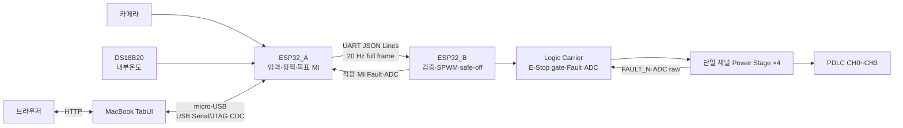

# KUGLASS 시스템 구조

이 문서는 현재 제품 코드와 제작 완료된 하드웨어를 기준으로 KUGLASS의 책임
경계와 데이터 흐름을 설명한다. 작품의 제안 배경과 개발 목표는
[`개발 계획서.md`](../개발%20계획서.md), 실제 frame 형식은
[`PROTOCOL.md`](PROTOCOL.md), 물리 회로 기준은 [`hardware/README.md`](../hardware/README.md)를
참조한다.

## 시스템 한눈에 보기

KUGLASS는 1:10 차량 모형에 부착한 PDLC를 CH0~CH3으로 나누어 제어하는 시연용
프로토타입이다. 입력은 카메라 1대와 YwRobot SEN050007 DS18B20 내부온도센서
모듈 1개다.



이 저장소는 실차 안전 장치나 자율주행 인지 성능 향상 장치를 구현하지 않는다.

## 채널과 카메라 좌표

| 채널 | PDLC 영역 | 카메라 방향 입력 |
| --- | --- | --- |
| CH0 | 운전석 창문 | TabUI 영상 왼쪽인 운전석측 ROI |
| CH1 | 조수석 창문·선루프 | TabUI 영상 오른쪽인 조수석측 ROI |
| CH2 | 운전석 옆 창문 | TabUI 영상 왼쪽인 운전석측 ROI |
| CH3 | 조수석 옆 창문 | TabUI 영상 오른쪽인 조수석측 ROI |

OV2640의 180° 장착 보정은 capture 단계에서 끝난다. ROI 분석과 TabUI JPEG는
보정된 같은 frame을 사용하고 TabUI는 영상을 추가 반전하지 않는다. 따라서 화면의
왼쪽 절반과 오른쪽 절반이 각각 운전석측과 조수석측 ROI다. 단일 카메라 ROI는
방향별 입사광의 대리 지표이며 각 창문이나 선루프를 직접 개별 촬영·측정한다는
뜻은 아니다. CH1에 묶인 조수석 창문과 선루프는 항상 하나의 목표 MI를 공유한다.

## 컴포넌트 책임

| 컴포넌트 | 소유하는 책임 | 소유하지 않는 책임 |
| --- | --- | --- |
| TabUI | UI, 고수준 명령 검증, 상태 집계, replay snapshot, ESP32_A USB gateway | LIVE 자동 MI 계산, ESP32_B 직접 제어 |
| ESP32_A | 카메라·온도 품질, 정책, LUT, AUTO MI noise deadband/빠른 servo, 관리자 지속/일반 TTL 수동 제어, 권위 있는 목표 MI, A→B heartbeat | 전력 출력, 로컬 Power Stage 안전 차단 |
| ESP32_B | full-frame 검증, 최종 bounded MI slew, 4채널 SPWM, E-Stop/timeout 전체 차단, 채널별 Fault 차단, 실제 적용 상태 | 센서 정책, 목표 MI 재계산 |
| Logic Carrier | ESP32_B 탑재, `EN_GLOBAL AND ENABLE_CHx`, Fault pull-up, ADC filter, J7 분배 | complementary gate drive, 인증된 전원 차단 |
| Power Stage ×4 | 채널별 H-Bridge, LC filter, `RUN_OK`, PDLC 출력, Fault/ADC feedback | 4채널 통합 제어, 목표 MI 결정 |

## 제어 흐름

1. ESP32_A가 카메라와 내부온도의 유효성·stale 여부를 판단한다.
2. 상황 모드, thermal, camera glare와 관리자 지속/일반 TTL 수동 제어를 결합해 CH0~CH3
   `target_mi`를 계산한다.
3. 완전 투명 운용점 0.60으로 스케일한 LUT, AUTO 0.01 MI deadband와 빠른 policy servo를
   적용한 `commanded_mi` 전체를 ESP32_B에 20 Hz로 보낸다.
4. ESP32_B가 version, sequence, TTL, 채널 집합과 범위를 검사한다.
5. ESP32_B가 정상 명령을 감소 12.0 MI/s, 증가 4.0 MI/s로 최종 제한하고 안전
   입력이 모두 정상일 때만 Logic Carrier를 통해 출력을 적용한다. 이 변화율은
   HIL 후보이며 전력부 실측 완료값이 아니다.
6. ESP32_B의 `applied_mi`, Fault, E-Stop과 ADC 진단을 ESP32_A가 TabUI로 중계한다.

제어 우선순위는 다음과 같다.

```text
E-Stop > latched Fault > Manual(관리자 지속/일반 TTL) > Demo/Auto
```

## 물리 연결

### TabUI와 ESP32_A

MacBook과 ESP32_A는 데이터 통신이 가능한 micro-USB 케이블로 DevKit USB
단자에 직접 연결한다. ESP32-S3 내장 USB Serial/JTAG(GPIO19/20)가 macOS의
`/dev/cu.usbmodem*` CDC/ACM 장치로 나타난다. 이 구간에 외부 UART TX/RX
배선을 추가하지 않는다.

### ESP32_A와 ESP32_B

A↔B는 115200 8-N-1, flow control 없음으로 동작하는 외부 3선 UART harness다.
각 장치의 TX를 상대 장치의 RX에 교차 연결하고 두 장치의 GND를 연결한다.

```text
ESP32_A GPIO39 TX -> ESP32_B GPIO44 RX
ESP32_A GPIO40 RX <- ESP32_B GPIO43 TX
ESP32_A GND       --- ESP32_B GND
```

TX끼리 또는 RX끼리 연결하지 않는다. Logic Carrier의 U3 TX(GPIO43)/RX(GPIO44)는
NC이고 J7에도 이 링크가 없으므로 위 harness를 별도로 배선한다. ESP32_B
GPIO43/44와 DevKit USB-UART bridge의 contention은 실기에서 확인해야 한다.

### ESP32_B와 전력부

ESP32_B는 제작된 Logic Carrier U3에 장착한다. J7의 네 channel block에 동일한
단일 채널 Power Stage PCB를 각각 한 장씩 연결한다. Logic Carrier를 생략하거나
ESP32_B를 Power Stage에 직접 연결하지 않는다. 상세 핀과 커넥터는
[`hardware/contracts/esp32_b_io.json`](../hardware/contracts/esp32_b_io.json)을
기준으로 한다.

## 상태 의미

| 값 | 의미 |
| --- | --- |
| `target_mi` | ESP32_A 정책이 원하는 값 |
| `commanded_mi` | ESP32_A가 rate limit 등을 적용해 ESP32_B에 보낸 값 |
| `applied_mi` | ESP32_B가 실제 출력에 적용하고 status로 보고한 값 |
| CLEAR | 현재 운용 상한 MI 0.60에 가까운 투명 방향 상태. MI 0.60은 완전 투명으로 취급 |
| safe-off | enable 해제와 MI 0.0. 전원 rail 전체가 차단됐다는 뜻은 아님 |

TabUI는 A와 B의 online/stale 상태를 따로 표시한다. B status를 받기 전에는
`applied_mi`를 목표값으로 추정하지 않는다.

## LIVE, MOCK, REPLAY, HIL

| 모드 | 장치 사용 | 용도 |
| --- | --- | --- |
| LIVE | ESP32_A USB 및 실제 A→B 경로 | 실제 센서와 출력 상태 표시·제어 |
| MOCK | 장치 없음 | UI와 명령 흐름 개발 |
| REPLAY | 장치 없음 | 저장된 상태 snapshot 재생 |
| HIL | 명시적으로 허용된 격리 벤치 | 환경·Fault 주입과 실기 검증 |

- LIVE telemetry가 stale이면 마지막 실제 상태를 유지하되 명령을 막는다.
- LIVE에서 MOCK으로 자동 전환하지 않는다.
- MOCK/REPLAY는 USB 장치를 열거나 하드웨어 명령을 만들지 않는다.
- 환경·Fault 주입은 TabUI와 ESP32_A 양쪽에서 HIL을 허용한 경우에만 가능하다.

## 안전 경계

- ESP32_B는 부팅, invalid frame, heartbeat timeout, E-Stop, Fault와 watchdog에서
  safe-off한다.
- J5 E-Stop은 `CHx_ENABLE`만 하드웨어로 차단한다. 전원 rail은 계속 live일 수
  있으므로 safety-rated power disconnect로 간주하지 않는다.
- ADC는 현재 raw/mV 진단 telemetry다. 보드별 calibration과 HIL 전에는 A/°C
  값이나 software protection threshold로 사용하지 않는다.
- MI-Vrms-투과도 LUT, 온도 임계와 카메라 개선 수치는 실측 전 확정값이 아니다.
- Power Stage와 고전압 시험은 [`hardware/validation/README.md`](../hardware/validation/README.md)의
  단계와 안전 조건을 따른다.
