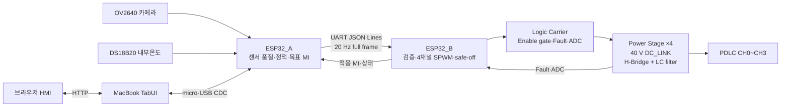

# KUGLASS 개발 종합 보고서

> 기준일: 2026-08-10  
> 대상: 1:10 차량 모형용 PDLC 4채널 시연 프로토타입  
> 현재 Power Stage 운용 전압: **40 V DC_LINK**

## 1. 프로젝트 한눈에 보기

KUGLASS는 카메라 영상과 차량 모형 내부온도를 분석하여 네 영역의 PDLC 산란도를
능동적으로 조절하는 스마트 글라스 시연 시스템이다. 센서 판단과 출력 구동을 두
ESP32-S3 장치로 분리하고, 자체 제작한 Logic Carrier와 Power Stage를 통해
CH0~CH3을 독립 제어한다.

| 항목 | 구성 |
| --- | --- |
| 적용 대상 | 1:10 차량 모형용 시연 프로토타입 |
| 입력 | OV2640 카메라 1대, DS18B20 내부온도센서 1개 |
| 판단 제어기 | ESP32_A: 센서 처리, 상황 판단, 목표 MI 산출 |
| 출력 제어기 | ESP32_B: 명령 검증, 4채널 SPWM, 로컬 안전 차단 |
| 출력 하드웨어 | Logic Carrier 1장, 동일한 단일 채널 Power Stage 4장 |
| 출력 대상 | PDLC CH0~CH3 |
| 사용자 화면 | MacBook에서 실행하는 TabUI 브라우저 HMI |
| DC bus | 40 V DC_LINK |

이 프로젝트는 모형 환경에서 스마트 글라스의 제어 가능성과 사용자 체감 가치를
보여주기 위한 시연 작품이다.

## 2. 개발 배경과 목표

차량 유리는 시야, 채광, 열 유입과 프라이버시에 동시에 영향을 준다. 고정 선팅이나
단순 ON/OFF 방식은 주행 환경과 사용 상황에 맞추어 광학 상태를 능동적으로 바꾸기
어렵다. KUGLASS는 다음 세 가지 상황에 대응하는 다채널 스마트 글라스 플랫폼을
목표로 한다.

- 강한 입사광에서 카메라 과포화 완화를 보조한다.
- 내부온도 상승 시 일사 유입을 줄이는 방향으로 제어한다.
- 차박과 주차 상황에서 프라이버시를 빠르게 확보한다.

핵심 목표는 카메라와 온도 입력을 이용해 채널별 목표값을 만들고, 자체 전력
구동부로 네 PDLC 영역의 산란도를 연속적으로 제어하는 것이다.

## 3. 핵심 차별성

| 일반적인 방식 | KUGLASS |
| --- | --- |
| 전체 유리를 일괄 ON/OFF | CH0~CH3 독립 제어 |
| 사용자가 직접 조작 | 카메라·온도·상황 기반 자동 판단 |
| 고정된 투명/불투명 상태 | MI 기반 연속 산란 제어 |
| 영상 보정만 수행 | PDLC를 카메라 전단의 능동 광학 계층으로 활용 |
| 단일 제어기에 기능 집중 | 판단용 ESP32_A와 실시간 출력용 ESP32_B 분리 |
| 상용 드라이버 의존 | 자체 Logic Carrier와 H-Bridge Power Stage 사용 |

## 4. 전체 시스템 구조



### 4.1 컴포넌트 책임

| 컴포넌트 | 핵심 책임 |
| --- | --- |
| TabUI | 화면, 사용자 명령, 상태 집계, ESP32_A USB gateway |
| ESP32_A | 카메라·온도 입력, 정책, 목표 MI, A→B 명령 전송 |
| ESP32_B | 명령 검증, 4채널 SPWM, Fault·E-Stop·timeout 차단 |
| Logic Carrier | ESP32_B 탑재, 전역 Enable gate, Fault/ADC 연결, J7 분배 |
| Power Stage ×4 | 채널별 H-Bridge, LC filter, PDLC 출력과 feedback |

자동 판단과 권위 있는 `target_mi`는 ESP32_A가 담당한다. ESP32_B는 목표를 다시
계산하지 않고 출력과 로컬 안전을 담당한다. 이 분리는 센서 처리와 실시간 구동의
복잡도를 낮추고, 통신 이상 시 출력부가 독립적으로 안전 정지할 수 있게 한다.

### 4.2 채널 구성

| 채널 | PDLC 영역 | 주요 자동 입력 |
| --- | --- | --- |
| CH0 | 운전석 창문 | 운전석측 카메라 ROI, 온도, 상황 모드 |
| CH1 | 조수석 창문·선루프 | 조수석측 카메라 ROI, 온도, 상황 모드 |
| CH2 | 운전석 옆 창문 | 운전석측 카메라 ROI, 온도, 상황 모드 |
| CH3 | 조수석 옆 창문 | 조수석측 카메라 ROI, 온도, 상황 모드 |

CH1의 조수석 창문과 선루프는 하나의 제어 채널로 같은 MI를 공유한다.

## 5. 제어 방식

### 5.1 MI 정의

MI(Modulation Index)는 PDLC 출력 세기를 나타내는 0.0~0.60의 제어값이다.

| 값 | 의미 |
| --- | --- |
| MI 증가 | CLEAR, 투명 방향 |
| MI 0.60 | 현재 완전 투명으로 사용하는 운용 상한 |
| MI 감소 | 산란 증가 방향 |
| MI 0.0 또는 Disable | 출력 차단과 강산란 방향의 safe-off |

시스템은 정책 목표인 `target_mi`, ESP32_A가 전송한 `commanded_mi`, ESP32_B가
실제로 적용한 `applied_mi`를 구분한다. 따라서 UI에서 판단 결과와 실제 출력
상태를 동시에 확인할 수 있다.

### 5.2 자동 제어 흐름

1. ESP32_A가 카메라 ROI와 DS18B20 데이터를 수집한다.
2. 입력의 유효성 및 최신 상태를 확인한다.
3. 주행·정차·차박·주차 상황과 glare·thermal·privacy 조건을 결합한다.
4. CH0~CH3의 `target_mi`를 계산하고 MI servo를 적용한다.
5. 20 Hz full frame을 ESP32_B에 전달한다.
6. ESP32_B가 frame과 안전 입력을 검증한 뒤 출력을 적용한다.
7. 실제 적용 MI, Fault와 ADC 상태를 TabUI로 회신한다.

제어 우선순위는 다음과 같다.

```text
E-Stop > 채널별 Latched Fault > Manual > Demo/Auto
```

### 5.3 사용자 제어 모드

| 모드 | 용도 |
| --- | --- |
| LIVE | 실제 센서와 ESP32_A/B 상태를 이용한 운용 |
| MOCK | 하드웨어 없이 UI와 명령 흐름 시연 |
| REPLAY | 최근 상태 snapshot 재생 |
| HIL | 격리된 환경에서 센서·Fault·출력 검증 |

일반 수동 제어는 기본 15초 후 AUTO로 복귀한다. 관리자 화면에서는 명시적인
AUTO 복귀 전까지 유지되는 지속 수동 제어를 사용할 수 있다.

## 6. 구현 내용

### 6.1 TabUI

TabUI는 Python 백엔드와 React·TypeScript 프런트엔드로 구성된 브라우저 HMI다.

- IONIQ 5 3D 모형과 CH0~CH3 상태 표시
- 주행, 열부하, 차박, 주차, 카메라 강광 시나리오
- 채널별 목표·명령·적용 MI 구분 표시
- 일반 수동 제어와 관리자 지속 제어
- ESP32_A/B online·stale·Fault 상태 분리
- 카메라 ROI 밝기·포화·Edge Density와 내부온도 표시
- 실제 ROI 경계가 포함된 on-demand 카메라 영상
- USB 장치 재탐색 및 gateway runtime 제어
- LIVE/MOCK/REPLAY의 명확한 구분

MacBook과 ESP32_A는 데이터 micro-USB 케이블과 ESP32-S3 USB Serial/JTAG CDC로
연결한다. LIVE 기본값은 `transport=usb`, `usb-port=auto`다.

### 6.2 ESP32_A 펌웨어

`ESP32_A_Algo/`는 입력 처리와 정책을 담당하는 제품 펌웨어다.

- OV2640 VGA RGB565 영상 수집과 좌우 ROI 분석
- 밝기, 포화도, highlight와 Edge Density 계산
- DS18B20 CRC·범위·stale 검사
- 상황별 thermal·glare·privacy 정책
- CH0~CH3 목표 MI와 MI servo
- 일반 TTL 및 관리자 지속 수동 override
- ESP32_B로 20 Hz full-frame heartbeat 전송
- B 상태 검증과 TabUI telemetry 중계
- 요청 시 약 5 fps JPEG 영상 전송

카메라와 온도 값이 유효하지 않거나 오래되면 결측으로 처리하며, 임의 기본값을
실측값처럼 사용하지 않는다.

### 6.3 ESP32_B 펌웨어

`ESP32_B_Algo/`는 전력 출력과 로컬 안전을 담당하는 제품 펌웨어다.

- CH0~CH3 full/unique frame 검증
- 16 kHz carrier와 60 Hz polarity의 4채널 SPWM
- 방향 전환 시 PWM 정지와 blanking 적용
- MI 변화율 제한과 최대 MI 0.60 보장
- E-Stop, 잘못된 frame, timeout과 watchdog의 전체 safe-off
- Power Stage Fault의 채널별 차단과 latch
- 8채널 ADC raw/mV와 validity telemetry
- boot/session/challenge 기반 Fault reset 검증

## 7. 통신 구조

### 7.1 물리 연결

```text
MacBook -- data micro-USB --> ESP32_A

ESP32_A GPIO39 TX --> ESP32_B GPIO44 RX
ESP32_A GPIO40 RX <-- ESP32_B GPIO43 TX
ESP32_A GND       --- ESP32_B GND
```

A↔B는 Logic Carrier를 통하지 않는 별도 3선 UART harness이며 115200 8-N-1로
동작한다.

### 7.2 프로토콜 핵심

- JSON Lines, protocol `v=1`
- A→B 20 Hz CH0~CH3 full frame
- 기본 command TTL 250 ms
- 단조 증가 sequence와 stale/duplicate 거부
- 채널 누락·중복·타입·범위 오류 시 frame 전체 거부
- B status는 실제 적용 MI와 Fault 상태를 보고
- `boot_id`, `source_session_id`, one-time `reset_challenge`로 Fault reset 보호

이 구조는 부분 frame 적용과 오래된 명령 재사용을 막고, A heartbeat가 끊기면
ESP32_B가 로컬에서 출력을 차단하도록 한다.

## 8. 하드웨어 구성

### 8.1 제작 보드

| 보드 | 수량 | 역할 |
| --- | ---: | --- |
| Logic Carrier | 1장 | ESP32_B 탑재, Enable gate, Fault pull-up, ADC filter, J7 분배 |
| Power Stage | 4장 | 채널별 H-Bridge, LC filter, PDLC 출력 |

ESP32_B는 Logic Carrier U3에 장착하고, J7의 네 채널 블록에 동일한 단일 채널
Power Stage를 한 장씩 연결한다.

### 8.2 전원 구조

| 전원 | 용도 |
| --- | --- |
| 24 V | Logic Carrier 외부 전원 경로 |
| 12 V | Power Stage gate driver와 J7 분배 |
| 5 V | ESP32_B DevKit 공급 |
| 3.3 V | Logic 및 ADC 기준 |
| **40 V DC_LINK** | Power Stage H-Bridge DC bus |

현재 Power Stage J8에는 40 V DC_LINK를 사용한다. 회로 원본에 남은
`+72V_HV`는 레거시 net명일 뿐 현재 인가 전압이 아니다.

### 8.3 Logic Carrier와 Power Stage

Logic Carrier의 핵심 하드웨어식은 다음과 같다.

```text
CHx_ENABLE = EN_GLOBAL AND ENABLE_CHx
```

Power Stage의 핵심 하드웨어식은 다음과 같다.

```text
DIR_N_CH0     = NOT DIR_CH0
PWM_LEFT_CH0  = PWM_MAG_CH0 AND DIR_CH0
PWM_RIGHT_CH0 = PWM_MAG_CH0 AND DIR_N_CH0
RUN_OK_CH0    = CH0_ENABLE AND FAULT_N_CH0
```

`RUN_OK`는 두 IRS2104 gate driver의 shutdown을 직접 제어한다. 따라서 Power Stage
Fault는 펌웨어 판단과 별개로 해당 채널의 gate drive를 하드웨어에서 차단한다.

Power Stage는 Q1~Q4 H-Bridge, IRS2104 gate driver, 470 µH 인덕터 2개와 470 nF
커패시터로 구성된 differential LC filter, 전류 shunt, Fault comparator와 NTC
feedback을 포함한다. 출력은 J9의 `PDLC_A/PDLC_B`를 사용한다.

### 8.4 ESP32_B 핀 계약

| 채널 | PWM | DIR | ENABLE | FAULT_N | Current ADC | Temp ADC |
| --- | ---: | ---: | ---: | ---: | ---: | ---: |
| CH0 | GPIO10 | GPIO11 | GPIO12 | GPIO13 | GPIO1 | GPIO2 |
| CH1 | GPIO14 | GPIO15 | GPIO16 | GPIO17 | GPIO4 | GPIO5 |
| CH2 | GPIO18 | GPIO21 | GPIO38 | GPIO39 | GPIO6 | GPIO7 |
| CH3 | GPIO40 | GPIO41 | GPIO42 | GPIO47 | GPIO8 | GPIO3 |

J7은 2×32 connector이며 모든 짝수 핀은 GND다. 각 채널의 홀수 8핀은
`PWM, DIR, ENABLE, FAULT_N, ADC_I, ADC_TEMP, 3.3 V, 12 V` 순서다.

## 9. 안전 설계

KUGLASS는 하드웨어 gate와 펌웨어 차단을 함께 사용한다.

- 부팅 직후 네 채널 Enable LOW와 PWM 0 보장
- 유효한 full command와 live TTL 전에는 출력 금지
- J5 NC E-Stop과 `EN_GLOBAL`을 이용한 전체 Enable 차단
- 채널별 active-low `FAULT_N`과 `RUN_OK` 하드웨어 shutdown
- 통신 timeout, invalid frame과 watchdog의 전체 safe-off
- 방향 전환 시 PWM force-low, blanking, DIR 변경, 안전 입력 재확인
- one-time challenge와 boot/session 일치를 요구하는 Fault reset
- MI 상한 0.60으로 IRS2104 bootstrap refresh 확보

J5 E-Stop은 채널 Enable을 차단하며 DC_LINK 자체를 분리하는 전원 차단기는 아니다.
실기 검증은 무전원 연속성, logic-only, 저전압 Power Stage, ADC/Fault 계측,
40 V DC_LINK와 PDLC 순서로 단계적으로 진행한다.

## 10. 구현 및 검증 현황

| 영역 | 현재 상태 |
| --- | --- |
| TabUI | LIVE/MOCK/REPLAY HMI, USB gateway, 관리자 제어, 카메라 viewer 구현 |
| ESP32_A | 카메라·온도, 정책, MI servo, A→B 통신 구현 |
| ESP32_B | 4채널 SPWM, strict parser, Fault·E-Stop·timeout 차단 구현 |
| 프로토콜 | sequence·TTL·full-frame·reset correlation 구현 |
| 하드웨어 | Logic Carrier 1장과 Power Stage 4장 제작 완료 |
| 자동 검증 | 하드웨어 계약, TabUI check/build, A/B host test 통과 |

자동 검증은 코드와 통신 계약의 정합성을 확인한다. 실제 광학 성능과
MI–Vrms–투과도 관계, 보드별 전류·온도 보정 및 40 V 전력 파형은 단계별 HIL에서
측정값으로 확정한다.

주요 검증 명령은 다음과 같다.

```bash
python3 hardware/tools/validate_hardware_contract.py

cd TabUI
npm run check
npm run build

cd ../ESP32_A_Algo
sh host_tests/run_tests.sh

cd ../ESP32_B_Algo
sh host_tests/run_tests.sh
```

## 11. 시연 구성

### 11.1 카메라 강광 대응

같은 광원과 카메라 조건에서 PDLC 개입 전후의 ROI 밝기, 포화 비율과 Edge
Density를 비교한다. 강한 입사광에 따라 해당 방향 채널의 MI가 변하고, 목표값과
실제 적용값이 UI에 함께 표시된다.

### 11.2 내부온도 대응

DS18B20 내부온도 변화가 thermal policy와 네 채널 목표 MI에 반영되는 과정을
보여준다. 센서 유효성과 최신 상태도 함께 표시한다.

### 11.3 차박·주차 프라이버시

차박 또는 주차 모드에서 네 채널을 산란 방향으로 전환하여 차량 모형 내부의
프라이버시 확보 과정을 보여준다.

### 11.4 수동 및 안전 제어

일반 수동 제어의 자동 만료, 관리자 지속 제어, AUTO 복귀와 함께 A→B 통신 단절,
E-Stop 또는 채널 Fault 발생 시 출력이 차단되는 과정을 시연한다.

## 12. 기대 효과와 확장성

- 주행 환경에 따른 능동 광학 제어 가능성 제시
- 내부 열부하와 프라이버시를 하나의 다채널 플랫폼에서 관리
- 센서 판단, 실시간 제어, 전력 전자와 HMI를 통합한 완성형 임베디드 시스템
- 4채널에서 더 세분화된 window segmentation으로 확장 가능
- 측정 LUT 또는 경량 예측 모델을 이용한 제어 고도화 가능
- 차량 외에도 건축용 스마트 윈도우와 이동형 공간에 적용 가능한 구조

## 13. 주요 기준 문서

| 문서 | 내용 |
| --- | --- |
| [`README.md`](README.md) | 프로젝트 개요와 실행 진입점 |
| [`개발 계획서.md`](개발%20계획서.md) | 개발 배경, 목표와 활용 계획 |
| [`docs/ARCHITECTURE.md`](docs/ARCHITECTURE.md) | 시스템 책임과 데이터 흐름 |
| [`docs/PROTOCOL.md`](docs/PROTOCOL.md) | TabUI↔A↔B 통신 계약 |
| [`TabUI/README.md`](TabUI/README.md) | HMI, backend, USB와 API |
| [`ESP32_A_Algo/README.md`](ESP32_A_Algo/README.md) | 센서, 정책과 ESP32_A 펌웨어 |
| [`ESP32_B_Algo/README.md`](ESP32_B_Algo/README.md) | SPWM, Fault와 ESP32_B 펌웨어 |
| [`hardware/README.md`](hardware/README.md) | 제작 하드웨어 기준과 안전 경계 |

## 14. 결론

KUGLASS는 카메라와 내부온도를 이용해 네 PDLC 영역의 산란도를 능동 제어하는
40 V DC_LINK 기반 시연 시스템이다. ESP32_A의 센서·정책 처리, ESP32_B의 실시간
4채널 출력과 로컬 안전, 자체 제작 Logic Carrier·Power Stage, MacBook TabUI를
하나의 동작 구조로 통합했다.

현재 센서 처리, 자동·수동 정책, 4채널 SPWM, 상태 회신, Fault·E-Stop·통신 timeout
차단과 HMI가 구현되어 있다. 이를 통해 열부하 대응, 프라이버시 확보와 카메라
강광 완화라는 사용자 체감 시나리오를 하나의 플랫폼에서 시연할 수 있다.
